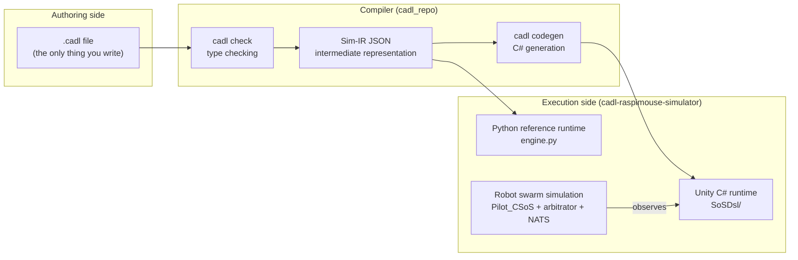

# Architecture & Code Walkthrough — for first-time readers

This page is for getting a 30–60 minute grasp of **how the system works as a whole** and **which file does what**, before you dive into Course A (the main textbook). If you read this once before touching anything, each Step in the textbook will make sense — you will know exactly which part of the machine you are working on.

## 1. The whole architecture in one picture

There are two worlds — the side where specifications are **written** and the side where they **run** — with a compiler connecting them.



There are only three things to remember.

1. **The only contract logic a human writes is the `.cadl` file.** The IR, the C# contract classes and the diagrams are generated from it by the toolchain commands.
2. **Two runtimes execute the same IR** with the same semantics: the C# contract code is *generated* from the IR, while the Python reference runtime is a hand-written *interpreter* that reads the IR directly (it serves as a cross-check).
3. The robot control code and the contract code are **separated**. The contract only "observes" the robots: the robot controller `Pilot_CSoS.cs` contains no contract logic, and the only hand-written glue is a thin bridge (`PilotContractBridge.cs`) that turns robot state changes into contract events.

## 2. Repositories and roles

| Repository | Role | Public? | Do you touch it in the course? |
| --- | --- | --- | --- |
| `cadl-spec` | The language specification and this textbook site | Yes | Read only |
| `cadl` (cloned as `cadl_repo`) | The compiler (parser, type checker, IR, code generation) | Yes | Used as a command |
| `cadl-explorer` | Streamlit app: compares governance designs, edits and checks CADL, draws state machine diagrams | Yes | Used as a web app (`streamlit run app.py`) |
| `cadl-raspimouse-simulator` | Unity project, Go arbitrator, Python runtime | Yes | **Where you mainly work in Steps 5–6** |

These are the four repositories. The simulator keeps the Unity project (`unity/`), the Go arbitrator (`arbitrator/`) and the Python runtime (`cadl/runtime/`) together in one repository; the files described in Section 4 below are all found there.

A note on names: the Unity scene (`C-SoS.unity`), the robot controller (`Pilot_CSoS`) and the arbitrator directory (`C-SoS/`) carry the label "C-SoS". In the simulator, C-SoS stands for Collaborative SoS (its config has `sosType: collaborative`) and names its centralised-arbitrator mode, as opposed to its "D-SoS" mode. That label is set in the simulator, independently of the `type:` in a CADL file. The CADL file of this course declares `type: Acknowledged`, and that declaration is what the course text means when it classifies the robot-delivery SoS.

## 3. The road one contract travels — file by file

Using the textbook example `sos_dsl_robot_delivery.cadl` (153 lines), let's follow where a single line you write ends up.

**(1) Spec → IR.** The `deadline: 5s` in your `.cadl` file is parsed by `cadl_repo/src/cadl/parser.py`, and once `sim/lower.py` lowers it into the IR it becomes the JSON `"deadline_ms": 5000` (the whole IR is 245 lines). The IR is an intermediate representation that discards the "human-friendly notation" and keeps only the "form that machines can easily execute".

**(2) IR → C#.** `codegen/unity_csharp/contract_emitter.py` reads the IR and generates three files per contract: the state enum (`DeliverySlaState.cs`), the state machine itself (`DeliverySlaContract.cs`), and the monitoring rules (`DeliverySlaMonitors.cs`). Together with 5 shared runtime files (described below), a total of 770 lines is placed under `unity/Assets/Scripts/SoSDsl/`.

**(3) The C# runs in Unity.** The `ContractRuntimeHost` in the scene calls `Runtime.Tick(now)` every frame, evaluating deadline expirations and monitoring rules. A `PilotContractBridge` attached to each robot translates the robot's state changes (won a delivery bid, finished a delivery) into **contract events** (`route_assignment`, `Delivered`) and feeds them in. Violations and state transitions appear line by line in the Console:

```
[lifecycle DELIVERY_SLA/robot-2-1 Proposed -> Assigned (assign, event) @ 2050ms]
[violation DELIVERY_SLA/robot-2-1 battery_guard Major monitor:battery_guard @ 2150ms]
```

## 4. Key files explained

### Contract runtime (the generated side, C#) — `unity/Assets/Scripts/SoSDsl/`

| File | What it contains | Approx. lines |
| --- | --- | --- |
| `Runtime/ContractRuntime.cs` | Instance registration, event delivery, the `Tick` loop. The heart of the system | ~90 |
| `Runtime/PredicateEvaluator.cs` | Evaluator for predicate strings like `"battery < 20 AND state == Assigned"` | ~250 |
| `Runtime/ContractEvent.cs` | Shared struct for lifecycle / violation events. The Console lines come from its `ToString()` | ~40 |
| `Runtime/EventBus.cs` / `Severity.cs` | Lightweight pub-sub and the severity enum | Small |
| `Generated/DeliverySlaContract.cs` | The transition table itself. Rows of if statements: "when this event arrives in this state, go to that state" | ~220 |
| `Generated/DeliverySlaMonitors.cs` | Monitoring rules. Evaluates a predicate on each period (e.g. 500ms) and emits a violation if true | ~100 |

### Hand-written glue — `SoSDsl/Demo/`

| File | What it contains |
| --- | --- |
| `ContractRuntimeHost.cs` | One per scene. Holds the runtime, ticks it every frame, and prints events to the Console |
| `PilotContractBridge.cs` | One per robot. **Observes** `Pilot_CSoS` and translates into contract events. `Assigned Dwell Ms` (700ms) is a wait time so that the periodic monitors don't miss the Assigned state |

### The simulator itself (runs independently of the contracts)

| File | What it contains |
| --- | --- |
| `LineTrace/Pilot_CSoS.cs` | The robot's brain. Path following, bidding on deliveries (claim), winning bids, completion. **Knows nothing about contracts** |
| `arbitrator/C-SoS/main/main.go` | The arbitrator (task dispatcher) written in Go. Distributes deliveries over NATS and awards them first-come-first-served (FCFS) |
| `Assets/streamingAssets/cadl_config.json` | The graph (11 nodes / 17 edges), robot count, NATS settings. The source of the `[Config]` lines in the Console |

### Python reference runtime — `cadl/runtime/` (for cross-checking)

| File | What it contains |
| --- | --- |
| `engine.py` | A Python implementation with the same semantics as the C# runtime (~720 lines). Reads the IR and drives state machines, deadlines, and monitors |
| `multi_robot_demo.py` | A scripted run in which 5 robots reach 5 different outcomes (completed, response deadline expired, battery violation, delivery delay, unassigned) |

## 5. What to touch to change what

When you feel like modifying things, there is one place to touch per goal (everything else is either generated or should not be edited by hand).

| What you want to do | What to touch |
| --- | --- |
| Change a deadline, add a monitor, add a state | **The `.cadl` file** (→ regenerate with the e2e script) |
| Change how robots move | `Pilot_CSoS.cs` (the contract side needs no change as long as the events the bridge observes stay the same) |
| Change the translation into contract events | `PilotContractBridge.cs` |
| Change the shape of the generated C# | `contract_emitter.py` (advanced) |
| Change the robot count or the map | `cadl_config.json` |

**Places you must not touch**: hand-editing the contents of `Generated/` and `Runtime/`. The next run of the e2e script will overwrite them (if something needs fixing, fix the generator).

## 6. Suggested reading order (30–60 min)

1. The diagram on this page and Section 3 (10 min)
2. Read `examples/sos_dsl_robot_delivery.cadl` top to bottom (10 min) — heavily commented, and it doubles as the answer key for textbook Steps 2–3
3. Read `HandleEvent` in `Generated/DeliverySlaContract.cs` (10 min) — confirm that the transitions from the `.cadl` file became if statements verbatim
4. Read `PilotContractBridge.cs` (10 min) — see how thin the "observation → event" translation really is
5. If you have time left, `ContractRuntime.tick` in `engine.py` (10 min)

Once you have read this far, head to Step 0 of [Course A (main textbook)](main-textbook.md).
