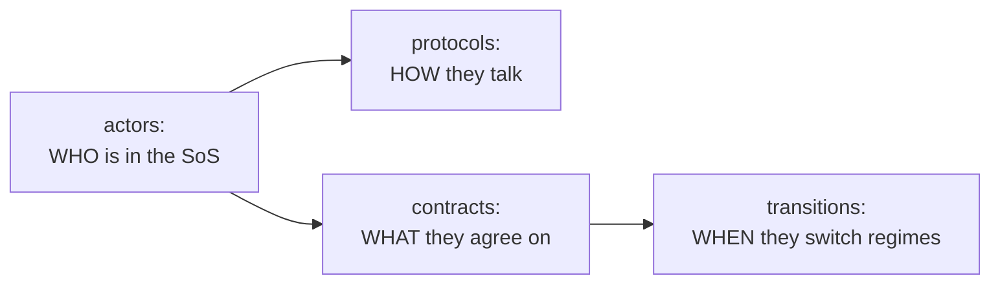
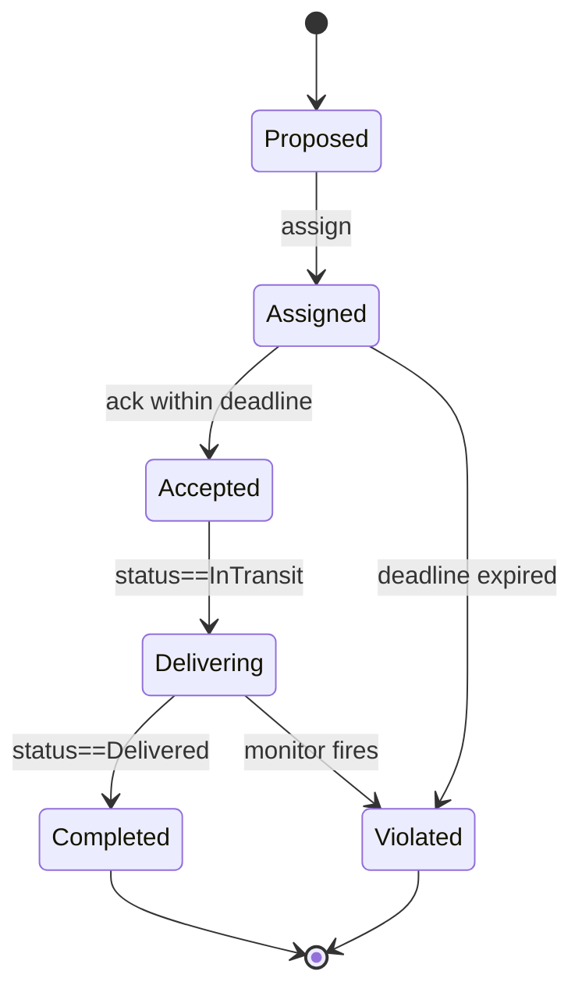

# Course A — Exercises

> ⬅ Back to the main course → [Course A — Robot Delivery](main-textbook.md)
>
> 📚 Academic background and references → [`academic-background.md`](academic-background.md)

This booklet collects the practice exercises that go with the SoS-DSL hands-on. Two parts:

- **Part 1 — Robot Delivery course (5-session series)**. A structured course that takes the same robot delivery domain through CADL modelling → DSL design → visualisation → simulation → improvement, one session per week. Designed for a 3 to 5 week class. **The bulk of this booklet.**
- **Part 2 — Modelling a new SoS end-to-end (Course C)**. After Part 1, you pick a *different* domain (food delivery, emergency response, …) and walk the full loop yourself. It is deliberately open-ended and given as an outline: closer to a self-directed mini-project than to weekly homework.

---

## Part 1 — Robot Delivery Course (5 sessions)

## Course at a glance

| Session | Title | Theme | Deliverable |
| --- | --- | --- | --- |
| 1 | **CADL Modelling** | Structure of an SoS | `my_delivery_v1.cadl` (structure only) |
| 2 | **DSL Design** | Norms: lifecycle and monitors | `my_delivery_v2.cadl` (with lifecycle + monitors) |
| 3 | **Visualisation** | Reading and comparing specs visually | A/B comparison report with screenshots |
| 4 | **Simulation** | Executing the spec, reading traces | Baseline trace + parameter sweep |
| 5 | **Improvement** | Using observations to refine the spec | `my_delivery_v3.cadl` + before/after report |

Each session is **~90 minutes in class** plus **~3 hours of homework**. The final deliverable across all five sessions is a **3-page report** (initial model / simulation comparison / reflection).

:::info[Repository availability]
Sessions 1–3 need only `cadl` and `cadl-explorer` (except the ★★★ Exercise 3.3, which takes a log from the simulator repository). Sessions 4–5 run the Python reference runtime that lives in `cadl-raspimouse-simulator` (see Step 0 of the [main textbook](main-textbook.md) for how to get it).
:::

### Compact 3-session version

If you only have three sessions (e.g., a short module, an intensive weekend), use this mapping:

| 3-session | Combines |
| --- | --- |
| Session A | Sessions 1 + 2 (Modelling + DSL design) |
| Session B | Sessions 3 + 4 (Visualisation + Simulation) |
| Session C | Session 5 (Improvement) |

The exercises stay the same; you simply move the optional / "stretch" exercises to homework.

### Per-session format

Every session has the same shape:

1. **Learning objectives** — what you should be able to do by the end.
2. **Prerequisites** — deliverables from the previous session, plus reading.
3. **Concept introduction** (~30 min) — the small amount of theory you need.
4. **Exercises** (~50 min) — graded ★ (basic) → ★★ (intermediate) → ★★★ (stretch).
5. **Wrap-up + homework** (~10 min) — what to bring to next session.

### Rubric (suggested)

The instructor can use this for grading; the student can self-check.

| Criterion | Weight |
| --- | --- |
| All ★ and ★★ exercises completed for every session | 40% |
| `cadl check` passes on every submitted CADL file | 20% |
| Final 3-page report demonstrates understanding (not just steps) | 30% |
| At least one ★★★ stretch exercise attempted | 10% |

---

## Session 1 — CADL Modelling

### Learning objectives

- Identify the actors in an SoS and declare them in CADL with `id`, `role`, `autonomy`, `interface`.
- Write a structural contract with `parties`, `assume`, `guarantee`, `incentives`.
- Run `cadl check` and explain its diagnostics.

### Prerequisites

- Steps 0 and 1 of the main hands-on textbook (repositories cloned; the chapters listed in Step 1 read — Introduction, Language Specification, Appendix E, Examples).
- 30 min of pre-reading: cadl-spec Chapter 5 — *Language Specification*.

### Concept introduction (~30 min)

A CADL file says **who** participates and **what they expect from each other**, before saying anything about *when* or *how often*. The structural building blocks are:



For Session 1 you will only touch **actors** and **contracts**. `protocols` and `transitions` are optional stretch material.

### Exercises (~50 min in class + homework)

#### Exercise 1.1 (★) — Build the baseline structural model

**Goal**: Reproduce the example actor / contract from the main hands-on, by hand, into a fresh file `my_delivery_v1.cadl`.

**Procedure**:

1. Create `my_delivery_v1.cadl` in the root of `cadl_repo` (the bundled example to compare with is `examples/sos_dsl_robot_delivery.cadl`), and run the commands below from that directory.
2. Declare three actors: `DISPATCHER`, `ROBOT[1..N]`, `CUSTOMER[1..M]`. Choose sensible `autonomy` levels for each.
3. Declare one contract `DELIVERY_SLA` with `parties: [DISPATCHER, "ROBOT[*]", "CUSTOMER[*]"]`, `assume: ["ROBOT[i].battery > 20"]`, `guarantee: ["delivery_time <= 300s"]`.
4. Run `cadl check my_delivery_v1.cadl` and confirm it prints `Type check passed: my_delivery_v1.cadl`.

**Check**: The file passes the type check, and the IR JSON shows 3 actors and 1 contract.

#### Exercise 1.2 (★★) — Add a fourth actor

**Goal**: Introduce a `MAINTENANCE` actor that periodically inspects robots, and declare a separate contract `MAINTENANCE_SLA` between `MAINTENANCE` and `ROBOT[*]`.

**Procedure**:

1. Add `MAINTENANCE` (single, low autonomy, capabilities `[inspect, repair]`).
2. Add a contract `MAINTENANCE_SLA` with `parties: [MAINTENANCE, "ROBOT[*]"]`.
3. Decide whether `assume` should include `ROBOT[i].battery > 0` or something stronger.
4. Re-run `cadl check`.

**Reflection**: When you have *two* contracts on the same actor, which `assume` clauses apply? (Hint: both must hold simultaneously — this is exactly the *interdependency* concern that Dahmann (2014) calls out as SoS pain point #5.)

#### Exercise 1.3 (★★) — Add a protocol

**Goal**: Move beyond the structural skeleton: write a `protocols:` section describing the delivery flow as a sequence of message exchanges.

**Procedure**:

1. Add a `protocols:` section under `sos:` (same indentation as `contracts:`) with one protocol, `DeliveryProposal`. Give it a `trigger`. A protocol has no separate list of participants: who takes part follows from the senders and receivers named in `steps`.
2. List 3 steps under `steps:`, each written as a quoted string: `"DISPATCHER -> ROBOT[i] : route_assignment"`, `"ROBOT[i] -> DISPATCHER : ack"`, `"ROBOT[i] -> DISPATCHER : completion"`.
3. Add a `precondition` / `postcondition` if you can think of any (the other optional keys are `safety_invariant` and `timing`).
4. Run `cadl check my_delivery_v1.cadl`, then confirm that the protocol really reached the IR: `cadl sim-ir my_delivery_v1.cadl --format json | grep -n -A6 '"protocols"'` should show `"id": "DeliveryProposal"`. Do not rely on `cadl check` alone here — it silently ignores keys it does not know, so a misspelt key (`pre:`, `participants:` …) still passes.

```yaml
  protocols:
    - id: DeliveryProposal
      trigger: "new_delivery_request(CUSTOMER[i])"
      precondition: "ROBOT[i].battery > 20"
      steps:
        - "DISPATCHER -> ROBOT[i] : route_assignment"
        - "ROBOT[i] -> DISPATCHER : ack"
        - "ROBOT[i] -> DISPATCHER : completion"
      postcondition: "ROBOT[i].status == Delivered"
```

**Reflection**: Why is the protocol described as a sequence of *messages*, not as code? What does this give you that a Python function would not? (Hint: think about who *implements* each step.)

#### Exercise 1.4 (★★★) — Write a domain you don't know yet

**Goal**: Without copying any existing file, write a CADL skeleton for a **delivery drone fleet** (instead of ground robots). Same domain shape, different actors and capabilities.

**Procedure**:

1. Create `my_drone_delivery.cadl` from scratch.
2. Decide who the actors are. Hint: a *DRONE* needs different `capabilities` than a *ROBOT* (consider altitude, no-fly zones, weather).
3. Run `cadl check`.

**Reflection**: How much of your file is *the same* as the robot delivery one, and how much is genuinely different? The same lifecycle could be reused with minor modifications — that is exactly the design intent of SoS-DSL.

### Wrap-up + homework

**Bring to Session 2**:

- `my_delivery_v1.cadl` (compiles cleanly).
- A short note (3–5 lines) describing what is missing in v1 — i.e., what the structural-only file *cannot* express. (Hint: timing, what counts as a violation, what the consequences are.)

---

## Session 2 — DSL Design

### Learning objectives

- Add a per-instance `lifecycle:` to a structural contract.
- Add declarative `monitors:` with predicates and sampling specs.
- Read `cadl sim-ir` JSON output and locate your additions in it.

### Prerequisites

- `my_delivery_v1.cadl` from Session 1.
- 30 min of pre-reading: cadl-spec [Appendix E](../spec/appendix-e-sos-dsl.md).

### Concept introduction (~30 min)

A class-level contract spec says "this is the kind of agreement we make." But every concrete delivery is its **own instance** of that agreement, going through:



Two new keys make this explicit:

- `lifecycle:` — defines states, initial / terminal markers, and transitions with `deadline` + `on_violation`.
- `monitors:` — declarative observers that are evaluated periodically or on events. When a monitor's `rule` matches, it records a violation (`on_match.violation`), moves the contract instance to the named target state (`on_match.transition`, e.g. `Violated`), or both.

### Exercises (~50 min in class + homework)

#### Exercise 2.1 (★) — Add the basic lifecycle

**Goal**: Save `my_delivery_v1.cadl` as `my_delivery_v2.cadl`, then add a `lifecycle:` block to `DELIVERY_SLA` with the 7 states from the main hands-on.

**Procedure**:

1. Copy `v1` → `v2`.
2. Add `lifecycle.states`, `lifecycle.initial`, `lifecycle.terminal`, and 4 transitions (`assign`, `accept`, `start_delivery`, `complete`).
3. On `accept`, set `deadline: 5s` and `on_violation.transition: Violated` (the value is the target state). Also declare `extensions: [sos-dsl: 0.1]` under `sos:`, as in Step 3 of the main textbook.
4. Run `cadl check my_delivery_v2.cadl`, then `cadl sim-ir my_delivery_v2.cadl --format json | grep -n -A3 '"lifecycle"'` (the `"lifecycle"` key sits well past the first screen of the IR — line 86 for the main textbook's file, later if you added actors or contracts in Session 1 — so `head` would cut it off).
5. Confirm in the output that `"lifecycle"` is no longer `null`: the line now reads `"lifecycle": {`, followed by `"states": [` and the first state names. If you added `MAINTENANCE_SLA` in Exercise 1.2, `grep` prints a second match for that contract, which still reads `"lifecycle": null`; that is expected, because only `DELIVERY_SLA` has a lifecycle.

#### Exercise 2.2 (★★) — Add an over-speed monitor

**Goal**: Detect a robot that drives faster than 1.5 m/s while delivering and move the contract instance to `Violated` with severity `Critical`.

**Procedure**: Add a monitor under `monitors:`:

```yaml
- id: over_speed
  observe: "ROBOT[i].speed"
  sampling: periodic(200ms)
  rule: "ROBOT[i].speed > 1.5 AND state == Delivering"
  on_match:
    transition: Violated
    severity: Critical
```

**Reflection**: You have just added a *new normative rule* without changing a single line of the robot's control code (Unity's `Pilot_CSoS.cs`). What does this say about the separation between the structural code and the normative spec? (Compare [Maier 1998] criterion (4), emergent behaviour: here a norm *constrains* it without redesigning the parts.)

#### Exercise 2.3 (★★) — Add a Cancelled lifecycle state

**Goal**: Let a customer cancel a delivery while it is still `Assigned`, routing the contract to a new `Cancelled` terminal state.

**Procedure**:

1. Add `Cancelled` to `lifecycle.states` and `lifecycle.terminal`.
2. Add a transition `customer_cancel` from `Assigned` to `Cancelled` triggered by `"CUSTOMER[i] -> DISPATCHER : cancel_order"`.
3. Decide: should `Cancelled` be a violation? In CADL, terminal states are not implicitly violations — they are just *closed*.

**Reflection**: When you added `Cancelled`, did the existing simulation break? Why or why not? (Adding a *state* is backward-compatible; adding a *deadline* is not.)

#### Exercise 2.4 (★★★) — Two contracts coexisting

**Goal**: Beside `DELIVERY_SLA`, add a `FLEET_SAFETY` contract whose lifecycle is independent of any delivery — it is *always on* while a robot is operational.

**Procedure**:

1. Define a 3-state lifecycle: `Operational → Degraded → OutOfService`.
2. Add a monitor that fires `Degraded` when battery < 10% (regardless of delivery state).
3. Run `cadl check`. Are there any conflicts with `DELIVERY_SLA` rules?

**Reflection**: A robot can be a party to *both* contracts simultaneously. What semantics do you want when one contract says "you may proceed" and the other says "you must stop"?

### Wrap-up + homework

**Bring to Session 3**:

- `my_delivery_v2.cadl` (with at minimum exercises 2.1–2.3 done).
- The IR JSON snapshot saved as `my_delivery_v2.ir.json` (run `cadl sim-ir … --format json > my_delivery_v2.ir.json`).
- (Optional) `my_delivery_v2_with_safety.cadl` if you tackled 2.4.

---

## Session 3 — Visualisation

### Learning objectives

- Use cadl-explorer's Lifecycle View to read a contract spec at a glance.
- Identify the visual conventions and explain what they mean to a non-CADL audience.
- Compare two specs (v1 vs v2) using diagrams.

### Prerequisites

- `my_delivery_v2.cadl` from Session 2.
- `my_delivery_v2.ir.json`.
- (Optional) Step 4 of the main hands-on if you have not yet opened cadl-explorer.

### Concept introduction (~30 min)

Software engineers debug code. SoS engineers debug **diagrams** — because the system is too distributed to step through with a debugger. The Lifecycle View is your debugger.

| Visual element | What it means |
| --- | --- |
| Double circle | `lifecycle.initial` |
| Dashed box, green fill | terminal state `Completed` |
| Dashed box, red fill | terminal state `Violated` |
| Dashed box, grey fill | other terminal states (e.g., `Terminated`, `Cancelled`) |
| Solid edge with `Δ 5s` | transition with a `deadline` |
| Red dashed edge | the forced move to the `on_violation` target state |

### Exercises (~50 min in class + homework)

#### Exercise 3.1 (★) — Visualise both v1 and v2

**Goal**: Open cadl-explorer and load both `v1` and `v2` IR files. Identify *exactly* what the Lifecycle View shows for v1 vs v2.

**Procedure**:

1. Run `cadl-explorer` (`streamlit run app.py`).
2. Generate IR for v1 too: `cadl sim-ir my_delivery_v1.cadl --format json > my_delivery_v1.ir.json`.
3. Open the **Contract Lifecycle** page (in the list of pages at the top of the sidebar). Upload v1 first, then v2.
4. Take screenshots.

**Check**: For v1, the page should display a warning that the contract has no lifecycle. For v2, it should render a state machine with 8 states (7 if you skipped Exercise 2.3, which adds `Cancelled`).

#### Exercise 3.2 (★★) — A/B comparison report

**Goal**: Write a 1-page A/B comparison report: *the same contract, before and after Session 2's normative additions*.

**Procedure**: A 1-page Markdown document, with:

- A screenshot of the v1 visualisation (likely "no lifecycle" message).
- A screenshot of the v2 lifecycle.
- A table listing: number of states, transitions with deadlines, monitors, terminal states.
- 3 sentences on **what kinds of failures the v2 spec catches that v1 silently allows**.

**Submit**: `session3_comparison.md` + the two screenshots.

#### Exercise 3.3 (★★★) — Build a Violation Trace View

**Goal**: Add a new Streamlit page to cadl-explorer that ingests an NDJSON log produced by `multi_robot_demo --log <path>` (you'll have one in Session 4) and displays it as a Gantt-style timeline.

**Procedure**:

1. Produce a log to develop against (from the simulator repository):

   ```bash
   cd ~/program/cadl-raspimouse-simulator
   python3 -m cadl.runtime.multi_robot_demo --log session4_baseline.ndjson
   ```

   Each line is one JSON record. The fields you need are `instance_id`, `kind` (`lifecycle` or `violation`), `to_state`, `t_ms`, and, on violations, `detected_by`.
2. Create `cadl-explorer/cadl_sim/sos_dsl/violation_trace_view.py`. Parse each NDJSON line and group by `instance_id`. A state segment runs from one `lifecycle` record's `t_ms` to the next one of the same instance. The log has no end-of-run record, so close each instance's last state at the largest `t_ms` in the log (otherwise an instance that never leaves `Proposed` has no bar).
3. Draw with Plotly — no new dependency required: `go.Bar(orientation="h", base=start, x=duration)` for the state segments and `go.Scatter(mode="markers", marker=dict(symbol="x", color="red"))` for the violations (`Bar` alone cannot draw the markers).
4. Wire it in as a page. cadl-explorer has no `pages/` directory: pages live in `views/` and are registered explicitly in `app.py`. Create `cadl-explorer/views/violation_trace.py` (use `views/lifecycle.py` as a model), let it read the log with `st.file_uploader(..., type=["ndjson"])` (the repository bundles no sample log), then add one entry to the `st.navigation([...])` list in `app.py`:

   ```python
   st.Page("views/violation_trace.py", title="Violation Trace", url_path="violation-trace"),
   ```

With the baseline log you should get five rows, `robot-0-1` to `robot-4-1`, and three red markers.

This builds on what you would expect to see *in advance* — by the time Session 4 runs simulation, you'll have a viewer ready for its output.

### Wrap-up + homework

**Bring to Session 4**:

- `session3_comparison.md` + 2 screenshots.
- (Optional) The `violation_trace_view.py` code from 3.3.

**Discussion to prep**: in 1 sentence each — *what would surprise you* in the simulation results?

---

## Session 4 — Simulation

### Learning objectives

- Run the Python reference runtime against your spec, multi-robot.
- Read NDJSON traces and aggregate them into per-robot summaries.
- Vary one parameter at a time and predict before observing.

### Prerequisites

- `my_delivery_v2.cadl` and its IR.
- (Optional) `violation_trace_view.py` from Session 3.

### Concept introduction (~30 min)

The Python runtime in `cadl-raspimouse-simulator/cadl/runtime/` consumes the IR and gives you *deterministic, replayable* discrete-time simulation. The five-robot `multi_robot_demo.py` is your fixed test bench:

| Robot | Scripted outcome | Why it matters |
| --- | --- | --- |
| robot-0-1 | `Completed` | sanity check that happy path works |
| robot-1-1 | `Violated` via `deadline:accept` | demonstrates detection of a missed deadline |
| robot-2-1 | `Violated` via `monitor:battery_guard` | demonstrates periodic monitor |
| robot-3-1 | `Violated` via `monitor:deadline_watch` | demonstrates declarative monitor |
| robot-4-1 | stays `Proposed` | demonstrates "instance never advances" is also a valid trace |

This is your **ground truth** to validate any spec change you make.

The table describes the *bundled* fixture, which declares both monitors, `battery_guard` and `deadline_watch`. When you run the demo on your own IR (`--ir`, from Exercise 4.2 on), a monitor your file does not declare cannot fire. With the main textbook's v2, which has `battery_guard` but no `deadline_watch`, `robot-3-1` ends in `Delivering` with no violation, not in `Violated`. If your v2 has no `battery_guard` either, `robot-2-1` is still `Violated`, but via `deadline:accept`.

### Exercises (~50 min in class + homework)

#### Exercise 4.1 (★) — Capture the baseline

**Goal**: Run `multi_robot_demo --summary` against the *bundled* fixture (not your `my_delivery_v2.cadl` — yet), capture the output verbatim, and explain each row.

**Procedure**:

```bash
cd ~/program/cadl-raspimouse-simulator
python3 -m cadl.runtime.multi_robot_demo --summary > session4_baseline.txt
python3 -m cadl.runtime.multi_robot_demo --log session4_baseline.ndjson
```

**Check**: All five robots' final states match the table above.

#### Exercise 4.2 (★★) — Tighten the deadline

**Goal**: Shorten the `accept` deadline in `my_delivery_v2.cadl` step by step — `5s` → `1s` → `100ms` → `50ms` — and find the point at which the outcome changes. Does any robot still complete?

**Procedure**:

1. Edit `my_delivery_v2.cadl`, change `deadline: 5s` to `deadline: 1s` on the `accept` transition (the scenario's time scale is milliseconds: the robots acknowledge about 100 ms after assignment).
2. Regenerate the IR and run the demo on it with the `--ir` option (without `--ir` the demo loads the bundled fixture):

   ```bash
   cd ~/program/cadl_repo
   cadl sim-ir my_delivery_v2.cadl --format json > my_delivery_v2.ir.json
   cd ~/program/cadl-raspimouse-simulator
   python3 -m cadl.runtime.multi_robot_demo --ir ~/program/cadl_repo/my_delivery_v2.ir.json --summary
   ```

3. Compare the summary with the one you get from the same file with `deadline: 5s`, then repeat steps 1–2 with `100ms` and `50ms`. With the main textbook's v2 you should see:

   | `deadline` | What changes |
   |---|---|
   | `5s`, `1s` | Nothing: the summaries are identical. The deadline is not what limits these runs. |
   | `100ms` | `robot-2-1` is still `Violated`, but the cause changes from `monitor:battery_guard` to `deadline:accept` — the deadline now fires before the monitor does. |
   | `50ms` | No robot completes: `robot-0-1` to `robot-3-1` are all `Violated` with `deadline:accept`. |

   `my_delivery_v2.cadl` has no `deadline_watch` monitor and no `late_failure` transition, so `robot-3-1` ends in `Delivering` instead of `Violated` at `5s`, `1s` and `100ms`: your own v2 reproduces four of the five outcomes of the bundled example.

**Reflection**: An overly tight deadline (`50ms` here) turns *every* contract into a violation, regardless of effort. An overly loose one (`5s` and `1s` behave the same) masks misbehaviour. **What process would you use to pick a deadline value for a real SoS?** (Hint: data from baseline runs, plus a target false-positive rate.)

#### Exercise 4.3 (★★) — Modify world parameters

**Goal**: Run the same scenario but with different per-instance battery / speed / deadline values. Capture how the violation pattern changes.

**Procedure**: Make a copy of `multi_robot_demo.py`, modify `_seed_battery(...)` and `update_instance_world(...)` calls, run with `--summary`. Try at least three configurations.

**Submit**: A small table showing config-name → terminal-state-per-robot.

#### Exercise 4.4 (★★★) — Run the Unity scene

**Goal**: Validate that the C# runtime produces the same trace shape as the Python one.

**Procedure**: Follow Step 6 of the main hands-on. Compare the Console output to your Python `session4_baseline.ndjson` and confirm that the *event format* is the same. (The per-robot breakdown of terminal states will not match the Python scenario — only the shape of the events does.)

### Wrap-up + homework

**Bring to Session 5**:

- `session4_baseline.txt` + `session4_baseline.ndjson`.
- Your `multi_robot_demo` parameter-sweep table (3+ configurations).
- 1 sentence: which violation pattern surprised you most, and why?

---

## Session 5 — Improvement

### Learning objectives

- Use observations from simulation to identify *which knob to turn*.
- Adjust the spec at the right layer (deadline / monitor / lifecycle / actor / runtime).
- Validate the change with a re-run.

### Prerequisites

- All deliverables from Sessions 1–4.

### Concept introduction (~30 min)

Each layer of the design has its own kind of fix:

| Symptom in trace | Layer that fixes it | Example fix |
| --- | --- | --- |
| Deadline expires for *every* robot | Spec — relax `deadline` | 5s → 7s |
| One robot's monitor fires too often (false positive) | Spec — tighten `rule` | `< 20` → `< 15` |
| Robots reach `Violated` because the world model is wrong | Runtime — fix world snapshot keys | check `update_instance_world` calls |
| Reward never gets paid | Runtime — implement reward execution | extend `engine.py` |
| All robots succeed but the *aggregate* is wrong (e.g., late) | New monitor or new contract | add `FLEET_THROUGHPUT_SLA` |

This is a small but useful *typology of regressions* in normative SoS specs.

### Exercises (~50 min in class + homework)

#### Exercise 5.1 (★) — Diagnose one failure

**Goal**: Pick *one* violation from your Session 4 traces. Explain in 1 paragraph: which layer would you change, and how.

**Submit**: `session5_diagnosis.md` (1 page).

#### Exercise 5.2 (★★) — Apply the fix

**Goal**: Implement your diagnosis. Save the fixed spec as `my_delivery_v3.cadl`.

**Procedure**:

1. Make the change you diagnosed in 5.1.
2. Generate the IR of the new file and re-run the demo against it, as in Exercise 4.2:

   ```bash
   cd ~/program/cadl_repo
   cadl sim-ir my_delivery_v3.cadl --format json > my_delivery_v3.ir.json
   cd ~/program/cadl-raspimouse-simulator
   python3 -m cadl.runtime.multi_robot_demo --ir ~/program/cadl_repo/my_delivery_v3.ir.json --summary
   ```

3. Confirm the violation you fixed is gone *and* you didn't break anything else.

**Submit**: `my_delivery_v3.cadl` + diff against v2.

#### Exercise 5.3 (★★★) — Implement reward execution

**Goal**: Currently a reward is *written* in the spec (`incentives.rules`) but never *applied* — and the rule text does not even reach the runtime. When the spec is lowered to the IR (`cadl_repo/src/cadl/sim/lower.py`), only `lambda` and `incentive_type` are kept, under the contract's `governance`; the `rules` list is dropped. Make the Python runtime maintain a per-actor balance and credit a reward when a contract reaches `Completed`.

**Procedure**:

1. Extend `ContractRuntime` with `balances: dict[str, float]`, accessor `runtime.balance(actor_id)`, and a way to receive the rules, for example `ContractRuntime(ir, log_path=None, reward_rules=[...])`.
2. Get the rules. Because the IR does not carry them, read them from the `.cadl` source with the cadl parser **in a separate script that writes them to JSON** (if your file has no `incentives:` block, add the one from Step 2 of the main textbook):

   ```python
   # dump_rules.py — run with the Python environment where cadl-lang is installed
   import json, sys
   from cadl.parser import parse_file

   sos = parse_file(sys.argv[1])
   rules = [{"contract": c.id, "rule": r.description}
            for c in sos.contracts if c.incentives
            for r in c.incentives.rules]
   json.dump(rules, open(sys.argv[2], "w"), indent=2)
   # python dump_rules.py my_delivery_v2.cadl rules.json
   # -> [{"contract": "DELIVERY_SLA", "rule": "reward(ROBOT[i], 10) when on_time_delivery"}]
   ```

   The script has to be separate: the simulator repository has its own top-level `cadl/` package, which shadows `cadl-lang`, so `from cadl.parser import parse_file` fails with `No module named 'cadl.parser'` inside the runtime, its tests, or anything run with `python -m` from the simulator root. Run the script from another directory and pass `rules.json` to the demo (add a `--rewards rules.json` option to `multi_robot_demo`).

   Each rule is a raw string. Parse entries of the form `reward(<actor_ref>, <amount>) when on_time_delivery` yourself (a regular expression is enough) and skip the others (the bundled example also has a `penalty(...)` rule).

   *Stretch variant*: instead of reading the source, extend `lower.py` (and `GovernanceParams` in `sim/ir.py`) so that the IR carries the rules, for example as `governance.incentive_rules`. Run `cadl` from your edited checkout (`pip install -e .`; the PyPI release does not have the key), confirm that the rules appear in the output of `cadl sim-ir --format json`, and let the runtime read them from the IR.
3. Decide who is paid. The runtime knows only the instance id (`robot-0-1`); a contract instance has no actor field. Pass the actor when the instance is opened (for example `open_instance(..., actors={"ROBOT": "robot-0"})`) and map the rule's `ROBOT[i]` to it.
4. Credit on entry to a terminal state. An instance is closed in two places — `StateMachineEngine.fire_transition` (ordinary transitions, including `complete`) and `ContractRuntime._fire_state_jump` (deadline and monitor jumps) — so hook both. Define `on_time_delivery` yourself as "the instance entered `Completed` and has no `violation` record"; the runtime's predicate evaluator cannot decide it, because it treats a bare identifier as true.
5. Add `cadl/runtime/tests/test_rewards.py` with at least:
   - One test: a robot earns 10 on a `Completed` delivery.
   - One test: no reward is paid on a `Violated` delivery.
6. Update `multi_robot_demo --summary` to print final balances. With the bundled scenario, `robot-0` ends with 10 and the other four with 0.

**Reflection**: The CADL spec already says `reward(ROBOT[i], 10) when on_time_delivery`, but until this exercise the runtime ignored it — the IR did not even carry it. **Where is the line between "the spec says so" and "the runtime does so"?**

#### Exercise 5.4 (★★★) — Final report

**Goal**: A 3-page report covering the entire course.

| Page | Content |
| --- | --- |
| 1 | Initial CADL model (v1), the question your model is asking, and what was missing in v1. |
| 2 | Simulation results — baseline vs your modifications. Tables and at least one screenshot from cadl-explorer. |
| 3 | Reflection: what did *adding norms* buy you? What did *running the simulation* teach you that the spec alone could not? Where do you think SoS-DSL could go next? |

### Wrap-up

**Submit by end of Session 5**:

- `my_delivery_v1.cadl` / `v2.cadl` / `v3.cadl`.
- `session5_diagnosis.md` + final report (3 pages).
- (Optional) `test_rewards.py` and the modified `engine.py`.

---

## Final deliverable summary

By the end of Session 5, every student should have:

| Artefact | From session |
| --- | --- |
| `my_delivery_v1.cadl` (structure only) | 1 |
| `my_delivery_v2.cadl` (with lifecycle + monitors) | 2 |
| `session3_comparison.md` + 2 screenshots | 3 |
| `session4_baseline.ndjson` + parameter-sweep table | 4 |
| `my_delivery_v3.cadl` (improved) + 3-page final report | 5 |
| (Optional) `test_rewards.py` + reward execution code | 5 |
| (Optional) `violation_trace_view.py` Streamlit page | 3 |

All five (or seven, with optionals) live in a single course-deliverables repository.

---

## Advanced exercise (optional, ★★★) — LLM-generated contracts: the propose-and-check loop

**Overview.** In Part 1 you wrote the contracts by hand. In this
advanced exercise you build and evaluate a loop in which an **LLM
generates the CADL contract from natural-language operating rules**
("respond within 5 seconds", "never assign a low-battery robot") and is
**auto-corrected until the draft passes `cadl check`**, with the
diagnostics fed back on every failure. The essence: the LLM proposes,
the type checker gatekeeps — no LLM output takes effect until it passes.
Keep in mind that passing `cadl check` is a syntactic and type-level
check, not a safety guarantee: it says the draft is well-formed CADL,
not that its deadlines and rules are the right ones.

**Key points.**

- A draft that passes the check is **not necessarily what you meant**.
  Compare the accepted draft's `deadline` values and monitor rules
  against the contract you hand-wrote in Step 3 — noticing that
  "passes ≠ matches intent" is the single biggest lesson here.
- Feed failure diagnostics back to the LLM **verbatim**. Record what
  it managed to fix and what it could not.
- Evaluate with counting statistics: first-pass rate, pass@K, and mean
  rounds to pass.

**Hints.**

- Spelling out the CADL grammar constraints in the system prompt (only
  four SoS types, ASCII identifiers, `deadline: 5s` duration format,
  ...) can be expected to raise the first-pass rate; measuring it with
  and without the constraints makes a good experiment.
- `cadl check` can be invoked as a subprocess (inspect the exit code
  and output).
- No reference implementation is publicly available at present (the
  authors' own, `step_a_design.py` and `measure_step_a.py` in the
  `cadl-ai-governance` repository, is not public), so writing the loop
  and a small measurement script is part of the exercise. Start with a
  deterministic mock in place of the LLM (a function that returns a
  fixed sequence of drafts) to watch the loop run, then switch to a
  real LLM.

---

## Part 2 — Modelling a New SoS End-to-End (Course C) {/* #course-c */}

Part 2 is deliberately open-ended. It is given as an outline rather than as step-by-step exercises: you choose the domain, write the specification from a blank page, and decide how to exercise it. Treat it as a small self-directed project.

Pick a domain other than robot delivery — recommended: **food delivery (modelled as a Collaborative SoS)**; as a stretch, **disaster response in its first hours, before any incident-command structure has formed (Virtual SoS)** — and take it through the same five stages as Part 1. The key difference: Part 2 does not give you a starting `.cadl` file.

1. Identify actors and contracts (no template is provided).
2. Decide which SoS type (Maier / ISO/IEC/IEEE 21841) the domain belongs to, and justify the `type:` you declare.
3. Write `lifecycle:` and `monitors:` from scratch, pass `cadl check`, and inspect the result in cadl-explorer.
4. Exercise the specification with a runtime of your choice. The suggested default is a lightweight Python discrete-event harness (for example SimPy) that replays the lifecycle from the IR JSON; Unity is not required. No harness is provided — writing it is part of the task.
5. Sweep parameters and write a comparison report (the 3-page format of Exercise 5.4 works well).

Part 2 needs only the public repositories (`cadl`, `cadl-explorer`).

For the academic positioning of this Part 2 exercise (Maier criteria, ISO standards, taxonomy), see [`academic-background.md`](academic-background.md).
