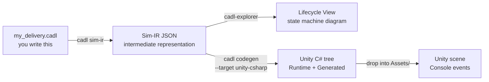
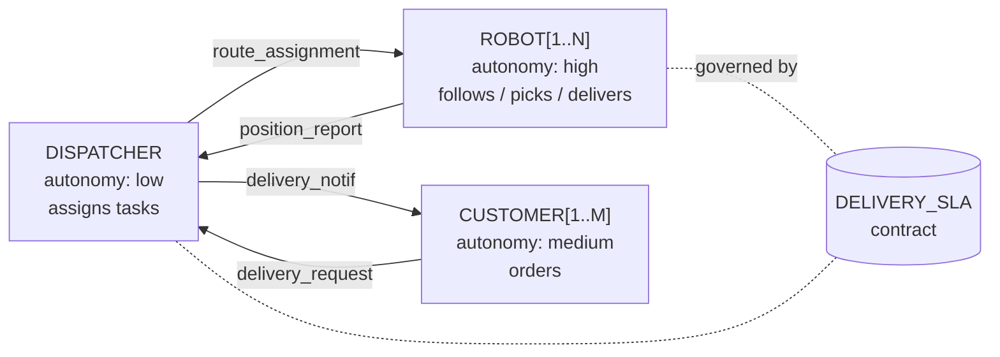
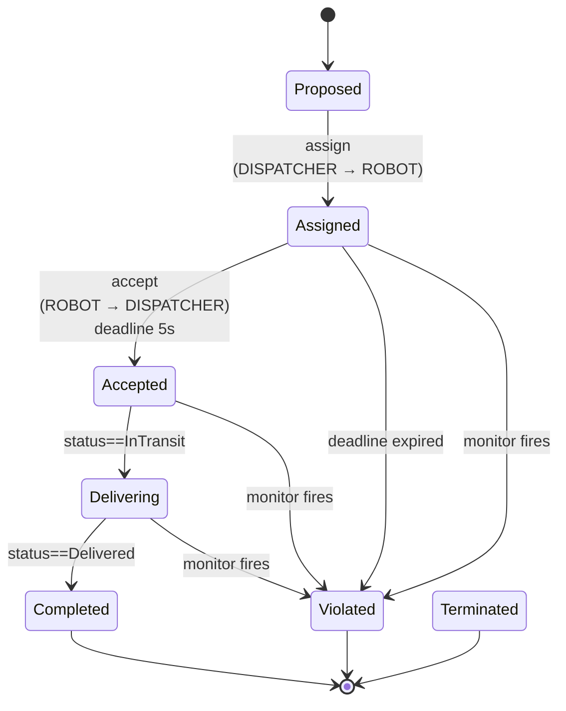

# Course A — Robot Delivery: Designing a System of Systems with CADL & SoS-DSL

> **Audience**: Undergraduates and beginning graduate students who have just been introduced to System of Systems (SoS) thinking. No CADL experience required.
>
> **Duration**: about 95 minutes — a 5-minute setup plus six 15-minute steps.
>
> **What you take home**: A working CADL specification you wrote yourself, a generated Unity C# implementation, and a running 5-robot delivery simulation in which missed deadlines and battery-rule violations are detected and the affected contract instances are moved to `Violated`.
>
> **First time here?** Read the [Architecture & Code Walkthrough](code-walkthrough.md) first — it shows which part of the system each Step touches.

---

## Why are we doing this?

A **System of Systems (SoS)** is a system whose parts are themselves independent, operationally autonomous systems — for example, a fleet of delivery robots, a central dispatcher, and the customers placing orders. The robot simulated in this hands-on is the **Raspberry Pi Mouse** ("raspimouse"), a small autonomous mobile robot — hence the simulator name `cadl-raspimouse-simulator`. (The physical robot runs on ROS; this hands-on is entirely simulator-based.) The parts have their own goals and their own software; the SoS designer's job is **not** to write all of their code, but to write the **rules of the game** they all follow: who can ask whom for what, what counts as a violation, what the consequences are.

Today you will learn three things:

1. **Describe the structure** of an SoS in CADL — who exists, who talks to whom.
2. **Describe the rules** of an SoS in the SoS-DSL extension ([Appendix E](../spec/appendix-e-sos-dsl.md)) — what each contract instance must do, by when, with what consequences for violations.
3. **Generate executable code** from a single specification, drop it into a Unity project, and watch the runtime detect violations of those rules in a running simulation.

## What makes a system an SoS?

A useful litmus test before declaring something "an SoS" is **Maier's five criteria** ([Maier, 1998]; the SoS taxonomy itself is standardised in **ISO/IEC/IEEE 21841:2019**):

| # | Criterion | Plain-English check |
| --- | --- | --- |
| 1 | Operational independence | Does each part work on its own when the SoS is "off"? |
| 2 | Managerial independence | Does each part have its own owner / decision-maker? |
| 3 | Geographic distribution | Are the parts spread out and exchanging information rather than energy or matter? |
| 4 | Emergent behaviour | Does the whole do things no individual part can? |
| 5 | Evolutionary development | Do parts get added, removed, modified over the SoS's lifetime? |

(1) and (2) are essentially mandatory. (3)–(5) usually accompany them.

**Applying it** — the robot delivery in this hands-on:

- ✓ (1) each robot can roam on its own even with no assignment.
- △ (2) all robots share a single dispatcher, so managerial independence is weak.
- ✓ (3) robots are distributed over a graph-shaped road network.
- ✓ (4) the collective delivery throughput is something no single robot can produce alone.
- △ (5) the robot count is fixed in this scenario, but the simulator itself supports changing it.

Because (2) is weak, this hands-on sits closer to a *parallel control problem* than to a textbook SoS. The CADL files nevertheless declare it `type: Acknowledged`: each robot is modelled as a constituent system that keeps its own control software and autonomy (`autonomy: high`) while recognising the dispatcher as the SoS-level authority for task assignment. A domain where managerial independence clearly holds (food delivery) is the recommended choice for **Part 2 of the exercises booklet**.

> 📚 For the full standards landscape (ISO/IEC/IEEE 21839 / 21840 / 21841 / 15288 / 42010), the four SoS taxonomy types, related research lines (ADLs, Normative MAS, Runtime Verification), and a curated reading list, see → [`academic-background.md`](academic-background.md).

---

## The big picture

You only need to write the leftmost box (a CADL file). Everything to its right is generated from it by the toolchain commands.

```
   ┌────────────────────────┐
   │  Your CADL source      │   ← You write this in Step 2 & 3
   │  my_delivery.cadl      │
   └──────────┬─────────────┘
              │
              │  cadl check    →  catch typos / type errors
              │  cadl sim-ir   →  emit a JSON Intermediate Representation (IR)
              │
              ▼
   ┌────────────────────────┐
   │  Sim-IR JSON           │
   │  (cadl-spec App. E.7)  │
   └─────┬──────────────┬───┘
         │              │
         │              └──────────────┐
         │  cadl-explorer              │  cadl codegen --target unity-csharp
         │  Lifecycle View             │
         ▼                             ▼
   ┌─────────────────┐       ┌─────────────────────────┐
   │  State machine  │       │  Unity C# tree          │
   │  diagram        │       │  Runtime/    Generated/ │
   └─────────────────┘       └────────────┬────────────┘
                                          │  drop into
                                          ▼
                             ┌──────────────────────────┐
                             │  Unity scene + arbitrator │
                             │  → live contract events   │
                             │  in the Console           │
                             └──────────────────────────┘
```



---

## Prerequisites

| Tool | Version | Why |
| --- | --- | --- |
| Python | 3.10+ | runs the `cadl` CLI |
| Unity | 6000.2.9f1 (Unity 6.2) | runs the simulation |
| Go | 1.21+ | builds the arbitrator |
| NATS Server | latest | message bus between robots ⇄ arbitrator |
| Node.js | 18+ | renders the spec website (optional) |

```bash
# macOS via Homebrew
brew install python@3.11 go nats-server node
# Unity is installed via Unity Hub.
```

---

## Step 0 — Setup (5 min)

### What you'll learn
- The repositories that make up the toolchain and which branch of each one to use.

### Background

The CADL toolchain is split across four repositories so each piece can evolve independently:

| Repository | Role | Branch to use |
| --- | --- | --- |
| `cadl-spec`            | the language reference and this hands-on site (Docusaurus) | `main` (default) |
| `cadl` (cloned as `cadl_repo`) | the compiler: parser, IR, code generators | `master` (default) |
| `cadl-explorer`        | a Streamlit visualiser | `main` (default) |
| `cadl-raspimouse-simulator` | the simulator used in Steps 5–6: Unity project, Go arbitrator and Python reference runtime in one repository | `main` (default) |

:::info[Repository availability]
`cadl-spec` (this specification and hands-on site), `cadl` (compiler / CLI), `cadl-explorer` (visualisation) and `cadl-raspimouse-simulator` (simulator) are public, so every step of Course A can be followed with public repositories. `mobility-sos-exercise`, used by Course B, is **not publicly available at present**.
:::

### Procedure

```bash
mkdir -p ~/program && cd ~/program

# 1) Clone the repositories.
#    cadl-spec, cadl and cadl-raspimouse-simulator stay on their default
#    branches (main / master / main).
git clone https://github.com/ertlnagoya/cadl-spec
git clone https://github.com/ertlnagoya/cadl                         cadl_repo
git clone https://github.com/ertlnagoya/cadl-explorer
git clone https://github.com/ertlnagoya/cadl-raspimouse-simulator

# 2) Install the cadl CLI in editable mode so changes are picked up.
cd ~/program/cadl_repo
python3 -m venv .venv && source .venv/bin/activate
pip install -e .
cd ~/program
```

### Expected output

```
$ cadl --help
usage: cadl [-h] [--version]
            {parse,check,verify,codegen,regime-map,iec62853,sim-validate,sim-ir,sim-gen,ai}
            ...

CADL: Contract Architecture Description Language toolchain

positional arguments:
  {parse,check,verify,codegen,regime-map,iec62853,sim-validate,sim-ir,sim-gen,ai}
                        Available commands
    parse               Parse a CADL file and report errors
    check               Parse and type-check a CADL file
    verify              Parse, type-check, and verify a CADL file
    codegen             Generate runtime code from a CADL file
    ...
```

### Check 0

If `cadl codegen --help` lists `unity-csharp` among the `--target` choices (`{python,solidity,opa,unity-csharp}`), your install is correct.

### Recap

After setup you can see that CADL is really four cooperating repositories — the spec site, the compiler, the visualizer, and the simulator. Everything that follows assumes **each repository is on the branch listed in the table above** (`main` everywhere, and `master` for `cadl_repo`); most trouble at this stage comes from a wrong branch.

### 🛠 Setup troubleshooting

**Check your branches (the most common pitfall).** All four repositories are used on their default branches: `main`, and `master` for `cadl_repo`. If a page or a command described here is missing, first check that you have not switched to an older branch. Verify:

```bash
cd ~/program
echo "cadl-spec:     $(git -C cadl-spec branch --show-current)"       # main
echo "cadl_repo:     $(git -C cadl_repo branch --show-current)"       # master
echo "cadl-explorer: $(git -C cadl-explorer branch --show-current)"   # main
echo "simulator:     $(git -C cadl-raspimouse-simulator branch --show-current)"   # main
```

For any repository on the wrong branch, switch with `git -C ~/program/<repo> checkout <branch>`.

---

## Step 1 — Read the CADL spec (15 min)

### What you'll learn
- Where in the spec the **structure layer** (actors / contracts / protocols) is described.
- Where in the spec the **norms layer** (Appendix E lifecycle / monitors) lives.

### Background

A specification language has two jobs in an SoS context:

1. **Descriptive** — *what exists*. The actors, the connections, the messages they exchange.
2. **Normative** — *what should happen*. Which obligations, which deadlines, which violations.

CADL covers (1) directly in its main grammar (Appendix A). The SoS-DSL extension ([Appendix E](../spec/appendix-e-sos-dsl.md)) adds (2) on top of (1) — same syntax family, just two new body keys: `lifecycle:` and `monitors:`.

### Procedure

```bash
cd ~/program/cadl-spec
npm install
npm run start
# Browser opens at http://localhost:3000
```

Read these chapters in order; the time guide is what we recommend so you stay within the 15-minute budget.

| Chapter | What it answers | Time |
| --- | --- | --- |
| 1. Introduction | What is CADL for? | 2 min |
| 5. Language Specification | How do I write actors / contracts / protocols? | 5 min |
| **[Appendix E](../spec/appendix-e-sos-dsl.md) (today's main)** | **How do I write a contract lifecycle and monitors?** | **6 min** |
| 7. Examples | What does a complete file look like? | 2 min |

### Expected output

Section E.6 of [Appendix E](../spec/appendix-e-sos-dsl.md) shows the robot-delivery example. The block below is an abridged version of it (one transition and one monitor only). Read it carefully — Step 3 will ask you to write something very similar.

```yaml
contracts:
  - id: DELIVERY_SLA
    parties: [DISPATCHER, "ROBOT[*]", "CUSTOMER[*]"]
    assume:
      - "ROBOT[i].battery > 20"
    guarantee:
      - "delivery_time <= 300s"

    lifecycle:
      states: [Proposed, Assigned, Accepted, Delivering, Completed, Violated, Terminated]
      initial: Proposed
      terminal: [Completed, Violated, Terminated]
      transitions:
        - id: accept
          from: Assigned
          to:   Accepted
          on:   "ROBOT[i] -> DISPATCHER : ack(accepted)"
          deadline: 5s
          on_violation:
            transition: Violated
            severity:   Major

    monitors:
      - id: battery_guard
        observe: "ROBOT[i].battery"
        sampling: periodic(500ms)
        rule: "ROBOT[i].battery < 20 AND state == Assigned"
        on_match:
          transition: Violated
          severity:   Major
```

### Check 1

Without scrolling, can you answer these three questions out loud?

1. What is the **initial state** of a delivery contract? → *Proposed*
2. If a robot does not ack within **5 seconds**, what happens? → *It is forced to transition to `Violated` with severity `Major`*
3. Which monitor fires when battery drops below 20% **while still Assigned**? → *`battery_guard`*

If you got all three, you understand the spec well enough to start writing.

### Recap

Having read the spec, you can place its two layers — the **structural** layer (what exists) and the **normative** layer (what must hold) — and say where each one lives. For the delivery contract you now know the key rules: the initial state is `Proposed`, a missing ack within 5 s forces a `Major` jump to `Violated`, and a low battery while `Assigned` trips `battery_guard`. With that map in hand you are ready to start writing in Step 2.

---

## Step 2 — Write CADL for Robot Delivery (15 min)

### What you'll learn
- How to declare actors with `id`, `role`, `autonomy`, `interface`.
- How to declare a contract's parties, A/G clauses (`assume` / `guarantee`), incentives.

### Background

Think of a CADL `actors:` block as a UML class diagram for the SoS — each actor type has ports (`interface.input` / `interface.output`) and a degree of self-direction (`autonomy: low | medium | high`). The `contracts:` block is the *agreement* between named subsets of those actors.



### Procedure

Create a new file `my_delivery.cadl` in the root of `cadl_repo` (that is, `~/program/cadl_repo/my_delivery.cadl`; the bundled example it resembles is `examples/sos_dsl_robot_delivery.cadl`), and paste the skeleton below. The commands in Steps 2–4 are run from `~/program/cadl_repo`. Read the comments — they explain what each block does.

```yaml
# my_delivery.cadl ─── My first SoS specification
# (this file just describes structure; norms come in Step 3)

sos:
  name: "MyDelivery"
  type: Acknowledged           # central authority + autonomous agents
  version: "0.1.0"

  context:
    environment:
      grid_size:    30                         # abstract parameter (not the Unity road graph)
      num_robots:    3
      time_step_ms: 100

  # ── WHO exists in the SoS ─────────────────────────────────────
  actors:
    - id: DISPATCHER
      role: "central_coordinator"
      autonomy: low                            # follows policy, no roaming
      capabilities: [assign_tasks]
      interface:
        input:  [position_report, task_completion]
        output: [route_assignment]

    - id: "ROBOT[1..N]"                        # parametric: N copies
      role: "delivery_agent"
      autonomy: high
      capabilities: [follow_path, pick_up, deliver]
      interface:
        input:  [route_assignment]
        output: [position_report, task_completion]

    - id: "CUSTOMER[1..M]"
      role: "service_requester"
      autonomy: medium
      capabilities: [submit_order]
      interface:
        input:  [delivery_notification]
        output: [delivery_request]

  # ── The agreement between them ────────────────────────────────
  contracts:
    - id: DELIVERY_SLA
      parties: [DISPATCHER, "ROBOT[*]", "CUSTOMER[*]"]
      assume:
        - "ROBOT[i].battery > 20"              # input precondition
      guarantee:
        - "delivery_time <= 300s"              # output postcondition
      incentives:
        type: task_completion
        lambda: 0.5
        rules:
          - "reward(ROBOT[i], 10) when on_time_delivery"
```

Run the type-checker:

```bash
cd ~/program/cadl_repo
cadl check my_delivery.cadl
```

### Expected output

```
$ cadl check my_delivery.cadl
Type check passed: my_delivery.cadl
```

Now lower it to IR JSON and look at the first 30 lines:

```bash
cadl sim-ir my_delivery.cadl --format json | head -30
```

```jsonc
{
  "name": "MyDelivery",
  "sos_type": "Acknowledged",
  "description": "",
  "environment": {
    "grid_size":    30,
    "num_robots":    3,
    "time_step_ms": 100
  },
  "institution": {
    "actors": [ ... ],
    "contracts": [
      {
        "id": "DELIVERY_SLA",
        "parties": ["DISPATCHER", "ROBOT[*]", "CUSTOMER[*]"],
        "assume":   ["ROBOT[i].battery > 20"],
        "guarantee":["delivery_time <= 300s"],
        ...
        "lifecycle": null,           ← we have NOT written it yet
        "monitors":  []
      }
    ]
  },
```

### Check 2

Verify both:

1. `cadl check my_delivery.cadl` prints `Type check passed: my_delivery.cadl` (and no `[ERROR]` lines).
2. The IR JSON has `"lifecycle": null` and `"monitors": []`.

These two `null` / `[]` are **the gap we will fill in Step 3** — they are why the structure-only specification cannot say "the robot must ack within 5 seconds".

### Common mistakes

| Symptom | Cause |
| --- | --- |
| `YAML parse error: while parsing a flow sequence` | You wrote a subscripted identifier without quoting, e.g. `[ROBOT[i].battery, ...]`. Quote it: `["ROBOT[i].battery", ...]`. |
| `Unknown SoS type: 'Centralized'` | CADL accepts only `Directed` / `Acknowledged` / `Collaborative` / `Virtual`. |
| `Type check failed: actor 'CUSTOMER' not declared` | You used `CUSTOMER` somewhere but only declared `CUSTOMER[1..M]`. Use `"CUSTOMER[*]"` to refer to all customers. |

### Recap

You now have a CADL file that describes the **structure** of your SoS. It compiles, it lowers to IR, and the IR confirms there is exactly one contract called `DELIVERY_SLA`. Next we add the norms that let a runtime check that contract.

---

## Step 3 — Add SoS-DSL contracts (lifecycle + monitors) (15 min)

### What you'll learn
- The seven **lifecycle states** a contract instance can occupy.
- How to write a `deadline` + `on_violation` that puts a time bound on a transition and says where the instance goes when the bound is missed.
- How to write a periodic `monitor` with a predicate over the world snapshot.

### Background

A class-level contract spec (Step 2) describes the **agreement**, but a real SoS has **many concurrent instances** of that agreement — one per delivery request. Each instance has its own state that progresses over time:



The **same lifecycle** is reused for every delivery request — only the data (which robot, which customer) differs.

### Procedure

First declare, near the top of `my_delivery.cadl`, that the file uses the SoS-DSL extension. [Appendix E](../spec/appendix-e-sos-dsl.md) asks for this declaration (SHOULD), and the bundled example has it:

```yaml
sos:
  name: "MyDelivery"
  type: Acknowledged           # central authority + autonomous agents
  version: "0.1.0"
  extensions:                  # ← NEW: this file uses the SoS-DSL extension
    - sos-dsl: 0.1
```

Then append the two highlighted blocks below to the `DELIVERY_SLA` contract. Indentation matters (YAML).

```yaml
  contracts:
    - id: DELIVERY_SLA
      parties: [DISPATCHER, "ROBOT[*]", "CUSTOMER[*]"]
      assume:
        - "ROBOT[i].battery > 20"
      guarantee:
        - "delivery_time <= 300s"
      incentives:
        type: task_completion
        lambda: 0.5
        rules:
          - "reward(ROBOT[i], 10) when on_time_delivery"

      # ╔═══════════════════════════════════════════════════════════════╗
      # ║  NEW BLOCK 1: per-instance lifecycle                          ║
      # ╚═══════════════════════════════════════════════════════════════╝
      lifecycle:
        states:
          - Proposed
          - Assigned
          - Accepted
          - Delivering
          - Completed
          - Violated
          - Terminated
        initial: Proposed
        terminal: [Completed, Violated, Terminated]
        transitions:
          - id: assign
            from: Proposed
            to:   Assigned
            on:   "DISPATCHER -> ROBOT[i] : route_assignment"

          - id: accept
            from: Assigned
            to:   Accepted
            on:   "ROBOT[i] -> DISPATCHER : ack(accepted)"
            deadline: 5s                           # ⏱  must happen within 5s
            on_violation:                          # otherwise → Violated
              transition: Violated
              severity:   Major

          - id: start_delivery
            from: Accepted
            to:   Delivering
            on:   "ROBOT[i].status == InTransit"

          - id: complete
            from: Delivering
            to:   Completed
            on:   "ROBOT[i].status == Delivered"

      # ╔═══════════════════════════════════════════════════════════════╗
      # ║  NEW BLOCK 2: declarative monitors                            ║
      # ╚═══════════════════════════════════════════════════════════════╝
      monitors:
        - id: battery_guard
          observe: "ROBOT[i].battery"
          sampling: periodic(500ms)
          rule: "ROBOT[i].battery < 20 AND state == Assigned"
          on_match:
            transition: Violated
            severity:   Major
```

Re-run the type-checker:

```bash
cadl check my_delivery.cadl
```

### Expected output

```
$ cadl check my_delivery.cadl
Type check passed: my_delivery.cadl
```

Lower to IR and verify the new fields are populated:

```bash
cadl sim-ir my_delivery.cadl --format json \
  | python3 -c "
import json, sys
d = json.load(sys.stdin)
c = d['institution']['contracts'][0]
print(f'lifecycle.initial : {c[\"lifecycle\"][\"initial\"]}')
print(f'lifecycle.states  : {c[\"lifecycle\"][\"states\"]}')
print(f'monitors[0].id    : {c[\"monitors\"][0][\"id\"]}')
print(f'  rule            : {c[\"monitors\"][0][\"rule\"]}')
"
```

```
lifecycle.initial : Proposed
lifecycle.states  : ['Proposed', 'Assigned', 'Accepted', 'Delivering', 'Completed', 'Violated', 'Terminated']
monitors[0].id    : battery_guard
  rule            : ROBOT[i].battery < 20 AND state == Assigned
```

### Check 3

1. The diff between Step 2 and Step 3 is **only the `extensions:` declaration and the two new blocks**. No actor changed.
2. The IR's `"lifecycle": null` is now a populated object; `"monitors": []` is now a 1-element list.

### Common mistakes

| Symptom | Why |
| --- | --- |
| `KeyError: 'states'` after a copy-paste | The `lifecycle:` block has wrong indentation. It must sit at the same level as `assume:` / `guarantee:`. |
| Parser silently treats `on:` as a boolean | YAML 1.1 quirk; the example file works because the parser has a workaround (`_yaml_on_key`). If you're writing your own parser, watch for this. |
| `monitor.rule` "always false" | The right-hand side of `state == Assigned` is a **bare identifier** by CADL convention. Quoting `"Assigned"` changes the meaning. |

### Recap

The same file now describes both the structure (Step 2) and the rules (Step 3). The IR is no longer "structural-only" — it carries enough information to build a runtime.

---

## Step 4 — Visualise the lifecycle (15 min)

### What you'll learn
- How to read the Lifecycle View page of cadl-explorer.
- How visual conventions (double circle, dashed border, red edge) map to the spec.

### Procedure

```bash
cd ~/program/cadl-explorer
pip install -r requirements.txt
streamlit run app.py
# Browser opens at http://localhost:8501
```

In the sidebar, switch from the default page (**app**) to **SoS DSL Lifecycle**. (If the sidebar has no such page, your checkout of `cadl-explorer` is out of date; run `git pull` on `main`.)

Two ways to load IR JSON:

- **(a) Upload** the IR of your own file. Save it first with `cadl sim-ir my_delivery.cadl --format json > my_delivery.ir.json` (run in `~/program/cadl_repo`), then drag-and-drop `my_delivery.ir.json` into the file uploader.
- **(b) Pick the bundled example** `sos_dsl_robot_delivery.ir.json` from the dropdown.

### What you should see

The screenshot below shows the page with **(b), the bundled example**: the sidebar with the uploader and the example selector on the left, the lifecycle diagram in the middle, and the lifecycle metadata on the right.


The diagram itself, enlarged (bundled example: 5 transitions; the red dashed edge is the forced move to `Violated` when the `accept` deadline expires):


Below the diagram, the page lists the monitors of the contract:


The sketch below reflects **(a), `my_delivery.cadl`** (4 transitions, 1 monitor). If you instead load **(b), the bundled example `sos_dsl_robot_delivery.cadl`**, you'll see 5 transitions (it adds `late_failure`) and 3 monitors (`battery_guard` / `collision_watch` / `deadline_watch`).

The page is split into two columns:

```
┌──────────────────────────────────┬──────────────────────────────┐
│ Lifecycle — DELIVERY_SLA          │  Lifecycle metadata          │
│                                   │                               │
│   ┏━━━━━━━━━━┓                    │  states          : 7         │
│   ┃ Proposed ┃ ←initial(double)   │  initial         : Proposed  │
│   ┗━━━━┳━━━━━┛                    │  terminal        : 3         │
│        │ assign                   │  transition_count: 4         │
│        ▼                          │                               │
│   ┌──Assigned──┐                  │                               │
│   │            │ accept Δ 5s      │                               │
│   │            ▼                  │                               │
│   │       ┌Accepted┐              │                               │
│   │       └────┬───┘              │                               │
│   │ violation  │                  │                               │
│   │  (red dash)│ start_delivery   │                               │
│   ▼            ▼                  │                               │
│ ╔Violated╗ ┌Delivering┐           │                               │
│ ╚════════╝ └────┬─────┘           │                               │
│ (red, dashed)   │ complete         │                               │
│                 ▼                  │                               │
│             ╔Completed╗            │                               │
│             ╚═════════╝            │                               │
│             (green, dashed)        │                               │
└──────────────────────────────────┴──────────────────────────────┘

┌─────────────────────────────────────────────────────────────────┐
│ Monitors                                                          │
├──────────────┬──────────────────────┬─────────────┬──────────────┤
│ id           │ sampling             │ on_match    │ severity     │
├──────────────┼──────────────────────┼─────────────┼──────────────┤
│ battery_guard│ periodic(500ms)      │ Violated    │ Major        │
└──────────────┴──────────────────────┴─────────────┴──────────────┘
```

Visual conventions:

| Element | Meaning |
| --- | --- |
| Double circle | `lifecycle.initial` |
| Dashed box, green fill | terminal state `Completed` |
| Dashed box, red fill | terminal state `Violated` |
| Dashed box, grey fill | terminal state `Terminated` |
| Solid edge, label `Δ 5s` | transition with `deadline_ms = 5000` |
| **Red dashed edge** with label `violation Major` | the forced move to the `on_violation` target state |

### Check 4

Take a screenshot of your lifecycle (or just look carefully) and confirm:

- The **only** double-circle node is `Proposed`.
- There is exactly one **red dashed edge** going from `Assigned` to `Violated`. That is the forced move to `Violated` when the `accept` deadline expires.
- The monitors table shows `battery_guard` with sampling `periodic(500ms)` and severity `Major`.

### Recap

The diagram is generated **directly from the IR JSON** with zero hand-coding. If you change `deadline: 5s` to `deadline: 10s` in your CADL file, regenerate the IR, refresh the page — the edge label will read `Δ 10s`.

---

## Step 5 — Generate Unity C# (15 min)

### What you'll learn
- How a single CLI command turns your CADL into a Unity-ready C# tree.
- Why there are **two** runtimes with the **same semantics**: a Python reference runtime that interprets the IR, and the generated C#.

### Procedure

The repo provides a single end-to-end script. Run it:

```bash
cd ~/program/cadl_repo
./scripts/sos_dsl_handson_e2e.sh \
    examples/sos_dsl_robot_delivery.cadl \
    --unity ../cadl-raspimouse-simulator/unity
```

> Without the simulator repository you can still run the pipeline up to code generation: pass `--unity ""` and the script stops after generating the C# tree under `output/sos_dsl_handson/`.
>
> Replace the input with `my_delivery.cadl` if you want to use your own specification — note that your file will need a `lifecycle.transitions[*].on:` matching the bridge's event names, so for the very first run we recommend the bundled example.

### Expected output

```
$ ./scripts/sos_dsl_handson_e2e.sh examples/sos_dsl_robot_delivery.cadl \
      --unity ../cadl-raspimouse-simulator/unity

== INPUT ==
  source : .../examples/sos_dsl_robot_delivery.cadl
  size   : 153 lines

== Step 1/4 — parse + type-check (cadl check) ==
  OK

== Step 2/4 — emit Sim-IR JSON (cadl sim-ir) ==
  output/sos_dsl_handson/sos_dsl_robot_delivery.ir.json
  contracts : 1
  states    : 7
  monitors  : 3

== Step 3/4 — codegen Unity C# (cadl codegen --target unity-csharp) ==
  output    : output/sos_dsl_handson/unity-csharp
  runtime   : 5 files
  generated : 3 files
  total lines : 770

== Step 4/4 — drop into ../cadl-raspimouse-simulator/unity/Assets/Scripts/SoSDsl/ ==
  installed : .../Runtime, .../Generated
  preserved : .../Demo (if it existed)

== DONE ==
Next steps for the student:
  1. Open the Unity project at .../unity in Unity 6 (6000.2)
  2. Open Assets/Scenes/C-SoS.unity
  3. Add a ContractRuntimeHost GameObject
  4. Attach PilotContractBridge to each robot that has Pilot_CSoS
  5. Press Play and watch the Console
```

Look at the generated tree:

```
output/sos_dsl_handson/unity-csharp/
├── Runtime/                          # constant per generation, common to all contracts
│   ├── Severity.cs                   # enum Minor / Major / Critical
│   ├── ContractEvent.cs              # struct used for both lifecycle & violation events
│   ├── EventBus.cs                   # tiny FIFO publish-subscribe
│   ├── PredicateEvaluator.cs         # CADL expression evaluator (mirrors the Python one)
│   └── ContractRuntime.cs            # registry + tick loop
└── Generated/                        # one set of files per CADL contract
    ├── DeliverySlaState.cs           # public enum DeliverySlaState { Proposed, Assigned, ... }
    ├── DeliverySlaContract.cs        # IContractInstance impl for DELIVERY_SLA
    └── DeliverySlaMonitors.cs        # one Eval_xxx method per monitor
```

After the script has run, the generated files are in the Unity project. Open the project in Unity (Step 6.2 describes how) and look at the Project window: they appear under `Assets/Scripts/SoSDsl/Generated`. Selecting `DeliverySlaContract` shows the generated C# in the Inspector (you do not edit this file; it is overwritten every time you regenerate):


### Why two runtimes?

The same IR drives both, in different ways. The Python reference runtime (`cadl/runtime/engine.py` in the simulator repository) is a hand-written **interpreter** that loads the IR JSON when it starts; the C# contract classes are **generated** from the IR by `cadl codegen`:

```
                             ┌──────────────────────┐
                             │ multi_robot_demo.py  │ ← run today as Python
                             │ (Python runtime)     │
                             │                      │
                  ┌──────────┘                      │
   IR JSON ──────►│                                 │
                  └──────────┐                      │
                             │ DeliverySlaContract  │ ← run later in Unity
                             │ (Unity / C#)         │
                             └──────────────────────┘
```

If both runtimes are correct, they must produce **the same trace** for the same inputs. We can sanity-check this without Unity:

```bash
cd ~/program/cadl-raspimouse-simulator
python3 -m cadl.runtime.multi_robot_demo --summary
```

```
$ python3 -m cadl.runtime.multi_robot_demo --summary
# multi_robot_demo summary (20 events)
  robot-0-1     state=Completed     violations=[(none)]
  robot-1-1     state=Violated      violations=[deadline:accept]
  robot-2-1     state=Violated      violations=[monitor:battery_guard]
  robot-3-1     state=Violated      violations=[monitor:deadline_watch]
  robot-4-1     state=Proposed      violations=[(none)]
```

Five robots, five different outcomes. This is a **scripted Python scenario**, built so that every outcome a contract can reach (normal completion, deadline violation, monitor violation, still unassigned) is visible in a single run.

The Unity run in Step 6 assigns deliveries at different times and gives the robots different battery settings, so **these five rows will not be reproduced as-is** (in Unity, typically the one robot whose battery you lowered violates via `battery_guard` while the rest progress to `Completed`). What you should be matching is not the per-robot outcomes but the **mechanism** — that the same lifecycle transitions, `deadline`, and `monitor` behave with the same meaning.

> #### 🛠 Troubleshooting: `multi_robot_demo` not found
>
> Run the command **from the root of `cadl-raspimouse-simulator`**. Python finds `cadl.runtime` relative to the current directory; from anywhere else it finds only the `cadl` compiler package, which has no `runtime` module, and reports `No module named cadl.runtime`.
>
> ```bash
> cd ~/program/cadl-raspimouse-simulator
> git pull                      # make sure the checkout is current
> python3 -m cadl.runtime.multi_robot_demo --summary
> ```
>
> To look at one contract instance at a time, `demo_delivery` exercises the same three mechanisms (happy path, deadline violation, monitor violation) on one contract instance (its output is for a single contract, so its shape differs from the 5-robot table above):
>
> ```bash
> PYTHONPATH=. python3 -m cadl.runtime.demo_delivery --scenario happy     # accepted, stops at Accepted
> PYTHONPATH=. python3 -m cadl.runtime.demo_delivery --scenario late      # 5s deadline missed -> Violated via deadline:accept
> PYTHONPATH=. python3 -m cadl.runtime.demo_delivery --scenario battery   # battery drops -> Violated via monitor:battery_guard
> ```

### Check 5

```bash
cd ~/program/cadl_repo
PYTHONPATH=src python3 -m pytest tests/test_unity_csharp_structural.py -q
# 9 passed
```

These nine tests catch the structural bugs that would prevent Unity from compiling the generated C# (mismatched braces, missing namespaces, name collisions, etc.). If they fail, the codegen has a regression.

### Recap

You now have:

- A 245-line Sim-IR JSON (for the bundled example).
- A 770-line Unity-ready C# tree, dropped into the Unity project.
- A Python proof-of-concept showing what the C# trace **must** look like once it runs.

----

## Step 6 — Run the simulation in Unity (15 min)

### What you'll learn
- How to wire `ContractRuntimeHost` and `PilotContractBridge` into an existing scene.
- How to read live contract events in the Unity Console.

### 6.1 Start NATS and the arbitrator

In **two** separate terminals:

```bash
# Terminal 1 — NATS message broker
nats-server -p 4222
```

```
[INFO] Starting nats-server
[INFO] Server is ready
[INFO] Listening for client connections on 0.0.0.0:4222
```

```bash
# Terminal 2 — C-SoS arbitrator (Go)
cd ~/program/cadl-raspimouse-simulator/arbitrator/C-SoS/main
go run main.go
```

```
[Config] Loaded from ../../../unity/Assets/streamingAssets/cadl_config.json: nats_url=nats://localhost:4222 numAgents=5
[Config]   init=init next=next ret=ret fin=fin disp=disp resource=resource
[Config]   taskArbitration.enabled=true protocol=fcfs intervalSec=1.0
```

If that third line reads `taskArbitration.enabled=true`, the arbitrator has loaded its configuration and is ready to start handing out deliveries. If it says `false`, or the `[Config]` lines do not appear at all, the config file was not read — pass its absolute path with `-config` as shown in the note below.

> #### 🛠 Restart the arbitrator before every Play (important)
>
> The Go arbitrator initializes robot count and delivery state **once at startup** and does **not** reset when you stop and re-enter Play in Unity. It keeps the previous session's "busy / assigned" state and stops broadcasting new deliveries, so **all robots stay `Proposed` and get `Violated` by `deadline_watch` after ~5 minutes**. **Restart the Terminal-2 arbitrator (`Ctrl+C`, then re-run) before every Play** (restart NATS too if unsure). Start order is always **NATS → arbitrator → Unity Play**.
>
> Pass the config as an **absolute path** to be safe (the default is relative and depends on the launch directory):
>
> ```bash
> cd ~/program/cadl-raspimouse-simulator/arbitrator/C-SoS/main
> go run main.go -config ~/program/cadl-raspimouse-simulator/unity/Assets/streamingAssets/cadl_config.json
> ```
>
> If `[Config] … taskArbitration.enabled=true …` prints at startup, the config loaded correctly.

### 6.2 Open the C-SoS scene

1. Launch Unity Hub. Open `~/program/cadl-raspimouse-simulator/unity` with **Unity 6000.2.9f1 (Unity 6.2)**.
2. First open takes several minutes (package download and Library import).
3. In the Project pane, double-click `Assets/Scenes/C-SoS.unity`.

You should see a road network (graph) made of **11 nodes and 17 edges**, with **five** robots — Red / Blue / Green / Yellow / Purple — driving on it. The node count, edge count, and robot count are all loaded from `Assets/streamingAssets/cadl_config.json`, so the Console also prints `[GraphDefinition] Loaded from CADL config: 11 nodes, 17 edges`. (The `grid_size: 30` under `context.environment` in the CADL file is an abstract environment parameter that is carried into the IR; the Unity scene does not read it — its road graph is the one defined in `cadl_config.json`.)


If the road looks small in the Scene view, select `road` in the Hierarchy, move the mouse over the Scene view and press `F` to frame it. Watch the robots in the **Scene** view: in this project the camera of the **Game** view does not point at the road.

> #### 🛠 Mind the Unity version
>
> The project is saved with **Unity 6000.2.9f1** (recorded in `ProjectSettings/ProjectVersion.txt`), and this course is checked with that version. Install it from Unity Hub; when you add the project, Unity Hub offers to install the matching Editor if it is missing.
>
> Do not open the project with Unity 2022.3 or older: `Packages/manifest.json` lists packages that exist only in Unity 6. A newer Unity 6 release will ask to upgrade the project on first open; that has not been checked for this course.

### 6.3 Add ContractRuntimeHost (one per scene)

```
Hierarchy ▸ Right-click ▸ Create Empty
Rename it to:        ContractRuntimeHost
Inspector ▸ Add Component ▸ search "ContractRuntimeHost" ▸ select  CADL.SosDsl.Demo.ContractRuntimeHost
```

Inspector:

```
Contract Runtime Host (Script)
└── Logging
    └── Log To Console   ☑  (leave checked)
```


### 6.4 Add PilotContractBridge to every robot

In the Hierarchy search box type `Pilot_CSoS`. Five robots will be filtered.

For each one:

```
Inspector ▸ Add Component ▸ "PilotContractBridge"   (CADL.SosDsl.Demo.PilotContractBridge)
```

The Inspector now shows:

```
Pilot Contract Bridge (Script)
└── World keys (must match the contract's predicates)
    ├── Robot Battery       [───────●───] 90
    ├── Request Deadline Ms              300000
    └── Assigned Dwell Ms                700
```

> `Assigned Dwell Ms` is the minimum time the contract dwells in `Assigned` before accepting. It gives periodic monitors gated on that state (e.g. `battery_guard`, sampled every 500 ms) at least one evaluation window. Leave it at the default 700 ms — setting it below the monitor period would make violations undetectable.

For one of the five robots, drag the Battery slider down to **15** so the `battery_guard` monitor will fire on that robot.

The Editor then looks like this, with the robot `m2` selected and its `Pilot Contract Bridge` component at the bottom of the Inspector (Robot Battery 15):


Save the scene (`Cmd+S` / `Ctrl+S`).

### 6.5 Press Play

Click ▶ at the top of the Editor.

### What you should see

In the Console, lines like the following should appear continuously. You can filter them by typing `lifecycle DELIVERY_SLA` or `violation` in the Console search box.


The screenshot was taken a few seconds into Play, with `DELIVERY_SLA` typed in the Console search box and the Scene tab selected.

A closer look at the road during the same run, with the five robots on their way:


```
[lifecycle DELIVERY_SLA/robot-0-1 Proposed -> Assigned     (assign,        event)   @ 1234ms]
[lifecycle DELIVERY_SLA/robot-0-1 Assigned -> Accepted     (accept,        event)   @ 1934ms]
[lifecycle DELIVERY_SLA/robot-0-1 Accepted -> Delivering   (start_delivery,event)   @ 1980ms]
[lifecycle DELIVERY_SLA/robot-0-1 Delivering-> Completed   (complete,      event)   @ 8341ms]

[lifecycle DELIVERY_SLA/robot-2-1 Proposed -> Assigned     (assign,        event)   @ 2050ms]
[violation DELIVERY_SLA/robot-2-1 battery_guard Major monitor:battery_guard         @ 2150ms]
[lifecycle DELIVERY_SLA/robot-2-1 Assigned -> Violated     (<jump>,        monitor) @ 2150ms]
```

Note the 700 ms between `assign` and `accept` for `robot-0-1`: that is the `Assigned Dwell Ms` set in 6.4.

### Check 6

Confirm all of these:

| Check | Expected |
| --- | --- |
| There are `[lifecycle ... robot-{id}-1 ...]` events for **all five robots** | Yes |
| The robot with battery 15 has a `monitor:battery_guard` violation | Yes |
| Every robot's first transition is `Proposed -> Assigned` | Yes |
| Each robot gets from `Proposed` to `Assigned` within roughly 10 seconds (not instantly — there is a claim delay) | Yes |
| The **same kinds of events** as Step 5's Python run (lifecycle transitions, violations) appear with the same meaning | Yes |

### Common mistakes

| Symptom | Fix |
| --- | --- |
| Console: `[PilotContractBridge X] ContractRuntimeHost.Instance is null` | You forgot to place the host. Redo Step 6.3. |
| Console silent — no contract events at all | NATS or arbitrator not running. Check that Terminal 1 shows `Server is ready` and Terminal 2 shows the `[Config] … taskArbitration.enabled=true …` line. |
| No delivery is ever assigned (no `WON delivery` in the Console) | The arbitrator probably did not load its config. Restart it passing the **absolute path** of `cadl_config.json` via `-config`, and confirm `taskArbitration.enabled=true` in its startup output (the shipped config already has it `true`). |
| Compile error in Console after Play: `The name 'CADL.SosDsl.Demo.ContractRuntimeHost' could not be found` | Generated/Runtime files not picked up. Re-run the e2e script. Or in Unity, `Assets ▸ Reimport All`. |
| **All robots stay `Proposed`, then get `Violated` by `deadline_watch` (~5 min)** | The arbitrator carried over state from the previous Play (no deliveries offered). Stop Play, **restart the arbitrator** (and NATS if unsure), then replay. It must be restarted **before every Play** (see the note in 6.1). |
| **Compile error `... already contains a definition for ...` with paths under `Generated/Generated/…` or `Runtime/Runtime/…`** | The generated tree was copied nested (duplicated). Delete `Assets/Scripts/SoSDsl/Generated/Generated` and `Runtime/Runtime` (the current e2e script self-heals this). |
| **The battery=15 robot also completes instead of violating** | The bridge fired `assign` and `accept` in the same frame, so the contract never dwells in `Assigned` long enough for the periodic `battery_guard` to sample. The shipped `PilotContractBridge` fixes this via `assignedDwellMs` (default 700 ms); if you replace the bridge, keep it above the monitor period. |

### Recap

You have just witnessed the **end-to-end story of an SoS contract**: written in CADL, lowered to IR, generated to C#, executed in a real-time simulation, and observed detecting missed deadlines and battery-rule violations and moving the affected contract instances to `Violated`. (The runtime detects and records violations; it does not prevent the robots from misbehaving.)

---

## Wrap-up — What did we just learn?

| Layer | We wrote | We didn't write |
| --- | --- | --- |
| Spec | a CADL file of about 100 lines (Steps 2 & 3) | nothing — the spec was the only source |
| IR | nothing | generated JSON (245 lines for the bundled example) |
| Visualisation | nothing | the Lifecycle View page |
| Implementation | nothing | generated Unity C# (770 lines for the bundled example) |
| Runtime semantics | nothing | a working state machine + monitors + deadline timers |

Why does this matter for SoS? **The same specification powers everything**: the docs, the diagram, the simulation, the code. When the specification changes — say, you tighten the deadline from 5s to 3s — you edit one file and re-run the generation commands (`cadl sim-ir`, `cadl codegen`, or the e2e script); the IR, the diagram and the generated C# then all follow from that single source, with no second copy of the rule to edit by hand. Keeping one source for all of them helps keep a large SoS design maintainable.

---

## What's next?

The hands-on ends here, but the practice exercises continue in a separate booklet:

→ **[`exercises.md`](exercises.md)**

It has two parts:

- **Part 1 — Robot Delivery course**: 5 sessions with 19 exercises in total (graded ★ to ★★★), plus one optional advanced exercise. They rebuild and then modify the system you just built one axis at a time — tighter deadlines, new monitors, new lifecycle states, reward execution, a violation-trace view.
- **Part 2 — Modelling a new SoS end-to-end (Course C)**: an open-ended, self-directed track given as an outline. Pick a *different* domain (food delivery, smart traffic, data sharing between organisations, …), write its CADL from a blank page, exercise it with a small simulation harness of your choice (a Python discrete-event harness such as SimPy is the suggested default), and compare results across parameter sweeps.

Pick whichever fits your goal: solidifying what you learned (Part 1) or trying the workflow on a fresh problem (Part 2).

---

## Reference

| Topic | File |
| --- | --- |
| Language reference | `cadl-spec/docs/spec/` ([Appendix E](../spec/appendix-e-sos-dsl.md) for today's content) |
| Parser implementation | `cadl_repo/src/cadl/parser.py` |
| IR | `cadl_repo/src/cadl/sim/ir.py`, `cadl_repo/src/cadl/sim/lower.py` |
| Unity C# generator | `cadl_repo/src/cadl/codegen/unity_csharp/` |
| Python reference runtime | `cadl-raspimouse-simulator/cadl/runtime/` |
| Lifecycle visualiser | `cadl-explorer/cadl_sim/sos_dsl/` |
| End-to-end script | `cadl_repo/scripts/sos_dsl_handson_e2e.sh` |

### Glossary

| Term | Meaning |
| --- | --- |
| **SoS** | System of Systems — a system whose parts are themselves operationally independent systems. |
| **Actor** | An autonomous participant in the SoS (robot, dispatcher, customer). |
| **Contract** | A class of normative agreement between named parties. |
| **Contract instance** | A concrete in-flight execution of a contract (one per delivery request). |
| **Lifecycle** | The state machine a contract instance progresses through. |
| **Monitor** | A declarative observation rule attached to a contract. |
| **Deadline** | A timing constraint expressed as `deadline: <duration>` on a transition. |
| **`on_violation`** | What the runtime does when a transition's deadline expires. Its `transition:` names the **target state** the instance is moved to (e.g. `Violated`), not a transition `id`. |
| **`on_match`** | What the runtime does when a monitor's `rule` holds. Its `transition:` likewise names the target state (e.g. `Violated`); `violation:` names a violation to record. |
| **Severity** | Classification of a violation: Minor / Major / Critical. |
| **IR** | Intermediate Representation — the JSON between parser and codegen. |
| **Codegen target** | A code generation backend, e.g. `python`, `solidity`, `unity-csharp`. |
| **Bridge** | A `MonoBehaviour` translating Pilot state changes into contract events. |
