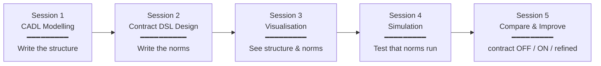
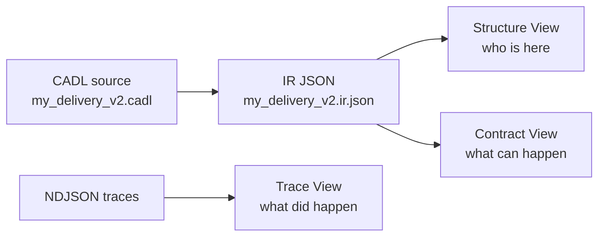
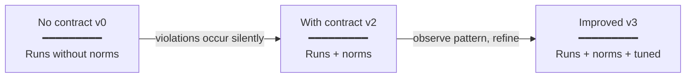

# PBL Course Design — Instructor's Guide

> A design document for a Project-Based Learning (PBL) course that takes students through CADL modelling → contract DSL design → visualisation → simulation → comparative analysis, end-to-end, using a robot delivery System of Systems (SoS) as the running example.

> **Note**: This is a syllabus / instructor guide, not a learner-facing tutorial. Learners should start with the [Hands-on Index](index.md).
>
> Related documents:
> - Main textbook → [`main-textbook.md`](main-textbook.md)
> - Exercises booklet (5-session series) → [`exercises.md`](exercises.md)
> - Academic background and references → [`academic-background.md`](academic-background.md)

## Positioning of this course

This document is **simultaneously a lesson plan for instructors** and **a learning guide for students**. By annotating each session and each exercise with its **academic significance** and **learning perspective**, we aim to run a PBL-style class in which students are *not* just following procedures but are also conscious of where each step sits in the wider research landscape.

> 💡 **How to read this document**:
> - § 1–2 form the skeleton of the course plan (5 sessions).
> - § 3 handles heterogeneous skill levels in the classroom.
> - § 4–7 deepen the four pillars (modelling / contracts / visualisation / simulation).
> - § 8–10 are instructor-facing aids (pitfalls, research linkage, extensions).

---

## 1. Course Design (5 sessions)

### Course at a glance



Each session is **90 minutes of class time** plus **2–3 hours of homework**. The end-of-course deliverable is a **3-page report**.

### Session 1 — CADL Modelling

| Item | Content |
| --- | --- |
| **Theme** | Describe the structure of an SoS in CADL |
| **Learning goals** | (1) Declare actors, capabilities, interfaces, and contracts in CADL.<br />(2) Articulate the limits of a structure-only specification — i.e., that it cannot express timing, what counts as a violation, or consequences. |
| **Student work** | (a) Identify the main actors of the robot delivery SoS (Robot, Coordinator, Customer).<br />(b) Define each actor's role / autonomy / capabilities / interface.<br />(c) Write a `DELIVERY_SLA` contract with parties / assume / guarantee.<br />(d) Pass `cadl check` with no errors. |
| **Instructor support** | (a) Introduce Maier's five criteria; reaffirm "why an SoS at all?"<br />(b) Pre-empt the common mistakes (see §4).<br />(c) Have students inspect the IR JSON and notice `lifecycle: null` / `monitors: []` — the deliberate gap that motivates Session 2. |
| **Deliverables** | `my_delivery_v1.cadl` (structure only) + a 3-to-5-line memo titled "what v1 cannot express". |
| **Academic significance** | Positions CADL within the lineage of Architecture Description Languages (Medvidovic & Taylor, 2000). Students experience the structural part of an architecture description as defined by ISO/IEC/IEEE 42010. |
| **Learning perspective** | Students experience, *as authors*, the separation between "writing structure" and "writing behaviour". The key insight to elicit: **a structural-only specification cannot express promises**. |

### Session 2 — SoS Contract DSL Design

| Item | Content |
| --- | --- |
| **Theme** | Layer norms on top of structure — declarative description of obligations, violations, and consequences |
| **Learning goals** | (1) Add a `lifecycle:` and `monitors:` block to a contract.<br />(2) Understand the relationship between deadlines and violations (`deadline` + `on_violation`).<br />(3) Articulate the difference between declarative observation (`monitors`) and operational state-machine description (`transitions`). |
| **Student work** | (a) Define a 7-state lifecycle (Proposed → … → Completed/Violated).<br />(b) Add a 5-second `deadline` to the `accept` transition with `on_violation` lifting to `Violated`.<br />(c) Add a `battery_guard` monitor (battery < 20% AND state == Assigned).<br />(d) Pick at least one ★★ exercise (over-speed monitor or Cancelled state). |
| **Instructor support** | (a) Concretise the obligation / permission / prohibition trichotomy with examples.<br />(b) Use the comparison table in §5 to pin down "how a contract differs from a program".<br />(c) Have students run `cadl sim-ir` and observe that `lifecycle` is no longer `null`. |
| **Deliverables** | `my_delivery_v2.cadl` (with lifecycle + monitors) and `my_delivery_v2.ir.json`. |
| **Academic significance** | An attempt to integrate the framework of Normative Multi-Agent Systems (Boella et al., 2006) into an ADL. Operationalises deontic logic going back to von Wright (1951). |
| **Learning perspective** | By **writing norms as data**, students experience that contracts can change without rewriting code. They become conscious of the boundary between programs and contracts. |

### Session 3 — Visualisation

| Item | Content |
| --- | --- |
| **Theme** | Inspect structure and norms visually — using CADL-explorer |
| **Learning goals** | (1) Explain the visual conventions of the Lifecycle View (double circle, dashed border, red edge).<br />(2) Compare v1 and v2 visually and articulate what kinds of failures v2 catches that v1 silently allowed.<br />(3) Distinguish static visualisation (Lifecycle View) from dynamic visualisation (Trace View). |
| **Student work** | (a) Launch cadl-explorer.<br />(b) Load v1 and v2 IR JSON, capture the visualisations.<br />(c) Take screenshots and write a 1-page A/B comparison report.<br />(d) ★★★: build a Violation Trace View as a custom Streamlit page. |
| **Instructor support** | (a) Explain the legend / visual conventions in 5 minutes.<br />(b) Engineer a strong contrast: have students open v1 first ("nothing is drawn / a warning appears"), then v2 — the difference should be visceral.<br />(c) Have students peer-review each other's reports and check explanatory ability. |
| **Deliverables** | `session3_comparison.md` (1 page) + 2 screenshots. |
| **Academic significance** | The lineage of architecture visualisation and architecture-driven analysis (Garlan & Schmerl, 2009). Tests the claim that visualisation is not decoration but a **second debugger**. |
| **Learning perspective** | Students experience that **the same specification exposes different aspects through different views**. SoS designers must master a portfolio of lenses (whole-system view × trace × monitoring dashboard). |

### Session 4 — Simulation

| Item | Content |
| --- | --- |
| **Theme** | Run the spec and observe whether the norms are actually enforced |
| **Learning goals** | (1) Run the Python reference runtime against your spec, multi-robot.<br />(2) Read NDJSON traces and aggregate them into per-robot summaries.<br />(3) Run the science cycle: vary one parameter at a time, predict before observing, validate. |
| **Student work** | (a) Run `multi_robot_demo --summary` to capture the baseline.<br />(b) Tighten the `accept` deadline from 5s to 1s and re-run (★★).<br />(c) Vary world parameters (battery, speed) and try at least three configurations.<br />(d) ★★★: run the Unity scene and verify that the C# runtime produces the same trace shape. |
| **Instructor support** | (a) Share the "ground truth" table (5 robots × 5 expected outcomes) ahead of time.<br />(b) Stress that the simulation is **deterministic**, not random — replayability is a learning multiplier.<br />(c) Have students post results on a shared whiteboard for cooperative learning. |
| **Deliverables** | `session4_baseline.ndjson` + parameter-sweep table (3+ configurations). |
| **Academic significance** | A teaching version of Runtime Verification (Bartocci et al., 2018). Spec-driven simulation is the bridge between formal methods and implementation. |
| **Learning perspective** | Students experience the boundary between **"the spec says so"** and **"the runtime actually does so"**. Spec review and runtime validation are complementary, not interchangeable. |

### Session 5 — Compare and Improve

| Item | Content |
| --- | --- |
| **Theme** | Use the **contract-OFF vs contract-ON vs improved** comparison to internalise the essence of SoS design |
| **Learning goals** | (1) Decide *which layer to change* (spec / runtime / environment) based on simulation observations.<br />(2) Quantitatively compare before-and-after and articulate the trade-offs.<br />(3) Report how making the norms explicit changed the SoS-wide behaviour. |
| **Student work** | (a) Build `my_delivery_v0.cadl` by **removing** lifecycle / monitors from v2; simulate.<br />(b) Compare v2 with v3 (improved version).<br />(c) Tabulate violation rate / delay / completion count.<br />(d) Write the 3-page final report (initial model / simulation comparison / reflection).<br />(e) ★★★: implement reward execution in `cadl/runtime/engine.py`. |
| **Instructor support** | (a) Introduce the *delete-the-contract* (v0) framing — this is the key idea of Session 5.<br />(b) Standardise the comparison metrics (violation rate / delay / efficiency / collisions).<br />(c) Distribute the 3-page report template. |
| **Deliverables** | `my_delivery_v0.cadl` (no contract) + `my_delivery_v3.cadl` (improved) + final report. |
| **Academic significance** | Empirical validation of *the social benefit of norms* (Andrighetto et al., 2013). A small-scale reproduction of SoS validation methodology (Sahin et al., 2007). |
| **Learning perspective** | By quantifying *what changes when contracts are present*, students discover the raison d'être of SoS-DSL on their own. The proposition **"the essence of SoS design is neither structure nor behaviour but norms"** is internalised through experience, not lecture. |

### Compact 3-session version

When time is tight:

| Compact | Combines | Primary emphasis |
| --- | --- | --- |
| Session A | Sessions 1 + 2 | Modelling + Contract DSL |
| Session B | Sessions 3 + 4 | Visualisation + Simulation |
| Session C | Session 5 | Compare and improve |

---

## 2. Detailed Exercises Per Session

### Session 1 — Details

#### Exercise 1.1 (mandatory, ★) — Build the baseline structural model

**Description**: Describe the robot delivery SoS in CADL. Declare three actors (Coordinator / Robot[1..N] / Customer[1..M]) and one `DELIVERY_SLA` contract between them.

**Inputs (handouts)**:
- The code excerpt of Step 2 in the main textbook ([`main-textbook.md`](main-textbook.md))
- `examples/sos_dsl_robot_delivery.cadl` (for reference only — copy-paste prohibited)
- Academic background §1 ([`academic-background.md`](academic-background.md)) on Maier's five criteria

**Outputs (submissions)**:
- `my_delivery_v1.cadl`
- Evidence (terminal output) that `cadl check my_delivery_v1.cadl` returns `OK`
- A 3-to-5-line memo `session1_gap.md` titled "what v1 cannot express"

**Evaluation**:
| Criterion | Weight | Rubric |
| --- | --- | --- |
| Syntactic correctness | 30% | `cadl check` returns `OK` |
| Actor design | 30% | role / autonomy / capabilities are sensible and consistent |
| Validity of contract A/G | 20% | `assume` and `guarantee` are reasonable for the domain |
| Articulation of the gap | 20% | Student can put into words what v1 cannot say |

#### Exercise 1.2 (intermediate, ★★) — Add an actor and a protocol

Add a `MAINTENANCE` actor, declare a `MAINTENANCE_SLA` contract, and write a `DeliveryProposal` protocol.

#### Exercise 1.3 (stretch, ★★★) — Drone delivery from scratch

Without referring to any existing file, write a CADL skeleton for a delivery drone fleet from a blank page.

---

### Session 2 — Details

#### Exercise 2.1 (mandatory, ★) — Add a lifecycle

**Description**: Copy v1 into v2 and add a 7-state lifecycle to `DELIVERY_SLA`. Set a 5-second `deadline` on the `accept` transition with `on_violation` to `Violated`.

**Inputs**: Session 1 deliverable `my_delivery_v1.cadl`; academic background §3.2 (Normative MAS).

**Outputs**: `my_delivery_v2.cadl`; `my_delivery_v2.ir.json`.

**Evaluation**:
| Criterion | Weight | Rubric |
| --- | --- | --- |
| State coverage | 25% | All 7 states declared, initial / terminal sensible |
| Transition correctness | 30% | `from` / `to` / `on` are consistent across the 4 transitions |
| Deadline justification | 25% | Why "5s" was chosen is explained in `session2_design_note.md` |
| `on_violation` validity | 20% | Severity choice (Major / Minor / Critical) is justified |

#### Exercise 2.2 (intermediate, ★★) — Add a monitor

Add either `battery_guard` or `over_speed`. Have the instructor confirm that the `rule` predicate follows CADL evaluator conventions (the bare-identifier-as-enum-literal idiom for `state == Assigned`).

#### Exercise 2.3 (intermediate, ★★) — Add a Cancelled state

Introduce a new terminal state `Cancelled` with a customer-side cancellation transition. Make students conscious of backward compatibility (the existing simulation must not break).

#### Exercise 2.4 (stretch, ★★★) — Two coexisting contracts

Make `DELIVERY_SLA` and `FLEET_SAFETY` coexist; design what happens when the same robot is a party to both.

---

### Session 3 — Details

#### Exercise 3.1 (mandatory, ★) — Visualise v1 / v2 and articulate the diff

**Description**: Launch cadl-explorer and load both v1 (no contract) and v2 (with contract) Lifecycle Views; compare visually.

**Inputs**: `my_delivery_v1.ir.json`, `my_delivery_v2.ir.json`, a working cadl-explorer environment.

**Outputs**: 
- 2 screenshots (v1 = warning screen; v2 = state machine diagram)
- `session3_comparison.md` (1-page A/B comparison report)

**Evaluation**:
| Criterion | Weight | Rubric |
| --- | --- | --- |
| Identification of visual elements | 30% | Can correctly explain double circle / dashed border / red edge |
| Articulation of differences | 40% | Records "what v1 cannot show" and "what v2 newly reveals" in 3+ sentences |
| Diagram-reading accuracy | 30% | Reads off state count / transition count / monitor count correctly |

#### Exercise 3.2 (intermediate, ★★) — A/B visual comparison

Generate the same diagram for several `deadline` values (5s / 1s / 10s) and confirm that the diagram alone reveals the difference.

#### Exercise 3.3 (stretch, ★★★) — Build the Violation Trace View

Add a new Streamlit page to cadl-explorer that ingests an NDJSON log and renders it as a Gantt-style timeline.

---

### Session 4 — Details

#### Exercise 4.1 (mandatory, ★) — Capture the baseline

**Description**: Run `multi_robot_demo --summary` and decode every per-robot final state.

**Inputs**: The Python runtime documented in the main textbook; `fixture_delivery.ir.json`.

**Outputs**: `session4_baseline.txt` (saved terminal output); `session4_baseline.ndjson`; one-line annotation per row.

**Evaluation**:
| Criterion | Weight | Rubric |
| --- | --- | --- |
| Successful execution | 30% | Baseline matches the expected (5 robots × 5 outcomes) |
| Trace decoding | 50% | Can explain each robot's state changes and violation cause |
| Quality of observation | 20% | Can pose observation-driven questions ("why does robot-4-1 stay Proposed?") |

#### Exercise 4.2 (intermediate, ★★) — Tighten and re-run

Change the `accept` deadline to 1s and observe how outcomes shift.

#### Exercise 4.3 (intermediate, ★★) — World parameter sweep

Compare three configurations (high/mid/low battery, high/mid speed, loose/strict deadline).

#### Exercise 4.4 (stretch, ★★★) — Validate Unity execution

Confirm that the C# runtime produces the same trace shape as the Python runtime.

---

### Session 5 — Details

#### Exercise 5.1 (mandatory, ★) — Build the no-contract version

**Description**: Remove the `lifecycle:` and `monitors:` blocks from v2 to produce `my_delivery_v0.cadl`. Simulate and compare with v2.

**Inputs**: All artefacts from Sessions 1–4.

**Outputs**:
- `my_delivery_v0.cadl`
- `session5_v0_trace.ndjson`
- A v0/v2 comparison table (described below)

**Evaluation**:
| Criterion | Weight | Rubric |
| --- | --- | --- |
| Correct construction of v0 | 20% | Contract section fully removed, `cadl check` passes |
| Construction of comparison table | 40% | Detection counts / delays / completions tabulated for v2 vs v0 |
| Interpretation | 40% | Can articulate the paradox "why does turning contracts ON appear to *increase* violations?" |

> 💡 **Instructor hint**: in v0, the concept of `Violated` does not even exist, so superficially "violations = 0". Letting students discover this is the path to the SoS-design core insight: **"violations don't vanish — they just become invisible."**

#### Exercise 5.2 (intermediate, ★★) — Build the improved version v3

Address an issue observed in Session 4 (e.g., a too-tight deadline) by editing the spec only, save as `my_delivery_v3.cadl`, and re-run simulation to validate.

#### Exercise 5.3 (stretch, ★★★) — Implement reward execution

Extend `cadl/runtime/engine.py` so that `incentives.rules` are actually executed (currently they are merely recorded).

#### Exercise 5.4 (mandatory, ★) — Final report (3 pages)

| Page | Content |
| --- | --- |
| 1 | Initial model (v1) and the deltas v0 / v2 / v3. Hypotheses behind the spec changes. |
| 2 | Simulation comparison tables and graphs across at least three configurations. |
| 3 | Reflection — what did adding norms buy you? What did simulation teach you that the spec alone could not? Where could SoS-DSL go next? |

**Evaluation**:
| Criterion | Weight | Rubric |
| --- | --- | --- |
| Hypothesis ↔ verification correspondence | 25% | Hypothesis → experiment → result → interpretation flow is clear |
| Quantitative data | 25% | Violation rate / delay / completion tabulated or charted |
| Insight into SoS design | 25% | At least one independent observation about the role of norms |
| Quality of writing | 25% | Fits in 3 pages, figures and tables used appropriately |

---

## 3. Tiered Difficulty Design

### Beginner (3rd-year undergrads, SoS first-timers)

**Coverage**: Sessions 1–3 (CADL modelling + contract DSL + visualisation).

Only the mandatory (★) exercises. Final report can be shortened to one page.

**Academic significance**: Experience the *raison d'être* of architecture description languages and normative description languages.

**Learning perspective**:
- Separation of structure and norms
- Comfort with writing specs *outside* of code
- That visualisation is not decoration but a **design verification mechanism**

### Intermediate (4th-year undergrads, pre-thesis)

**Coverage**: Sessions 1–4 plus Session 5's ★ exercise (build the no-contract version).

Complete all mandatory and intermediate (★★) exercises. Stretch (★★★) is optional.

**Academic significance**: Spec-driven simulation as norm verification — bridging formal methods and implementation.

**Learning perspective**:
- The meaning of "the same spec" running against different targets (Python / Unity / SimPy)
- The discipline of changing one parameter at a time
- Discovering the value of SoS-DSL by oneself through the v0 vs v2 comparison

### Advanced (Master's, research-oriented)

**Coverage**: All exercises from all five sessions, plus at least one extension topic (§10).

At least one ★★★ exercise (reward execution / Violation Trace View / drone-delivery) implemented.

**Academic significance**: Working at the research frontier of "norms as executable specifications" — Andrighetto et al. (2013) and Bartocci et al. (2018) traditions.

**Learning perspective**:
- Experience of **changing semantics by extending the runtime**
- A clear path from implementation to publication
- Ecosystem awareness — *my* spec drives *somebody else's* code generator

### Stretch exercises (optional)

| Stretch exercise | Target level | Academic linkage |
| --- | --- | --- |
| Drone delivery (altitude / weather / no-fly zones) | Intermediate / Advanced | Continuous-variable norms, Cyber-Physical Systems |
| Multi-contract coexistence (DELIVERY + SAFETY) | Advanced | Norm conflict resolution |
| Reward execution implementation | Advanced | Mechanism design |
| Violation Trace View development | Intermediate / Advanced | Architecture-driven debugging, visualisation research |
| Contract execution on a blockchain | Advanced | Smart contracts, distributed consensus |

---

## 4. CADL Modelling Exercise Design

### The starter skeleton students should write

```yaml
# my_delivery_v1.cadl ─── Session 1 starting point
sos:
  name: "MyDelivery"
  type: Acknowledged
  version: "0.1.0"

  context:
    environment:
      grid_size: 30
      num_robots: 3
      time_step_ms: 100

  actors:
    - id: COORDINATOR              # the textbook says DISPATCHER, but ask
                                   # students to write in their own vocabulary
      role: "central_coordinator"
      autonomy: low
      capabilities: [assign_tasks]
      interface:
        input:  [position_report, task_completion]
        output: [route_assignment]

    - id: "ROBOT[1..N]"
      role: "delivery_agent"
      autonomy: high
      capabilities: [follow_path, pick_up, deliver]
      interface:
        input:  [route_assignment]
        output: [position_report, task_completion]

  contracts:
    - id: DELIVERY_SLA
      parties: [COORDINATOR, "ROBOT[*]"]
      assume:
        - "ROBOT[i].battery > 20"
      guarantee:
        - "delivery_time <= 300s"
```

The student is asked to write these 30 lines **not by transcription, but in their own understanding**.

### Common mistakes

| Mistake | Symptom | Fix direction |
| --- | --- | --- |
| Unquoted actor IDs | `[1..N]` `[` is parsed as a YAML flow sequence start, parse error | Wrap in double quotes: `"ROBOT[1..N]"` |
| `assume` ↔ `guarantee` mix-up | Writing `delivery_time <= 300s` under `assume` | `assume` is precondition (input); `guarantee` is postcondition (output) |
| Skipping `interface.input/output` | Unclear what the actor consumes and produces | Require at least one input and one output |
| `parties` referencing undeclared actors | Type-check error (or silently skipped) | Reconcile actors section against parties via the IR |
| Setting `autonomy` to `high` for everyone | Authority structure of the SoS becomes undescribable | Instructor asks "is the Coordinator really high?" |

### Improvement directions (sample instructor comments)

- "DISPATCHER names a function, but COORDINATOR aligns better with the course-wide vocabulary."
- "`capabilities: [assign_tasks]` is a single capability. What other capabilities are needed will be discovered in Session 2."
- "`assume: ['ROBOT[i].battery > 20']` is fine, but who observes and guarantees it? → designed as a `monitor` in Session 2."

### Why structural modelling matters — academic significance

**The claim of ISO/IEC/IEEE 42010**: A system's architecture is constituted to satisfy its stakeholders' concerns. By defining actors and their relationships as contracts, you can write *what each stakeholder can expect* in a separable manner. Source code cannot do this.

**Specificity in SoS context**: SoS components are operationally and managerially independent (Maier 1998 conditions 1, 2). So **a common specification readable by everyone** is required — that is, an ADL. CADL's `actors` block becomes a document each constituent system's owner can read to identify their organisational responsibility.

### Abstraction skills to cultivate

| Abstraction level | Concrete example | Required student thinking |
| --- | --- | --- |
| **L1: Abstracting physical objects** | Abstracting individual delivery robots into `ROBOT[1..N]` | From individual instances to types |
| **L2: Abstracting roles** | Naming "central coordination" as `role: "central_coordinator"` | From behaviour to role |
| **L3: Abstracting relationships** | Expressing "request-response" as `interface.output → interface.input` | Communication as directed connection |
| **L4: Abstracting norms** | Writing "respond within deadline" as `deadline + on_violation` (Session 2) | Declarative rather than imperative |

These four levels are climbed in sequence over five sessions.

---

## 5. SoS Contract DSL Exercise Design

### Concrete examples of obligation / permission / prohibition

Expressed via CADL's existing `obligations:` / `permissions:` / `prohibitions:` clauses plus the SoS-DSL extension's `lifecycle:` block.

| Norm type | Natural language | CADL expression |
| --- | --- | --- |
| **Obligation** | "Robot must respond within 5 seconds of being assigned" | `lifecycle.transitions[id=accept].deadline: 5s` + `on_violation.transition: Violated` |
| **Obligation** | "Robot must complete delivery within 300 seconds" | `contract.guarantee: ["delivery_time <= 300s"]` + `monitor.deadline_watch` |
| **Permission** | "Coordinator may reassign a delivery if the robot does not respond" | `permissions: [- "reassign(Robot, DeliveryRequest) when no_response"]` (existing CADL clause) |
| **Prohibition** | "When battery is below 20%, robot must not accept new deliveries" | `monitor.battery_guard.rule: "battery < 20 AND state == Assigned"` + `on_match.transition: Violated` |
| **Prohibition** | "Coordinator must not simultaneously assign the same delivery to two robots" | (Not yet supported by current SoS-DSL — assigned to advanced students) |

### Violation design examples

| Violation type | Detection method | Severity | Consequence |
| --- | --- | --- | --- |
| **Late (response)** | `deadline` expiry on `accept` | Major | Lift to `Violated`, trigger reassignment authority |
| **Late (delivery)** | `monitor.deadline_watch` matches `now > request.deadline` | Critical | Lift to `Violated`, accumulate penalty |
| **No response** | Same as above (`accept` deadline) | Major | Reassignment |
| **Collision** | `monitor.collision_watch` matches `min_dist < 0.05` | Critical | Immediate `Violated`, stop simulation |
| **Battery violation** | `monitor.battery_guard` matches `battery < 20 AND Assigned` | Major | Refuse delivery, `Violated` |

### State transition example (mandatory template)

```yaml
lifecycle:
  states:
    - Proposed         # delivery request published
    - Assigned         # a robot has been assigned
    - Accepted         # robot has accepted
    - Delivering       # in transit
    - Completed        # done (terminal)
    - Violated         # discontinued for norm violation (terminal)
    - Terminated       # external abort (terminal)
  initial: Proposed
  terminal: [Completed, Violated, Terminated]
  transitions:
    - id: assign         # event-driven
      from: Proposed
      to:   Assigned
      on:   "COORDINATOR -> ROBOT[i] : route_assignment"

    - id: accept         # deadline-bounded
      from: Assigned
      to:   Accepted
      on:   "ROBOT[i] -> COORDINATOR : ack(accepted)"
      deadline: 5s
      on_violation:
        transition: Violated
        severity:   Major

    - id: start_delivery # state-change driven
      from: Accepted
      to:   Delivering
      on:   "ROBOT[i].status == InTransit"

    - id: complete       # state-change with guard
      from: Delivering
      to:   Completed
      on:   "ROBOT[i].status == Delivered"
      when: "now <= request.deadline"
```

### Academic significance of modelling norms

**Deontic logic since von Wright (1951)**: a tradition that separates "what ought to be" from "what is" and treats them logically. Developed in AI, philosophy, and law.

**Boella et al. (2006)** define a Normative MAS as a system whose agents may **choose to comply or violate**. This contrasts sharply with classical control theory, which assumes that norms cannot be violated.

**Connection to SoS**: SoS components are managerially independent and therefore **cannot be controlled at code level**. To regulate their behaviour, one needs (a) explicit norms, (b) violation detection, and (c) a mechanism that produces consequences. This is precisely the design rationale for SoS-DSL.

### How to make students understand the program-vs-contract distinction

A comparison table to present to students:

| Dimension | Program | Contract |
| --- | --- | --- |
| **Author** | Developer | All stakeholders (or representatives) |
| **Reader** | Compiler | All stakeholders |
| **Executor** | CPU | The constituent systems (autonomously) |
| **What happens on violation** | Crash / exception | Violation detection + consequence (reward / penalty) |
| **Execution model** | Sequential instructions | Contract-state transitions + concurrency |
| **Verifiability** | Unit tests | Runtime norm verification |
| **Effect of change** | Codebase-wide | Localised to a single contract |

> 💡 **A question for students**: "Which is better for an SoS?" Almost everyone says "contract." Then ask "Why?" — only at this point do Maier's conditions (1) and (2) sink in.

---

## 6. Visualisation Design (CADL-explorer)

CADL-explorer is Streamlit-based and exposes three view families across the existing and proposed designs.

### Structure View (existing — first half of Session 3)

**What it visualises**: communication relationships among actors, drawn as nodes and edges. Each actor's role / autonomy / interface ports are shown as attributes.

**What students should notice**: at a glance, "who is in this SoS, how many of them, who talks to whom." For SoS designs with many actors, this is **the first sanity check that the `actors` declarations of the prior chapter are correct**.

**Academic significance**: The most basic of the architecture views (ISO 42010). The whole point of an ADL is that this diagram can be auto-generated from the same source as the code.

### Contract View (existing Lifecycle View — second half of Session 3)

**What it visualises**: a directed graph of the contract's lifecycle states. Visual conventions:

- Double circle = `lifecycle.initial`
- Dashed box, green fill = `Completed`
- Dashed box, red fill = `Violated`
- Dashed box, grey fill = other terminal states (e.g., `Terminated`)
- Solid edge with `Δ 5s` = transition with deadline
- Red dashed edge = the `on_violation` lift

**What students should notice**: that the v2 file (written *as code*) and this diagram (viewed *as a diagram*) carry **the same meaning**. The diagram makes **what triggers a violation** visceral.

**Academic significance**: State-machine visualisation of normative logic (Boella et al.'s 2008 procedural norms). A demonstration that **norms can be inspected dynamically as well as written statically**.

### State-transition (Trace) View (proposed — Session 3 ★★★)

**What it visualises**: runtime traces (NDJSON) plotted on a time axis. One row per contract instance, bars colour-coded per state span, violation events as red `×` markers.

**What students should notice**: the static state-machine diagram (Contract View) and the dynamic trace (State-transition View) are **different lenses**. The former shows "what *can* happen," the latter "what *did* happen." Both are required for SoS design.

**Academic significance**: Visualisation of runtime verification (Bartocci et al., 2018) helps validate the contract definition itself. An implementation example of architecture-driven debugging (Garlan & Schmerl, 2009).

### Relationships among the three views



Show this diagram at the start of Session 3 so students consciously recognise that **their source file branches into three views**.

---

## 7. Simulation Design

The point of using simulation in Sessions 4 and 5 is to **quantify how the SoS-wide behaviour changes when contracts are present versus absent**.

### No-contract case (v0)

**How to build**: remove the `lifecycle:` and `monitors:` blocks from `my_delivery_v2.cadl` to produce `my_delivery_v0.cadl`. Keep `actors`, `parties`, `assume`, `guarantee`.

**How to run**: modify `multi_robot_demo` to handle a contract that has no initial state (use `open_instance` with care).

**Expected behaviour**:
- Robots still move, attempts at delivery still happen (the actors themselves are unchanged).
- Deadlines do still expire in the simulation, but because there is no `Violated` state to lift to, **they leave no trace in the log**.
- Violations occur in silence.

### With-contract case (v2)

**How to run**: as documented in the main textbook (`multi_robot_demo`).

**Expected behaviour**: 5 robots × 5 distinct outcomes (Completed / 3 kinds of Violated / stays-Proposed).

### Comparison metrics and computation

| Metric | v0 (no contract) | v2 (with contract) | What the student observes |
| --- | --- | --- | --- |
| **Delay** | Computed by hand: `now - deadline` per delivery | Auto-detected via `deadline:` violations | v0 makes delay **invisible** |
| **Failure rate** | Manual detection of `delivery_time > 300s` | Count of `Violated` states | v2 puts failure into **language** |
| **Throughput** | `Completed` deliveries per unit time | Same | v2 may appear *worse* on the surface because some completions become Violated |
| **Collision** | No automatic detection (or sim-internal only) | Auto-detected by `monitor.collision_watch` | v2 treats dangerous behaviour **as a contract violation** |

### Why comparison matters — academic significance

**Andrighetto et al. (2013)** discuss the **social benefit of norms**. Norms themselves do not produce anything; the question is whether the **costs** of introducing them (writing effort, detection infrastructure, violation processing) are outweighed by the **benefits** (predictability, trust, lower coordination cost). Quantifying this is the heart of normative-systems research.

Students answer this question, **with numbers**, using a small-scale implementation of SoS-DSL. This is research at miniature scale.

### The "essence of SoS design" to instil



**Core claim to convey**:

> The essence of SoS design is neither *making it work* nor *optimising it*, but **deciding what counts as a violation**.

Students experience this through the v0 ↔ v2 comparison. In v0, the SoS *runs* (so it "looks like it's working"); only with v2 do "actually there were delays" and "actually there was dangerous behaviour" become **observable**. This is the rationale for adopting SoS-DSL.

### Sample comparison table (the core of the final report)

| Metric | v0 | v2 | v3 | Interpretation |
| --- | --- | --- | --- | --- |
| Completed count | ? | ? | ? | … |
| Violated count (`accept` deadline) | (undetectable) | ? | ? | First measurable in v2 |
| Violated count (`battery_guard`) | (undetectable) | ? | ? | Same |
| Mean delay | ? | ? | ? | … |
| Robot utilisation | ? | ? | ? | … |

Students fill this table and explain each column delta in three sentences or fewer.

---

## 8. Important Educational Points

### Where students get stuck

| Stumble | Symptom | Instructor intervention |
| --- | --- | --- |
| **YAML syntax (indentation, quoting)** | Frequent parse errors in `cadl check` | Spend 5 minutes in Session 1 demonstrating YAML traps (`on:` is boolean, `[ROBOT[i]]` is a flow sequence, etc.) |
| **`assume` ↔ `guarantee` confusion** | A/G are swapped | Map to UML pre / postconditions |
| **Significance of `lifecycle.terminal`** | `Completed` is left non-terminal | "Terminal states are *closed*. `Violated` works the same way." |
| **`deadline` units and relativity** | Confusion about whether 5s is absolute or relative | "It is the elapsed time *since entering the state*." |
| **Monitor vs transition confusion** | Confused between `monitor.on_match.transition` and `transition.on_violation.transition` | A diagram contrasting them: monitors are observation-driven, transitions are event-driven |
| **Visualisation seen as decoration** | Skipping cadl-explorer in Session 3 | Mandate "identify three differences between v1 and v2 from the diagram alone" |
| **Trace interpretation** | Looking at the 5-robot outcome and saying "it worked" | Ask "*why* does robot-4-1 stay Proposed?" |
| **Vague improvement proposals** | Writing "make it better" | Demand "which line, why, changed to what" |

### Aha moments

Typical "I see!" moments students experience in this course:

1. **End of Session 1**: looking at `"lifecycle": null` in the IR JSON and feeling that *something is missing in the structure-only spec*.
2. **Mid Session 2**: writing `deadline: 5s`, regenerating the IR, and discovering it was normalised to `deadline_ms: 5000`. **The spec has become processable data.**
3. **Session 3**: seeing v1's "no lifecycle" page next to v2's 6-state diagram, and being **viscerally** struck by the contrast.
4. **Session 4**: running the baseline, seeing five robots × five outcomes, and confirming that *predictions match observations*.
5. **First half of Session 5**: simulating v0 (no contract) and noticing that no "violations" are reported — followed by the realisation: **"violations are not absent, they are merely invisible."**
6. **Second half of Session 5**: observing that v3 (improved) has a lower violation rate, and feeling that **"my spec change changed the system's behaviour."**

The instructor should design the class to **deliberately create** these moments. For example, in Session 3, have students open v1 *first*; in Session 5, run v0 simulation *first*.

### Tactics to convey "SoS-ness"

| Tactic | Effect |
| --- | --- |
| **Role-play**: assign one robot per student to 5 students; have them guess which one will miss the deadline | Internalise actor autonomy and SoS uncertainty |
| **"What if there was no contract" scenario**: Session 5's v0 vs v2 | Realise the necessity of norms via their *negative* effect |
| **Coordinator-side viewpoint shift**: have one student play the Coordinator and decide reassignments | Make visible **what the SoS's authoritative decision-maker actually observes when deciding** |
| **Maier's 5-criteria checklist**: distribute at the start of Session 1 | Habituate self-checking "is this *really* an SoS?" |
| **Peer review**: have students read each other's Session 3 reports | Experience reading *somebody else's* spec — a primary skill in real SoS development |

---

## 9. Connection to Research

This course connects directly to research themes for graduation theses and Master's research. Major linkage points:

### Research themes this course leads to

| Research theme | Linkage in the course | Direction of development |
| --- | --- | --- |
| **Norm efficacy measurement** | Session 5's v0 vs v2 vs v3 comparison | Scaling effects from 5 robots to 50 / 500. Empirical validation of the Andrighetto et al. (2013) discussion |
| **Norm conflict resolution** | Exercise 2.4 (DELIVERY_SLA + FLEET_SAFETY coexistence) | Algorithms for detecting contradictions between norms; automatic priority assignment |
| **Multi-target code generation** | Python / C# / SimPy generation in main textbook | Extension to Solidity / OPA / Rego; semantic-equivalence proof across targets |
| **Architecture-driven debugging** | Violation Trace View development (Exercise 3.3) | Automatic deviation-pattern extraction from large logs |
| **Norm learning** | Reward execution (Exercise 5.3) | Reinforcement learning to discover the optimal deadline value |
| **CPS (Cyber-Physical) contracts** | Stretch: drone delivery | Language extension for norms over continuous variables (position, velocity, weather) |
| **Norm verification (formal)** | Session 4 simulation | Translation to TLA+ or UPPAAL for model checking |

### Publication angles

The course outputs can be publicised in the following forms:

| Paper type | Content | Target venues |
| --- | --- | --- |
| **Methodology paper** | "A DSL extension that integrates normative description into an ADL: the case of CADL+SoS-DSL" | INCOSE IS, ICSE SoSE, Software & Systems Modeling |
| **Tool paper** | "SoS-DSL hands-on as a PBL educational tool" | Computer Science Education, CSEE&T |
| **Empirical paper** | "Effect of norms on SoS-wide behaviour: a robot-delivery case study" | SoSE, CASE, ICRA |
| **Comparison paper** | "Heterogeneous-target code generation from a single specification and semantic equivalence" | MODELS, SLE |

### Directions for novelty claims

| Claim | Basis for novelty | Required additional experiments |
| --- | --- | --- |
| (1) An original design integrating normative logic into an existing ADL | Existing ADLs (AADL, ACME, SysML) do not handle norms; existing Normative MAS frameworks (OperA, Tropos) are not ADLs | A feature-comparison table against existing tools |
| (2) Small-scale empirical demonstration of norm efficacy | Reproducible v0 / v2 / v3 comparison at 5-robot scale | Scale-up experiments (10 / 50 / 500 robots) |
| (3) Educational efficacy | Design of a PBL course and measurement of its outcomes | Pre / post test, student survey |
| (4) Multi-target code generation from a single IR | Semantic equivalence among Python / C# / SimPy | Formal proof of equivalence |

---

## 10. Extension Topics (3 candidates)

### A. Drone delivery (altitude / weather / no-fly zones)

**Why this is a good extension**:
- Structurally very similar to robot delivery (the actors / contracts templates are reusable)
- But **the expressiveness of the norms** must be extended — continuous variables and time-dependent conditions like altitude, weather, airspace restrictions
- An "isomorph in the same domain" — tests SoS-DSL's generality

**Academic significance**:
- The **CPS (Cyber-Physical Systems) contracts** research area — norms over physical quantities
- Integration of hybrid automata (continuous + discrete) with norms
- Research line published in venues like Rajeev Alur's group, RTSS, EMSOFT

**Features to add**:
- Continuous variables in `monitor.observe` (altitude, wind speed)
- Time integrals in the `rule` predicate (e.g., "above 100 m for more than 30 s")
- Geo-fence representation

### B. Smart traffic (signals, buses, ambulances, private cars)

**Why this is a good extension**:
- Multiple **independent organisations** (city DOT, bus company, police, citizens) involved — a **genuine Collaborative SoS**
- All five Maier criteria discussed in the academic-background page §1 are satisfied
- A domain students experience daily

**Academic significance**:
- Closely tied to smart-cities research (the subject of Madni & Sievers, 2014)
- The canonical example of **hierarchical norms** ("emergency vehicles take priority")
- Multidimensionality of norms (time × space × priority)

**Features to add**:
- Priority among norms (ambulance > bus > car)
- Geographic scope constraints ("at this intersection only")
- Dynamic relaxation of norms (suspend rules for ordinary vehicles in emergencies)

### C. Data-sharing SoS (medical / smart meters / government)

**Why this is a good extension**:
- **Data providers and consumers belong to different organisations**, satisfying Maier (1)(2) strongly
- Dimensions of norms not visible in robot delivery — privacy, consent, accountability
- Visible interdisciplinary linkage with law and ethics

**Academic significance**:
- Integration with **GDPR / Japan's revised personal-information protection law**: legal codes as norm specifications
- **Data governance research** (International Data Spaces Association, Gaia-X, etc.)
- Norms for consent management — conditional obligations like "Alice may receive data only when Bob has given permission"

**Features to add**:
- Subject identification and consent state
- Provenance tracking
- Time-bounded norms ("this consent expires in 30 days")

### How to choose the extension

| Student background | Recommended |
| --- | --- |
| Robotics / control engineering | A. Drone delivery |
| Transport engineering / smart cities | B. Smart traffic |
| Information security / privacy / ELSI | C. Data-sharing SoS |
| No specific thesis topic yet | B. Smart traffic (strongest Maier compliance, easiest to publish) |

---

## Appendix — Instructor Pre-class Checklist

Items the instructor should confirm before each session:

| Check | Before S1 | Before S2 | Before S3 | Before S4 | Before S5 |
| --- | :---: | :---: | :---: | :---: | :---: |
| All four repos cloned on `feature/sos-dsl` branch | ✓ | | | | |
| `cadl check` / `cadl sim-ir` / `cadl codegen` known to work | ✓ | | | | |
| Student laptops have Python 3.10+ and Node 18+ | ✓ | | | | |
| Maier 5-criteria checklist printed as handout | ✓ | | | | |
| `examples/sos_dsl_robot_delivery.cadl` runs locally | | ✓ | | | |
| cadl-explorer can launch | | | ✓ | | |
| `multi_robot_demo --summary` produces expected output | | | | ✓ | |
| v0 sample (no contract) prepared in advance | | | | | ✓ |
| Comparison-report template shared with students | | | | | ✓ |

---

## Appendix — Related documents

| Document | Purpose |
| --- | --- |
| [`main-textbook.md`](main-textbook.md) | Main textbook (90-minute version) |
| [`exercises.md`](exercises.md) | Student exercises booklet (5-session series) |
| [`academic-background.md`](academic-background.md) | Academic background and references (ISO 21839/40/41, Maier, etc.) |
| [`sos-dsl-pr-drafts.md`](sos-dsl-pr-drafts.md) | Implementation PR drafts (reference) |
| [`sos-dsl-unity-runbook.md`](sos-dsl-unity-runbook.md) | Unity execution walkthrough |
| [`sos-contract-dsl-design.md`](sos-contract-dsl-design.md) | Design notes for the contract DSL |
