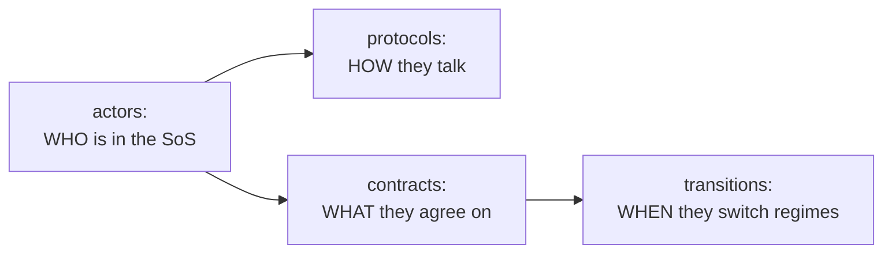
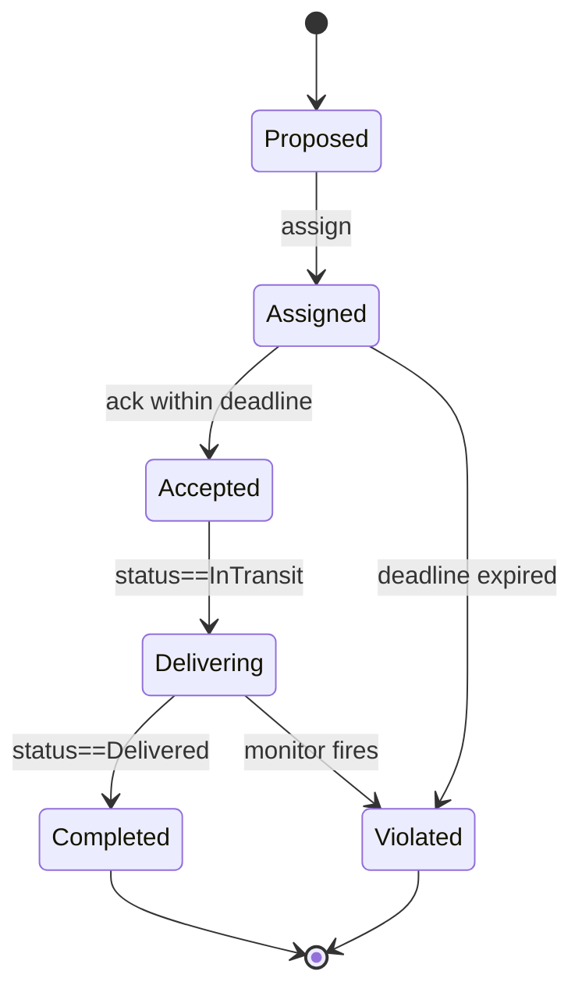

# SoS-DSL Exercises

> 🌐 **日本語版** → [`sos-dsl-exercises.ja.md`](sos-dsl-exercises.ja.md)
>
> ⬅ Back to the main handson textbook → [`sos-dsl-handson-textbook.en.md`](sos-dsl-handson-textbook.en.md)
>
> 📚 Academic background and references → [`sos-academic-background.en.md`](sos-academic-background.en.md)

This booklet collects the practice exercises that go with the SoS-DSL hands-on. Two parts:

- **Part 1 — Robot Delivery course (5-session series)**. A structured course that takes the same robot delivery domain through CADL modelling → DSL design → visualisation → simulation → improvement, one session per week. Designed for a 3 to 5 week class. **The bulk of this booklet.**
- **Part 2 — Modelling a new SoS end-to-end**. After Part 1, you pick a *different* domain (food delivery, emergency response, …) and walk the full loop yourself. Closer to a research mini-project than to weekly homework.

---

# Part 1 — Robot Delivery Course (5 sessions)

## Course at a glance

| Session | Title | Theme | Deliverable |
| --- | --- | --- | --- |
| 1 | **CADL Modelling** | Structure of an SoS | `my_delivery_v1.cadl` (structure only) |
| 2 | **DSL Design** | Norms: lifecycle and monitors | `my_delivery_v2.cadl` (with lifecycle + monitors) |
| 3 | **Visualisation** | Reading and comparing specs visually | A/B comparison report with screenshots |
| 4 | **Simulation** | Executing the spec, reading traces | Baseline trace + parameter sweep |
| 5 | **Improvement** | Using observations to refine the spec | `my_delivery_v3.cadl` + before/after report |

Each session is **~90 minutes in class** plus **~3 hours of homework**. The final deliverable across all five sessions is a **3-page report** (initial model / simulation comparison / reflection).

### Compact 3-session version

If you only have three sessions (e.g., a short module, an intensive weekend), use this mapping:

| 3-session | Combines |
| --- | --- |
| Session A | Sessions 1 + 2 (Modelling + DSL design) |
| Session B | Sessions 3 + 4 (Visualisation + Simulation) |
| Session C | Session 5 (Improvement) |

The exercises stay the same; you simply move the optional / "stretch" exercises to homework.

### Per-session format

Every session has the same shape:

1. **Learning objectives** — what you should be able to do by the end.
2. **Prerequisites** — deliverables from the previous session, plus reading.
3. **Concept introduction** (~30 min) — the small amount of theory you need.
4. **Exercises** (~50 min) — graded ★ (basic) → ★★ (intermediate) → ★★★ (stretch).
5. **Wrap-up + homework** (~10 min) — what to bring to next session.

### Rubric (suggested)

The instructor can use this for grading; the student can self-check.

| Criterion | Weight |
| --- | --- |
| All ★ and ★★ exercises completed for every session | 40% |
| `cadl check` passes on every submitted CADL file | 20% |
| Final 3-page report demonstrates understanding (not just steps) | 30% |
| At least one ★★★ stretch exercise attempted | 10% |

---

## Session 1 — CADL Modelling

### Learning objectives

- Identify the actors in an SoS and declare them in CADL with `id`, `role`, `autonomy`, `interface`.
- Write a structural contract with `parties`, `assume`, `guarantee`, `incentives`.
- Run `cadl check` and explain its diagnostics.

### Prerequisites

- Steps 0 and 1 of the main hands-on textbook (cloned repos, browsed Appendix A).
- 30 min of pre-reading: cadl-spec Chapter 5 — *Language Specification*.

### Concept introduction (~30 min)

A CADL file says **who** participates and **what they expect from each other**, before saying anything about *when* or *how often*. The structural building blocks are:



For Session 1 you will only touch **actors** and **contracts**. `protocols` and `transitions` are optional stretch material.

### Exercises (~50 min in class + homework)

#### Exercise 1.1 (★) — Build the baseline structural model

**Goal**: Reproduce the example actor / contract from the main hands-on, by hand, into a fresh file `my_delivery_v1.cadl`.

**Procedure**:

1. Create `my_delivery_v1.cadl` next to `examples/sos_dsl_robot_delivery.cadl`.
2. Declare three actors: `DISPATCHER`, `ROBOT[1..N]`, `CUSTOMER[1..M]`. Choose sensible `autonomy` levels for each.
3. Declare one contract `DELIVERY_SLA` with `parties: [DISPATCHER, "ROBOT[*]", "CUSTOMER[*]"]`, `assume: ["ROBOT[i].battery > 20"]`, `guarantee: ["delivery_time <= 300s"]`.
4. Run `cadl check my_delivery_v1.cadl` and ensure it returns `OK`.

**Check**: The file compiles, IR JSON shows 3 actors and 1 contract.

#### Exercise 1.2 (★★) — Add a fourth actor

**Goal**: Introduce a `MAINTENANCE` actor that periodically inspects robots, and declare a separate contract `MAINTENANCE_SLA` between `MAINTENANCE` and `ROBOT[*]`.

**Procedure**:

1. Add `MAINTENANCE` (single, low autonomy, capabilities `[inspect, repair]`).
2. Add a contract `MAINTENANCE_SLA` with `parties: [MAINTENANCE, "ROBOT[*]"]`.
3. Decide whether `assume` should include `ROBOT[i].battery > 0` or something stronger.
4. Re-run `cadl check`.

**Reflection**: When you have *two* contracts on the same actor, which `assume` clauses apply? (Hint: both must hold simultaneously — this is exactly the *interdependency* concern that Dahmann (2014) calls out as SoS pain point #6.)

#### Exercise 1.3 (★★) — Add a protocol

**Goal**: Move beyond the structural skeleton: write a `protocols:` section describing the delivery flow as a sequence of message exchanges.

**Procedure**:

1. Add a protocol `DeliveryProposal` with `participants: [DISPATCHER, "ROBOT[i]"]`.
2. List 3 steps: `DISPATCHER -> ROBOT : route_assignment`, `ROBOT -> DISPATCHER : ack`, `ROBOT -> DISPATCHER : completion`.
3. Add `pre`/`post` conditions if you can think of any.

**Reflection**: Why is the protocol described as a sequence of *messages*, not as code? What does this give you that a Python function would not? (Hint: think about who *implements* each step.)

#### Exercise 1.4 (★★★) — Write a domain you don't know yet

**Goal**: Without copying any existing file, write a CADL skeleton for a **delivery drone fleet** (instead of ground robots). Same domain shape, different actors and capabilities.

**Procedure**:

1. Create `my_drone_delivery.cadl` from scratch.
2. Decide who the actors are. Hint: a *DRONE* needs different `capabilities` than a *ROBOT* (consider altitude, no-fly zones, weather).
3. Run `cadl check`.

**Reflection**: How much of your file is *the same* as the robot delivery one, and how much is genuinely different? The same lifecycle could be reused with minor modifications — that is exactly the design intent of SoS-DSL.

### Wrap-up + homework

**Bring to Session 2**:

- `my_delivery_v1.cadl` (compiles cleanly).
- A short note (3–5 lines) describing what is missing in v1 — i.e., what the structural-only file *cannot* express. (Hint: timing, what counts as a violation, what the consequences are.)

---

## Session 2 — DSL Design

### Learning objectives

- Add a per-instance `lifecycle:` to a structural contract.
- Add declarative `monitors:` with predicates and sampling specs.
- Read `cadl sim-ir` JSON output and locate your additions in it.

### Prerequisites

- `my_delivery_v1.cadl` from Session 1.
- 30 min of pre-reading: cadl-spec Appendix E.

### Concept introduction (~30 min)

A class-level contract spec says "this is the kind of agreement we make." But every concrete delivery is its **own instance** of that agreement, going through:



Two new keys make this explicit:

- `lifecycle:` — defines states, initial / terminal markers, and transitions with `deadline` + `on_violation`.
- `monitors:` — declarative observers that run periodically or on events, fire violations or transitions when their `rule` matches.

### Exercises (~50 min in class + homework)

#### Exercise 2.1 (★) — Add the basic lifecycle

**Goal**: Save `my_delivery_v1.cadl` as `my_delivery_v2.cadl`, then add a `lifecycle:` block to `DELIVERY_SLA` with the 7 states from the main hands-on.

**Procedure**:

1. Copy `v1` → `v2`.
2. Add `lifecycle.states`, `lifecycle.initial`, `lifecycle.terminal`, and 4 transitions (`assign`, `accept`, `start_delivery`, `complete`).
3. On `accept`, set `deadline: 5s` and `on_violation.transition: Violated`.
4. Run `cadl check` and `cadl sim-ir my_delivery_v2.cadl --format json | head -60`.
5. Confirm in the IR that `"lifecycle"` is no longer `null`.

#### Exercise 2.2 (★★) — Add an over-speed monitor

**Goal**: Detect a robot that drives faster than 1.5 m/s while delivering and lift the contract to `Violated` with severity `Critical`.

**Procedure**: Add a monitor under `monitors:`:

```yaml
- id: over_speed
  observe: "ROBOT[i].speed"
  sampling: periodic(200ms)
  rule: "ROBOT[i].speed > 1.5 AND state == Delivering"
  on_match:
    transition: Violated
    severity: Critical
```

**Reflection**: You have just added a *new normative rule* without changing a single line of pilot code. What does this say about the separation between the structural code and the normative spec? (See [Maier 1998] criterion (4): emergent behaviour can be *constrained* without redesigning the parts.)

#### Exercise 2.3 (★★) — Add a Cancelled lifecycle state

**Goal**: Let a customer cancel a delivery while it is still `Assigned`, routing the contract to a new `Cancelled` terminal state.

**Procedure**:

1. Add `Cancelled` to `lifecycle.states` and `lifecycle.terminal`.
2. Add a transition `customer_cancel` from `Assigned` to `Cancelled` triggered by `"CUSTOMER[i] -> DISPATCHER : cancel_order"`.
3. Decide: should `Cancelled` be a violation? In CADL, terminal states are not implicitly violations — they are just *closed*.

**Reflection**: When you added `Cancelled`, did the existing simulation break? Why or why not? (Adding a *state* is backward-compatible; adding a *deadline* is not.)

#### Exercise 2.4 (★★★) — Two contracts coexisting

**Goal**: Beside `DELIVERY_SLA`, add a `FLEET_SAFETY` contract whose lifecycle is independent of any delivery — it is *always on* while a robot is operational.

**Procedure**:

1. Define a 3-state lifecycle: `Operational → Degraded → OutOfService`.
2. Add a monitor that fires `Degraded` when battery < 10% (regardless of delivery state).
3. Run `cadl check`. Are there any conflicts with `DELIVERY_SLA` rules?

**Reflection**: A robot can be a party to *both* contracts simultaneously. What semantics do you want when one contract says "you may proceed" and the other says "you must stop"?

### Wrap-up + homework

**Bring to Session 3**:

- `my_delivery_v2.cadl` (with at minimum exercises 2.1–2.3 done).
- The IR JSON snapshot saved as `my_delivery_v2.ir.json` (run `cadl sim-ir … --format json > my_delivery_v2.ir.json`).
- (Optional) `my_delivery_v2_with_safety.cadl` if you tackled 2.4.

---

## Session 3 — Visualisation

### Learning objectives

- Use cadl-explorer's Lifecycle View to read a contract spec at a glance.
- Identify the visual conventions and explain what they mean to a non-CADL audience.
- Compare two specs (v1 vs v2) using diagrams.

### Prerequisites

- `my_delivery_v2.cadl` from Session 2.
- `my_delivery_v2.ir.json`.
- (Optional) Step 4 of the main hands-on if you have not yet opened cadl-explorer.

### Concept introduction (~30 min)

Software engineers debug code. SoS engineers debug **diagrams** — because the system is too distributed to step through with a debugger. The Lifecycle View is your debugger.

| Visual element | What it means |
| --- | --- |
| Double circle | `lifecycle.initial` |
| Dashed box, green fill | terminal state `Completed` |
| Dashed box, red fill | terminal state `Violated` |
| Dashed box, grey fill | other terminal states (e.g., `Terminated`, `Cancelled`) |
| Solid edge with `Δ 5s` | transition with a `deadline` |
| Red dashed edge | the `on_violation` lift |

### Exercises (~50 min in class + homework)

#### Exercise 3.1 (★) — Visualise both v1 and v2

**Goal**: Open cadl-explorer and load both `v1` and `v2` IR files. Identify *exactly* what the Lifecycle View shows for v1 vs v2.

**Procedure**:

1. Run `cadl-explorer` (`streamlit run app.py`).
2. Generate IR for v1 too: `cadl sim-ir my_delivery_v1.cadl --format json > my_delivery_v1.ir.json`.
3. Open the *SoS_DSL_Lifecycle* page. Upload v1 first, then v2.
4. Take screenshots.

**Check**: For v1, the page should display a warning that the contract has no lifecycle. For v2, it should render a state machine with at least 6 states.

#### Exercise 3.2 (★★) — A/B comparison report

**Goal**: Write a 1-page A/B comparison report: *the same contract, before and after Session 2's normative additions*.

**Procedure**: A 1-page Markdown document, with:

- A screenshot of the v1 visualisation (likely "no lifecycle" message).
- A screenshot of the v2 lifecycle.
- A table listing: number of states, transitions with deadlines, monitors, terminal states.
- 3 sentences on **what kinds of failures the v2 spec catches that v1 silently allows**.

**Submit**: `session3_comparison.md` + the two screenshots.

#### Exercise 3.3 (★★★) — Build a Violation Trace View

**Goal**: Add a new Streamlit page to cadl-explorer that ingests an NDJSON log produced by `multi_robot_demo --log <path>` (you'll have one in Session 4) and displays it as a Gantt-style timeline.

**Procedure**:

1. Create `cadl-explorer/cadl_sim/sos_dsl/violation_trace_view.py`.
2. Parse each NDJSON line, group by `instance_id`, render as a horizontal bar with red `×` markers on violations.
3. Use Plotly (`plotly.graph_objects.Bar`) — no new dependency required.
4. Wire it in `cadl-explorer/pages/SoS_DSL_Violation_Trace.py`.

This builds on what you would expect to see *in advance* — by the time Session 4 runs simulation, you'll have a viewer ready for its output.

### Wrap-up + homework

**Bring to Session 4**:

- `session3_comparison.md` + 2 screenshots.
- (Optional) The `violation_trace_view.py` code from 3.3.

**Discussion to prep**: in 1 sentence each — *what would surprise you* in the simulation results?

---

## Session 4 — Simulation

### Learning objectives

- Run the Python reference runtime against your spec, multi-robot.
- Read NDJSON traces and aggregate them into per-robot summaries.
- Vary one parameter at a time and predict before observing.

### Prerequisites

- `my_delivery_v2.cadl` and its IR.
- (Optional) `violation_trace_view.py` from Session 3.

### Concept introduction (~30 min)

The Python runtime in `raspimouse-swarm-simulator/cadl/runtime/` consumes the IR and gives you *deterministic, replayable* discrete-time simulation. The five-robot `multi_robot_demo.py` is your fixed test bench:

| Robot | Scripted outcome | Why it matters |
| --- | --- | --- |
| robot-0-1 | `Completed` | sanity check that happy path works |
| robot-1-1 | `Violated` via `deadline:accept` | demonstrates deadline enforcement |
| robot-2-1 | `Violated` via `monitor:battery_guard` | demonstrates periodic monitor |
| robot-3-1 | `Violated` via `monitor:deadline_watch` | demonstrates declarative monitor |
| robot-4-1 | stays `Proposed` | demonstrates "instance never advances" is also a valid trace |

This is your **ground truth** to validate any spec change you make.

### Exercises (~50 min in class + homework)

#### Exercise 4.1 (★) — Capture the baseline

**Goal**: Run `multi_robot_demo --summary` against the *bundled* fixture (not your `my_delivery_v2.cadl` — yet), capture the output verbatim, and explain each row.

**Procedure**:

```bash
cd ~/program/raspimouse-swarm-simulator
python3 -m cadl.runtime.multi_robot_demo --summary > session4_baseline.txt
python3 -m cadl.runtime.multi_robot_demo --log session4_baseline.ndjson
```

**Check**: All five robots' final states match the table above.

#### Exercise 4.2 (★★) — Tighten the deadline

**Goal**: Cut `accept` deadline from `5s` to `1s` in `my_delivery_v2.cadl`. Does any robot still complete?

**Procedure**:

1. Edit `my_delivery_v2.cadl`, change `deadline: 5s` to `deadline: 1s` on the `accept` transition.
2. Use the e2e script to regenerate the IR and copy it as the demo fixture (or modify the demo script to load your IR).
3. Re-run `multi_robot_demo --summary`.

**Reflection**: An overly tight deadline turns *every* contract into a violation, regardless of effort. An overly loose one masks misbehaviour. **What process would you use to pick a deadline value for a real SoS?** (Hint: data from baseline runs, plus a target false-positive rate.)

#### Exercise 4.3 (★★) — Modify world parameters

**Goal**: Run the same scenario but with different per-instance battery / speed / deadline values. Capture how the violation pattern changes.

**Procedure**: Make a copy of `multi_robot_demo.py`, modify `_seed_battery(...)` and `update_instance_world(...)` calls, run with `--summary`. Try at least three configurations.

**Submit**: A small table showing config-name → terminal-state-per-robot.

#### Exercise 4.4 (★★★) — Run the Unity scene

**Goal**: Validate that the C# runtime produces the same trace shape as the Python one.

**Procedure**: Follow Step 6 of the main hands-on. Compare console output to your Python `session4_baseline.ndjson`.

### Wrap-up + homework

**Bring to Session 5**:

- `session4_baseline.txt` + `session4_baseline.ndjson`.
- Your `multi_robot_demo` parameter-sweep table (3+ configurations).
- 1 sentence: which violation pattern surprised you most, and why?

---

## Session 5 — Improvement

### Learning objectives

- Use observations from simulation to identify *which knob to turn*.
- Adjust the spec at the right layer (deadline / monitor / lifecycle / actor / runtime).
- Validate the change with a re-run.

### Prerequisites

- All deliverables from Sessions 1–4.

### Concept introduction (~30 min)

Each layer of the design has its own kind of fix:

| Symptom in trace | Layer that fixes it | Example fix |
| --- | --- | --- |
| Deadline expires for *every* robot | Spec — relax `deadline` | 5s → 7s |
| One robot's monitor fires too often (false positive) | Spec — tighten `rule` | `< 20` → `< 15` |
| Robots reach `Violated` because the world model is wrong | Runtime — fix world snapshot keys | check `update_instance_world` calls |
| Reward never gets paid | Runtime — implement reward execution | extend `engine.py` |
| All robots succeed but the *aggregate* is wrong (e.g., late) | New monitor or new contract | add `FLEET_THROUGHPUT_SLA` |

This is a small but useful *typology of regressions* in normative SoS specs.

### Exercises (~50 min in class + homework)

#### Exercise 5.1 (★) — Diagnose one failure

**Goal**: Pick *one* violation from your Session 4 traces. Explain in 1 paragraph: which layer would you change, and how.

**Submit**: `session5_diagnosis.md` (1 page).

#### Exercise 5.2 (★★) — Apply the fix

**Goal**: Implement your diagnosis. Save the fixed spec as `my_delivery_v3.cadl`.

**Procedure**:

1. Make the change you diagnosed in 5.1.
2. Re-run `multi_robot_demo --summary` against the new IR.
3. Confirm the violation you fixed is gone *and* you didn't break anything else.

**Submit**: `my_delivery_v3.cadl` + diff against v2.

#### Exercise 5.3 (★★★) — Implement reward execution

**Goal**: Currently rewards are *recorded* in `incentives.rules` but never *applied*. Make the Python runtime maintain a per-actor balance and credit a reward when a contract reaches `Completed`.

**Procedure**:

1. Extend `ContractRuntime` with `balances: dict[str, float]`, accessor `runtime.balance(actor_id)`.
2. Parse `contract.spec["incentives"]["rules"]` for entries of the form `reward(<actor_ref>, <amount>) when on_time_delivery`.
3. On terminal-state entry, evaluate each rule against the trace; credit the matched actor.
4. Add `cadl/runtime/tests/test_rewards.py` with at least:
   - One test: a robot earns 10 on a `Completed` delivery.
   - One test: no reward is paid on a `Violated` delivery.
5. Update `multi_robot_demo --summary` to print final balances.

**Reflection**: The CADL spec already says `reward(ROBOT[i], 10) when on_time_delivery`, but until this exercise the runtime ignored it. **Where is the line between "the spec says so" and "the runtime does so"?**

#### Exercise 5.4 (★★★) — Final report

**Goal**: A 3-page report covering the entire course.

| Page | Content |
| --- | --- |
| 1 | Initial CADL model (v1), the question your model is asking, and what was missing in v1. |
| 2 | Simulation results — baseline vs your modifications. Tables and at least one screenshot from cadl-explorer. |
| 3 | Reflection: what did *adding norms* buy you? What did *running the simulation* teach you that the spec alone could not? Where do you think SoS-DSL could go next? |

### Wrap-up

**Submit by end of Session 5**:

- `my_delivery_v1.cadl` / `v2.cadl` / `v3.cadl`.
- `session5_diagnosis.md` + final report (3 pages).
- (Optional) `test_rewards.py` and the modified `engine.py`.

---

## Mapping to the original 5 exercises (1.1–1.5)

| Original | Now in |
| --- | --- |
| 1.1 Tighten accept deadline | Exercise 4.2 |
| 1.2 Over-speed monitor | Exercise 2.2 |
| 1.3 Cancelled lifecycle state | Exercise 2.3 |
| 1.4 Reward execution | Exercise 5.3 |
| 1.5 Violation Trace View | Exercise 3.3 |

The 5 exercises are still all there — they are just placed inside the session that needs them.

---

## Final deliverable summary

By the end of Session 5, every student should have:

| Artefact | From session |
| --- | --- |
| `my_delivery_v1.cadl` (structure only) | 1 |
| `my_delivery_v2.cadl` (with lifecycle + monitors) | 2 |
| `session3_comparison.md` + 2 screenshots | 3 |
| `session4_baseline.ndjson` + parameter-sweep table | 4 |
| `my_delivery_v3.cadl` (improved) + 3-page final report | 5 |
| (Optional) `test_rewards.py` + reward execution code | 5 |
| (Optional) `violation_trace_view.py` Streamlit page | 3 |

All seven (or nine, with optionals) live in a single course-deliverables repository.

---

# Part 2 — Modelling a New SoS End-to-End

(Outline only — content to be expanded once Part 1 is in production.)

After Part 1, advanced students pick a different domain — recommended: **food delivery (Collaborative SoS)** as the primary, **emergency response (Virtual SoS)** as the stretch — and walk the same 5-session structure on it. Key difference: Part 2 does not give you a starting `.cadl` file; you write one from a blank page.

The goal is to **experience the workflow on a fresh domain**:

1. Identify actors and contracts (no provided template).
2. Decide which SoS taxonomy class (Maier / ISO 21841) it belongs to.
3. Write `lifecycle:` and `monitors:` from scratch.
4. Implement a SimPy harness for the simulation step (no Unity).
5. Sweep parameters and write a comparison report.

For the academic positioning of this Part 2 exercise (Maier criteria, ISO standards, taxonomy), see [`sos-academic-background.en.md`](sos-academic-background.en.md).
