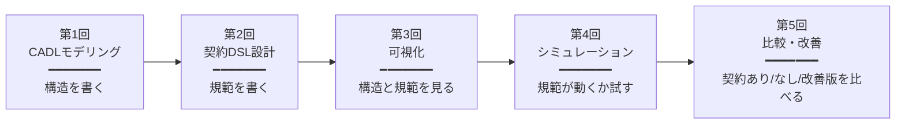
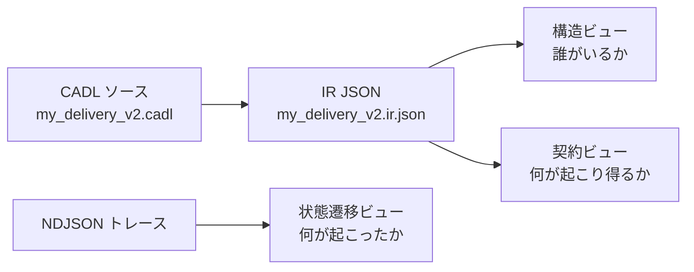
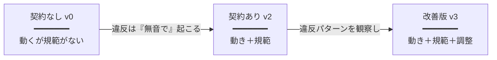

# SoS-DSL ハンズオン PBL コース設計書

> ロボット配送 SoS を題材とした、CADL モデリング → 契約 DSL 設計 → 可視化 → シミュレーション → 比較分析 を一気通貫で体験させる Project-Based Learning（PBL）コースの設計書です。

> 関連ドキュメント：
> - メイン教材 → [`sos-dsl-handson-textbook.ja.md`](sos-dsl-handson-textbook.ja.md)
> - 演習問題集（5 回シリーズ） → [`sos-dsl-exercises.ja.md`](sos-dsl-exercises.ja.md)
> - 学術背景・参考文献 → [`sos-academic-background.ja.md`](sos-academic-background.ja.md)

## 本コースの位置付け

このコース設計書は **教員のレッスンプラン** であり、同時に **学生の学習ガイド** です。各回・各課題に「学術的意義」と「学びの観点」を併記することで、単なる手順指導ではなく、研究領域の中での位置付けを学生に意識させながら手を動かさせる、PBL 型授業の運営を可能にします。

> 💡 **本書の読み方**:
> - § 1〜2 は授業計画の骨格（全 5 回）。
> - § 3 はクラス内の習熟度差への対応。
> - § 4〜7 は教材内容を縦に深掘り（モデリング / 契約 / 可視化 / シミュレーション）。
> - § 8〜10 は教員視点の補助（つまずき、研究接続、発展）。

---

## 1. 演習全体設計（5 回）

### コース全体図



各回は授業時間 **90 分**、宿題 **2〜3 時間** を想定。コース末の最終提出物は **3 ページのレポート**。

### 第 1 回 — CADL モデリング

| 項目 | 内容 |
| --- | --- |
| **テーマ** | SoS の構造を CADL で記述する |
| **到達目標** | (1) アクター・能力・インターフェイス・契約を CADL で宣言できる<br>(2) 構造的な仕様の限界（時間・違反・帰結を扱えないこと）を言語化できる |
| **学生の作業** | (a) ロボット配送 SoS の主要アクター（Robot, Coordinator, Customer）を識別<br>(b) 各アクターの role / autonomy / capabilities / interface を定義<br>(c) `DELIVERY_SLA` 契約の parties / assume / guarantee を記述<br>(d) `cadl check` で文法・型チェックを通す |
| **教員の支援** | (a) Maier の 5 条件を導入し「なぜ SoS なのか」を確認<br>(b) よくある誤りに事前注意（§4 参照）<br>(c) IR JSON で `lifecycle: null` / `monitors: []` を可視化させ「ここに何かが足りない」と感じさせる |
| **成果物** | `my_delivery_v1.cadl`（構造のみ）+ 「v1 で表現できないもの」3〜5 行のメモ |
| **学術的意義** | アーキテクチャ記述言語（ADL）の系譜（Medvidovic & Taylor, 2000）に CADL を位置付ける。ISO/IEC/IEEE 42010 が定義する「アーキテクチャ記述」の構造的部分を体験する。 |
| **学びの観点** | 「構造を書くこと」と「振る舞いを書くこと」の分離を、書き手として体感させる。**構造記述だけでは『約束』を表現できない**ことに気付かせるのが本回の要諦。 |

### 第 2 回 — SoS 契約 DSL 設計

| 項目 | 内容 |
| --- | --- |
| **テーマ** | 構造に規範（norm）を載せる — 義務・違反・帰結の宣言的記述 |
| **到達目標** | (1) 契約に `lifecycle:` / `monitors:` を追加できる<br>(2) 期限と違反の関係（`deadline` + `on_violation`）を理解する<br>(3) 述語による宣言的観測（`monitors`）と、状態遷移による動作的記述（`transitions`）の違いを説明できる |
| **学生の作業** | (a) 7 状態のライフサイクルを定義（Proposed → … → Completed/Violated）<br>(b) `accept` 遷移に 5 秒の `deadline` を設定し、`on_violation` で Violated に lift<br>(c) `battery_guard` モニターを追加（バッテリ < 20% かつ Assigned で発火）<br>(d) 1 つの ★★ 課題（過速度モニター or Cancelled 状態追加） |
| **教員の支援** | (a) 義務（obligation）/ 許可（permission）/ 禁止（prohibition）の具体例提示<br>(b) 「contract がプログラムと違う点」を§ 5 の比較表で明示<br>(c) `cadl sim-ir` で IR JSON を出力させ、`lifecycle` キーが populated に変わることを確認させる |
| **成果物** | `my_delivery_v2.cadl`（lifecycle + monitors 付き）+ `my_delivery_v2.ir.json` |
| **学術的意義** | 規範的マルチエージェントシステム（Normative MAS, Boella et al., 2006）の枠組みを ADL に統合する試み。von Wright（1951）以来の義務論理（deontic logic）の運用化。 |
| **学びの観点** | **規範をデータとして書く**ことで、契約は「コードを書き直さずに変更できる」ことを実感させる。プログラムと契約の境界線を意識させる。 |

### 第 3 回 — 可視化

| 項目 | 内容 |
| --- | --- |
| **テーマ** | 構造と規範を視覚的に検査する — CADL-explorer による可視化 |
| **到達目標** | (1) Lifecycle View の視覚的慣習（二重円・破線枠・赤エッジ）を説明できる<br>(2) v1 と v2 を視覚的に比較し、v2 で何が「捕まえられる」ようになったかを言語化できる<br>(3) 静的可視化（Lifecycle View）と動的可視化（Trace View）の使い分けを理解する |
| **学生の作業** | (a) cadl-explorer を起動<br>(b) v1 / v2 の IR JSON をロードし、それぞれの可視化を取得<br>(c) スクリーンショットを撮り、A/B 比較レポートを 1 ページ作成<br>(d) ★★★：Violation Trace View を独自に追加（任意） |
| **教員の支援** | (a) ビューの慣習（凡例）を 5 分で説明<br>(b) v1 を見たときに「何も描かれない／警告が出る」体験を演出（v2 との対比を強烈に）<br>(c) 学生レポートをペアレビューさせ、説明能力を検査 |
| **成果物** | `session3_comparison.md`（1 ページ）+ スクリーンショット 2 枚 |
| **学術的意義** | アーキテクチャ可視化と「アーキテクチャ駆動の解析」（Garlan & Schmerl, 2009）の系譜。可視化は単なる装飾ではなく **第二のデバッガ** であるという主張の検証。 |
| **学びの観点** | **同じ仕様が異なるビューで異なる側面を露出する**ことを体験。SoS 設計者は「全体図 × トレース × 監視ダッシュボード」のように複数のレンズを使い分ける必要があると気付かせる。 |

### 第 4 回 — シミュレーション

| 項目 | 内容 |
| --- | --- |
| **テーマ** | 仕様を実行し、規範が本当に強制されるかを観察する |
| **到達目標** | (1) Python 参照ランタイムで自分の仕様を 5 ロボット並行で実行できる<br>(2) NDJSON トレースを読み、ロボットごとの結末を集約できる<br>(3) パラメータを 1 つ変えて結果を予測 → 実行 → 検証する科学的サイクルを回せる |
| **学生の作業** | (a) `multi_robot_demo --summary` でベースラインを取得<br>(b) `accept` 期限を 5s → 1s に縮め、再実行（★★）<br>(c) world parameters（battery, speed）を変えて 3 構成試行<br>(d) ★★★：Unity 実行で C# ランタイムでも同じ trace 形が出るか検証 |
| **教員の支援** | (a) ベースラインの「正解」テーブル（5 ロボット × 期待終端）を事前に共有<br>(b) ランダム性ではなく**決定論的シミュレーション**であることを強調 — リプレイ可能性は学習効果を高める<br>(c) 各構成の結果を学生にホワイトボードに書かせ、共有する（協調学習） |
| **成果物** | `session4_baseline.ndjson` + パラメータスイープ表（3 構成以上） |
| **学術的意義** | 実行時検証（Runtime Verification, Bartocci et al., 2018）の教材化。仕様駆動シミュレーションは形式手法と実装の橋渡しである。 |
| **学びの観点** | **仕様にそう書いてある** と **ランタイムが本当にそう動く** の境界を体験。仕様レビューと実行検証は補完関係であり置換関係ではないと理解させる。 |

### 第 5 回 — 比較・改善

| 項目 | 内容 |
| --- | --- |
| **テーマ** | 「契約あり vs なし vs 改善版」の比較で SoS 設計の核心を体感する |
| **到達目標** | (1) シミュレーション観察から **どの層を変えるべきか**（仕様 / ランタイム / 環境）を判断できる<br>(2) 改善前後を定量的に比較し、トレードオフを言語化できる<br>(3) 規範を仕様化した結果として SoS 全体の挙動がどう変わったかをレポートできる |
| **学生の作業** | (a) v2 から **契約を抜いた v0**（lifecycle / monitors を削除）を作成し、シミュレーション<br>(b) v2 と v3（改善版）を比較<br>(c) 違反率・遅延・完了数を表にまとめる<br>(d) 3 ページの最終レポート（初期モデル / シミュレーション比較 / 振り返り）<br>(e) ★★★：報酬実行を `cadl/runtime/engine.py` に実装 |
| **教員の支援** | (a) 「契約を抜く」という発想（v0）を提示 — これが本回のキーアイディア<br>(b) 比較指標（違反率 / 遅延 / 効率 / 衝突）の定義を統一<br>(c) レポートのテンプレート（3 ページ構成）を配布 |
| **成果物** | `my_delivery_v0.cadl`（契約なし） + `my_delivery_v3.cadl`（改善版）+ 最終レポート |
| **学術的意義** | 規範の効果測定 — Andrighetto et al. (2013) が提起する「norm の社会的便益」の実験的検証。SoS validation 方法論（Sahin et al., 2007）の小規模再現。 |
| **学びの観点** | **契約があると何が変わるか** を数値で示すことで、SoS-DSL の存在意義そのものを学生自身の手で発見させる。「SoS 設計の本質は構造でも振る舞いでもなく、規範である」という主張を体験的に納得させる。 |

### 縮小 3 回バージョン

時間が限られる場合：

| 縮小回 | 統合 | 主たる重点 |
| --- | --- | --- |
| 第 A 回 | 第 1〜2 回 | モデリング + 契約 DSL |
| 第 B 回 | 第 3〜4 回 | 可視化 + シミュレーション |
| 第 C 回 | 第 5 回 | 比較・改善 |

---

## 2. 各回の詳細課題

### 第 1 回 — 詳細

#### 課題 1.1（必修・★）— ベースライン構造モデルの作成

**課題説明**: ロボット配送 SoS を CADL で記述する。Coordinator / Robot[1..N] / Customer[1..M] の 3 アクターと、それらの間の `DELIVERY_SLA` 契約を 1 つ宣言する。

**入力（配布物）**:
- メイン教材 [`sos-dsl-handson-textbook.ja.md`](sos-dsl-handson-textbook.ja.md) Step 2 のコード片
- `examples/sos_dsl_robot_delivery.cadl`（参照のみ。コピペ禁止）
- 学術背景 [`sos-academic-background.ja.md`](sos-academic-background.ja.md) §1（Maier 5 条件）

**出力（提出物）**:
- `my_delivery_v1.cadl`
- `cadl check my_delivery_v1.cadl` が `OK` で終わる証拠（端末出力）
- 「v1 で表現できないもの」3〜5 行のメモ（`session1_gap.md`）

**評価観点**:
| 観点 | 配点 | 評価基準 |
| --- | --- | --- |
| 文法的正しさ | 30% | `cadl check` が `OK` で終わる |
| アクター設計 | 30% | role/autonomy/capabilities が妥当・一貫している |
| 契約 A/G の妥当性 | 20% | `assume`/`guarantee` がドメインに照らして合理的 |
| ギャップ言語化 | 20% | v1 で表現できないことを言語化できている |

#### 課題 1.2（中級・★★）— アクター追加とプロトコル

`MAINTENANCE` アクターを追加し、`MAINTENANCE_SLA` 契約と `DeliveryProposal` プロトコルを記述。

#### 課題 1.3（発展・★★★）— ドローン配送ドメインを白紙から

既存ファイルを参照せず、配送ドローン群の CADL 骨格をゼロから書く。

---

### 第 2 回 — 詳細

#### 課題 2.1（必修・★）— ライフサイクル追加

**課題説明**: v1 を v2 にコピーし、`DELIVERY_SLA` に 7 状態のライフサイクルを追加。`accept` 遷移に 5 秒の `deadline` と `on_violation` を設定。

**入力**: 第 1 回成果物 `my_delivery_v1.cadl`、学術背景 §3.2 (規範的 MAS)

**出力**: `my_delivery_v2.cadl`、`my_delivery_v2.ir.json`

**評価観点**:
| 観点 | 配点 | 評価基準 |
| --- | --- | --- |
| 状態網羅 | 25% | 7 状態すべて宣言、initial/terminal が妥当 |
| 遷移の正当性 | 30% | 4 遷移の from / to / on が一貫している |
| deadline 設計 | 25% | 5s が選ばれた理由を `session2_design_note.md` で説明 |
| on_violation の妥当性 | 20% | severity の選択（Major/Minor/Critical）が justified |

#### 課題 2.2（中級・★★）— モニター追加

`battery_guard` または `over_speed` のいずれかを追加。`rule` の述語が CADL の評価規則（state == Assigned のような bare identifier 慣習）に従っているか教員と確認。

#### 課題 2.3（中級・★★）— Cancelled 状態の追加

新しい terminal state `Cancelled` を追加し、顧客側からのキャンセル遷移を定義。後方互換性（既存トレースが壊れないこと）を意識させる。

#### 課題 2.4（発展・★★★）— 2 契約の共存

`DELIVERY_SLA` と `FLEET_SAFETY` を共存させ、同じロボットが両方の契約の当事者になるとどうなるかを設計。

---

### 第 3 回 — 詳細

#### 課題 3.1（必修・★）— v1/v2 の可視化と差分の言語化

**課題説明**: cadl-explorer を起動し、v1（契約なし）と v2（契約あり）の Lifecycle View を取得、両者を視覚的に比較。

**入力**: `my_delivery_v1.ir.json`、`my_delivery_v2.ir.json`、cadl-explorer 起動済み環境

**出力**: 
- スクリーンショット 2 枚（v1 = 警告画面、v2 = 状態機械図）
- `session3_comparison.md`（1 ページ、A/B 比較レポート）

**評価観点**:
| 観点 | 配点 | 評価基準 |
| --- | --- | --- |
| 視覚要素の同定 | 30% | 二重円・破線枠・赤エッジを正しく説明できる |
| 違いの言語化 | 40% | v1 で「何が見えないか」、v2 で「何が見えるようになったか」を 3 文以上で記述 |
| 図の読み取り正確性 | 30% | 状態数・遷移数・monitor 数を正しく読み取れる |

#### 課題 3.2（中級・★★）— A/B 視覚比較

複数の deadline 値（5s / 1s / 10s）に対して同じ画面を生成し、視覚で違いを確認。

#### 課題 3.3（発展・★★★）— Violation Trace View 開発

cadl-explorer に新しい Streamlit ページを追加し、NDJSON ログを Gantt 風タイムラインで表示。

---

### 第 4 回 — 詳細

#### 課題 4.1（必修・★）— ベースライン取得

**課題説明**: `multi_robot_demo --summary` を実行し、5 ロボットそれぞれの最終状態を解読。

**入力**: メイン教材記載の Python ランタイム、`fixture_delivery.ir.json`

**出力**: `session4_baseline.txt`（端末出力の保存）、`session4_baseline.ndjson`（トレース）、各行を 1 文で説明したアノテーション

**評価観点**:
| 観点 | 配点 | 評価基準 |
| --- | --- | --- |
| 実行成功 | 30% | ベースラインが期待値（5 ロボット × 5 結末）と一致 |
| トレース解読 | 50% | 各 ロボットの状態変化と違反原因を説明できる |
| 観察の質 | 20% | 「なぜ robot-4-1 は Proposed のままか」など、観察に基づく問いを立てられる |

#### 課題 4.2（中級・★★）— 期限変更と再実行

`accept` の deadline を 1s に変更し、結果がどう変わるか観察。

#### 課題 4.3（中級・★★）— World パラメータスイープ

3 構成（battery 高 / 中 / 低、speed 高 / 中、deadline 緩 / 厳）で結果を比較。

#### 課題 4.4（発展・★★★）— Unity 実行検証

C# ランタイムが Python と同じトレース形を生成することを確認。

---

### 第 5 回 — 詳細

#### 課題 5.1（必修・★）— 契約なしバージョンの作成

**課題説明**: v2 から `lifecycle:` と `monitors:` ブロックを削除し、`my_delivery_v0.cadl` として保存。これに対して同じシミュレーションを実行。

**入力**: 第 4 回までの成果物すべて

**出力**: 
- `my_delivery_v0.cadl`
- `session5_v0_trace.ndjson`
- v2 と v0 の比較表（後述）

**評価観点**:
| 観点 | 配点 | 評価基準 |
| --- | --- | --- |
| v0 が正しく構築できている | 20% | 契約セクションを完全に削除し、`cadl check` を通す |
| 比較表の作成 | 40% | 違反検出数 / 遅延 / 完了数を v2 と v0 で対比 |
| 解釈 | 40% | 「契約があるとなぜ違反が増えるか」のパラドックスを言語化できる |

> 💡 **教員のヒント**: v0 では `Violated` という概念自体が無いので、表面的には「違反 0 件」となる。これを学生に発見させると **「規範がないと違反は『見えなく』なるだけで、悪い結果はそのまま起きる」** という SoS 設計の核心に至る。

#### 課題 5.2（中級・★★）— 改善版 v3 の作成

第 4 回で観察された問題（例：deadline が厳しすぎる）に対し、仕様レベルで修正した `my_delivery_v3.cadl` を作成。再シミュレーションで効果を検証。

#### 課題 5.3（発展・★★★）— 報酬実行の実装

`cadl/runtime/engine.py` を拡張して `incentives.rules` を実行可能にする。

#### 課題 5.4（必修・★）— 最終レポート（3 ページ）

| ページ | 内容 |
| --- | --- |
| 1 | 初期モデル（v1）と v0/v2/v3 の差分。仕様変更の意図と仮説 |
| 2 | シミュレーション結果の比較表とグラフ。3 構成最低 |
| 3 | 振り返り — 規範を仕様化することで何が得られたか、SoS-DSL の改善案 |

**評価観点**:
| 観点 | 配点 | 評価基準 |
| --- | --- | --- |
| 仮説と検証の対応 | 25% | 仮説 → 実験 → 結果 → 解釈の流れが明確 |
| 定量データ | 25% | 違反率・遅延・完了数が表/グラフで提示されている |
| SoS 設計への洞察 | 25% | 規範の効果について 1 つ以上の独自観察 |
| 文章の質 | 25% | 3 ページに収まり、図表が適切に使われている |

---

## 3. 段階的難易度設計

### 初級（学部 3 年・SoS 初学者）

**扱う内容**: 第 1〜3 回（CADL モデリング + 契約 DSL + 可視化）

各回必修課題（★）のみ。第 5 回の最終レポートも 1 ページに短縮可。

**学術的意義**: アーキテクチャ記述言語と規範記述言語の存在意義を体感する。

**学びの観点**:
- 構造と規範の分離
- 仕様を「コード以外で書く」ことへの慣れ
- 可視化が単なる装飾でなく**設計の検証手段**であること

### 中級（学部 4 年・卒研着手前）

**扱う内容**: 第 1〜4 回 + 第 5 回 ★ 課題（契約なしケースの作成）

すべての必修と中級（★★）課題を完了。発展（★★★）は任意。

**学術的意義**: 仕様駆動シミュレーションによる規範検証 — 形式手法と実装の橋渡し。

**学びの観点**:
- 「同じ仕様」が異なるターゲット（Python / Unity / SimPy）で動く意味
- パラメータを 1 つだけ変える科学的実験の作法
- v0 vs v2 比較から SoS-DSL の存在意義を発見

### 上級（修士・研究志向）

**扱う内容**: 全 5 回すべての課題 + 1 つ以上の発展テーマ（§ 10）

★★★ 課題（報酬実行・Violation Trace View・ドローン版）を最低 1 つ実装。

**学術的意義**: 規範を実行可能仕様として扱う研究の最先端 — Andrighetto et al. (2013) や Bartocci et al. (2018) の流れに自分の実装を位置付ける。

**学びの観点**:
- ランタイムの拡張により仕様の意味論を変える経験
- 実装→論文化の道筋を見通せる
- 「自分が書いた spec が他人の codegen と動く」エコシステムの感覚

### 発展課題（任意）

| 発展課題 | 対応レベル | 学術的接点 |
| --- | --- | --- |
| ドローン配送（高度・天候・no-fly zone） | 中・上 | 連続変数を含む規範記述、CPS（Cyber-Physical Systems） |
| マルチ契約共存（DELIVERY + SAFETY） | 上 | 規範間の衝突解消（norm conflict resolution） |
| 報酬実行の実装 | 上 | 機構設計（mechanism design）への接続 |
| Violation Trace View 開発 | 中・上 | アーキテクチャ駆動デバッグ、可視化研究 |
| 契約をブロックチェーン上で実行 | 上 | スマートコントラクト、分散合意 |

---

## 4. CADL モデリング課題設計

### 学生に最初に書かせるモデル例（雛形）

```yaml
# my_delivery_v1.cadl  ─── 第 1 回の出発点
sos:
  name: "MyDelivery"
  type: Acknowledged
  version: "0.1.0"

  context:
    environment:
      grid_size: 30
      num_robots: 3
      time_step_ms: 100

  actors:
    - id: COORDINATOR              # 教科書では DISPATCHER だが、自分の語彙で書かせる
      role: "central_coordinator"
      autonomy: low
      capabilities: [assign_tasks]
      interface:
        input:  [position_report, task_completion]
        output: [route_assignment]

    - id: "ROBOT[1..N]"
      role: "delivery_agent"
      autonomy: high
      capabilities: [follow_path, pick_up, deliver]
      interface:
        input:  [route_assignment]
        output: [position_report, task_completion]

  contracts:
    - id: DELIVERY_SLA
      parties: [COORDINATOR, "ROBOT[*]"]
      assume:
        - "ROBOT[i].battery > 20"
      guarantee:
        - "delivery_time <= 300s"
```

学生にはこの 30 行を「写経 ではなく、自分の理解で書き直す」ことを要求する。

### よくある誤り

| 誤り | 症状 | 修正の方向性 |
| --- | --- | --- |
| アクター ID をクオートしない | `[1..N]` の `[` が YAML フロー配列開始と解釈され、パースエラー | `"ROBOT[1..N]"` のようにダブルクオートで囲む |
| `assume` と `guarantee` を混同 | `delivery_time <= 300s` を `assume` に書く | `assume` は前提（入力側）、`guarantee` は保証（出力側） |
| `interface.input/output` を省略 | アクターが「何を受け、何を出すか」が不明瞭になる | 入出力を 1 つ以上は必ず宣言させる |
| 契約の `parties` に未宣言アクターを入れる | 型チェックでエラー、または黙ってスキップされる | actors セクションと parties の整合性を IR で確認 |
| `autonomy` を全部 `high` にする | SoS の権威構造が表現できない | 教員が「Coordinator は本当に high か？」と問う |

### 改善の方向性（教員からのコメント例）

- 「DISPATCHER という名前は機能を表しているが、語彙統一の観点で COORDINATOR の方がコース全体で一貫する」
- 「`capabilities: [assign_tasks]` は 1 つだけ。他にどんな能力が必要かは Step 2 で発見する」
- 「`assume: ['ROBOT[i].battery > 20']` は良いが、誰が観測してそれを保証するのか？ → これは Step 2 で `monitor` として設計する」

### なぜ構造モデリングが重要なのか — 学術的意義

**ISO/IEC/IEEE 42010 の主張**：システムのアーキテクチャは、関係者（stakeholder）の「関心事（concerns）」を満たすために構成される。アクターを定義し、その関係を契約として記述することで、関係者ごとに「何を期待するか」を分離して書ける。これは伝統的なソースコードでは実現できない。

**SoS 文脈における特異性**: SoS は単一組織のシステムと違い、構成要素が**運用・管理上独立**している（Maier 1998 条件 1, 2）。だから「全員が読む共通の仕様」が必要であり、それが ADL である。CADL の `actors` ブロックは、各構成システムのオーナーが自組織の責任範囲を読み取れる文書になっている。

### 学生に身につけさせたい抽象化能力

| 抽象化レベル | 具体例 | 学生に求められる思考 |
| --- | --- | --- |
| **L1: 物理的なモノの抽象化** | 配達ロボットの個体差を抽象化し `ROBOT[1..N]` と書く | 個別事例から型へ |
| **L2: 役割の抽象化** | 「中央管制」を `role: "central_coordinator"` と命名する | ふるまいから役割へ |
| **L3: 関係の抽象化** | 「依頼-応答」を `interface.output → interface.input` で表す | 通信を有向接続として記述 |
| **L4: 規範の抽象化** | 「期限内応答」を `deadline + on_violation` と書く（第 2 回の主題） | 動詞ではなく宣言で書く |

この 4 段階を 5 回で順に登る。

---

## 5. SoS 契約 DSL 課題設計

### 義務・許可・禁止の具体例

CADL 既存構文の `obligations:` / `permissions:` / `prohibitions:` clause + SoS-DSL 拡張の `lifecycle:` で表現する。

| 規範種別 | 自然言語 | CADL 表現 |
| --- | --- | --- |
| **義務（obligation）** | 「ロボットは割当後 5 秒以内に応答せよ」 | `lifecycle.transitions[id=accept].deadline: 5s` + `on_violation.transition: Violated` |
| **義務** | 「ロボットは配送を 300 秒以内に完了せよ」 | `contract.guarantee: ["delivery_time <= 300s"]` + `monitor.deadline_watch` |
| **許可（permission）** | 「Coordinator は応答無しの配送を再割当できる」 | `permissions: [- "reassign(Robot, DeliveryRequest) when no_response"]`（既存 CADL clause） |
| **禁止（prohibition）** | 「バッテリ 20% 未満時は新規配送を受諾してはならない」 | `monitor.battery_guard.rule: "battery < 20 AND state == Assigned"` + `on_match.transition: Violated` |
| **禁止** | 「Coordinator は同じ配送を 2 体以上に同時割当してはならない」 | （現行 SoS-DSL では未対応 — 上級学生への発展課題に） |

### 違反設計の例

| 違反種別 | 検出方法 | 重大度（severity） | 帰結 |
| --- | --- | --- | --- |
| **遅延（応答）** | `accept` の `deadline` 切れ | Major | `Violated` 状態へ遷移、再割当権発動 |
| **遅延（配送）** | `monitor.deadline_watch` の `now > request.deadline` | Critical | `Violated` 状態、ペナルティ計上 |
| **応答なし** | 同上（`accept` deadline） | Major | 再割当 |
| **衝突** | `monitor.collision_watch` の `min_dist < 0.05` | Critical | 即時 `Violated`、シミュレーション停止 |
| **バッテリ違反** | `monitor.battery_guard` の `battery < 20 AND Assigned` | Major | 配送拒否、`Violated` 状態 |

### 状態遷移の例（必修テンプレート）

```yaml
lifecycle:
  states:
    - Proposed         # 配送要求が公開された
    - Assigned         # ロボットが割当てられた
    - Accepted         # ロボットが受諾した
    - Delivering       # 走行中
    - Completed        # 完了（terminal）
    - Violated         # 規範違反で打ち切り（terminal）
    - Terminated       # 外部からの中止（terminal）
  initial: Proposed
  terminal: [Completed, Violated, Terminated]
  transitions:
    - id: assign         # event-driven
      from: Proposed
      to:   Assigned
      on:   "COORDINATOR -> ROBOT[i] : route_assignment"

    - id: accept         # deadline-bounded
      from: Assigned
      to:   Accepted
      on:   "ROBOT[i] -> COORDINATOR : ack(accepted)"
      deadline: 5s
      on_violation:
        transition: Violated
        severity:   Major

    - id: start_delivery # state-change driven
      from: Accepted
      to:   Delivering
      on:   "ROBOT[i].status == InTransit"

    - id: complete       # state-change with guard
      from: Delivering
      to:   Completed
      on:   "ROBOT[i].status == Delivered"
      when: "now <= request.deadline"
```

### 規範をモデル化することの学術的意義

**von Wright (1951) 以来の義務論理（deontic logic）**: 「すべきこと」と「あること」を分離して論理的に扱う伝統。AI・哲学・法学で発展してきた。

**Boella et al. (2006)** が定義する Normative MAS は、エージェントが「規範に従うか破るか」を選択できる前提でシステムを設計する。これは「規範を破れない」と仮定する伝統的な制御理論とは大きく異なる。

**SoS との関係**: SoS の構成要素は管理上独立しているため、**コードレベルで強制できない**。彼らの行動を制御するには、(a) 規範を明示し、(b) 違反を検出し、(c) 帰結を与えるメカニズムが必要。これがまさに SoS-DSL の機能設計の根拠である。

### プログラムと契約の違いをどう理解させるか

学生に提示する比較表：

| 観点 | プログラム | 契約 |
| --- | --- | --- |
| **誰が書くか** | 開発者 | 関係者全員（または代表） |
| **誰が読むか** | コンパイラ | 関係者全員 |
| **誰が実行するか** | CPU | 構成システム（自律的） |
| **違反したらどうなるか** | クラッシュ・例外 | 違反検出・帰結（reward / penalty） |
| **実行モデル** | 命令の逐次実行 | 契約状態の遷移 + 並行性 |
| **検証可能性** | 単体テスト | 規範違反の運用時検証 |
| **変更影響** | コードベース全体 | 契約 1 つの変更で影響範囲を限定 |

> 💡 **学生への問いかけ**: 「どちらが SoS に向いているか？」と問うと、ほぼ全員「契約」と答える。次に「なぜ？」と問うと、ここで初めて Maier の (1)(2) 条件が腑に落ちる。

---

## 6. 可視化設計（CADL-explorer）

CADL-explorer は Streamlit ベースで、現行 / 提案ビューの 3 系統を学生に体験させる。

### 構造ビュー（既存・第 3 回前半）

**何を可視化するか**: アクター間の通信関係をノード・エッジで描画。アクターの役割・自律度・interface ポートを属性として表示。

**学生に何を気づかせるか**: 「この SoS には誰が／何種類いて、どこと通信しているか」が一目で分かる。たくさんアクターがいる SoS では、これが**契約の前提（前章の `actors` 宣言）が正しく書けているかの最初の検査**になる。

**学術的意義**: アーキテクチャビュー（ISO 42010）の最も基本的なもの。ADL の存在意義はこの図がコードから自動生成できる点にある。

### 契約ビュー（既存 Lifecycle View・第 3 回後半）

**何を可視化するか**: 契約のライフサイクル状態を有向グラフで描画。視覚的慣習：

- 二重円 = `lifecycle.initial`
- 緑塗り破線 = `Completed`
- 赤塗り破線 = `Violated`
- 灰塗り破線 = `Terminated` 等
- 実線エッジ + `Δ 5s` = deadline 付き遷移
- 赤破線エッジ = `on_violation` の lift

**学生に何を気づかせるか**: 同じ契約を「コードとして」書いた v2 ファイルと、「図として」見たビューが**同じ意味**であること。図の方が **何が違反を引き起こすか** を直感できる。

**学術的意義**: 規範論理の状態機械可視化（Boella et al., 2008 の手続き的規範）。**規範は静的に書くだけでなく動的にも見られる**ことの実演。

### 状態遷移ビュー（提案・第 3 回 ★★★）

**何を可視化するか**: 実行時のトレース（NDJSON）を時間軸でプロット。各契約インスタンスが 1 行、状態区間ごとに色分けされたバー、違反イベントは赤い × マーカー。

**学生に何を気づかせるか**: 静的な状態機械図（契約ビュー）と動的なトレース（状態遷移ビュー）は**異なるレンズ**である。前者は「何が起こり得るか」、後者は「何が起こったか」。両方が SoS 設計に必要。

**学術的意義**: 実行時検証（Bartocci et al., 2018）の可視化が、契約定義の妥当性検証に役立つ。アーキテクチャ駆動デバッグ（Garlan & Schmerl, 2009）の実装例。

### 3 ビューの相互関係



学生にはこの図を第 3 回の冒頭で示し、**自分が書いたソースが 3 つのビューに枝分かれしていく**ことを意識させる。

---

## 7. シミュレーション設計

第 4 回・第 5 回でシミュレーションを使う目的は **「契約の有無で SoS 全体の挙動がどう変わるか」を定量的に比較する** こと。

### 契約なしケース（v0）

**作成方法**: `my_delivery_v2.cadl` から `lifecycle:` と `monitors:` ブロックを削除して `my_delivery_v0.cadl` を作る。`actors` と `parties`、`assume`/`guarantee` は残す。

**実行方法**: `multi_robot_demo` を v0 に対応するよう修正（`open_instance` で初期状態がない契約を扱う）。

**期待される挙動**:
- ロボットは依然として走り回り、配送を試みる（actors 自体は動く）
- 期限切れも観測されるが、`Violated` という状態に遷移する仕組みがないので **ログには現れない**
- 違反は「無音で起こる」

### 契約ありケース（v2）

**実行方法**: メイン教材で説明済みの multi_robot_demo を使用。

**期待される挙動**: 5 ロボット × 5 結末（Completed / 3 種類の Violated / Proposed のまま）。

### 比較項目と算出方法

| 比較項目 | v0（契約なし） | v2（契約あり） | 学生の観察 |
| --- | --- | --- | --- |
| **遅延** | 全配送について `now - deadline` を測定（自前で計算） | `deadline:` 違反として自動検出 | v0 は遅延を「見えなく」する |
| **失敗率** | `delivery_time > 300s` の手動検出 | `Violated` 状態の発生数 | v2 は failure を **言語化** する |
| **効率（throughput）** | `Completed` 配送数 / 単位時間 | 同上 | v2 では `Violated` がカウントされず、表面上の効率が下がって見える可能性がある |
| **衝突** | 衝突検知ロジックがない（あるいは sim 内のみ） | `monitor.collision_watch` で自動検出 | v2 は危険挙動を**契約違反として**扱う |

### なぜ比較が重要か — 学術的意義

**Andrighetto et al. (2013)** が議論する **「規範の社会的便益」**: 規範はそれ自体何かを生産しない。むしろ、規範を導入する **コスト**（書く手間、検出器の運用、違反処理）に対して、得られる **利益**（予測可能性、信頼、合意形成のコスト削減）を計測することが規範研究の核心。

学生はこの問いを、SoS-DSL の小規模な実装を使って **数値で答える** 経験をする。これは規範研究のミニチュア版である。

### 学生に理解させたい「SoS 設計の本質」



**核心の主張**: 

> SoS 設計の本質は「動かすこと」でも「最適化すること」でもなく、**「何を違反として認識するかを決めること」**である。

v0 と v2 の比較で学生はこれを実感する。v0 では SoS は動く（から「うまく動いているように見える」）が、v2 で初めて「実は遅延が起きていた」「実は危険挙動があった」が**観測可能になる**。これが SoS-DSL を導入する根拠である。

### サンプル比較表（学生に書かせる最終提出物の核）

| 指標 | v0 | v2 | v3 | 解釈 |
| --- | --- | --- | --- | --- |
| Completed 数 | ? | ? | ? | … |
| Violated 数（`accept` 期限） | (検出不可能) | ? | ? | v2 で初めて測定可能に |
| Violated 数（`battery_guard`） | (検出不可能) | ? | ? | 同上 |
| 平均遅延 | ? | ? | ? | … |
| ロボット稼働率 | ? | ? | ? | … |

学生はこの表を埋め、各列の差分を 3 文以内で説明する。

---

## 8. 教育的に重要なポイント

### 学生がつまずくポイント

| つまずき | 兆候 | 教員の介入 |
| --- | --- | --- |
| **YAML 構文（インデント・引用符）** | `cadl check` でパースエラー多発 | 第 1 回で 5 分かけて YAML の罠（`on:` がブール、`[ROBOT[i]]` がフロー配列、等）を実演 |
| **`assume` と `guarantee` の混同** | A/G が逆 | UML の事前条件・事後条件と対応させる |
| **`lifecycle.terminal` の意義** | `Completed` を terminal にしないままにする | 「終了状態は閉じている。`Violated` も同じ」と説明 |
| **`deadline` の単位と相対性** | 5s が absolute か relative か混乱 | 「state に入った瞬間からの経過時間」と明示 |
| **モニターと遷移の混同** | `monitor.on_match.transition` と `transition.on_violation.transition` の違い | 図で対比：monitor は観測駆動、transition は event 駆動 |
| **可視化が「ただの装飾」と思う** | 第 3 回でビューを開かずスキップ | 「v1 と v2 の違いを 3 つ図から読み取れ」を強制 |
| **シミュレーション結果の解釈** | 5 ロボットの結末を見て「とりあえず動いた」で終わる | 「robot-4-1 が Proposed のままなのはなぜ？」を問う |
| **改善提案が specific でない** | 「もっと良くする」と書く | 「どの行を、なぜ、何に変えたか」を要求 |

### 理解が進む瞬間（aha ポイント）

学生がこのコースで「分かった！」となる典型的瞬間：

1. **第 1 回末**: IR JSON で `"lifecycle": null` を見て、「構造だけでは何かが足りない」と感じる瞬間。
2. **第 2 回中盤**: `deadline: 5s` を書いて IR を再生成し、`deadline_ms: 5000` に正規化されているのを発見する瞬間。**仕様が処理可能なデータになる**ことを目視する。
3. **第 3 回**: v1 と v2 の Lifecycle View を並べて見せたとき、v1 が「無」、v2 が「6 状態の図」になっていることに驚く瞬間。
4. **第 4 回**: ベースラインの 5 ロボット 5 結末を実行し、自分の予想と一致するのを確認する瞬間。
5. **第 5 回前半**: v0（契約なし）でシミュレートしたとき、「違反」が報告されないことに気付く瞬間 — **「違反は起きていないのではない、見えていないだけだ」**。
6. **第 5 回後半**: 改善版 v3 で違反率が下がるのを観測し、「自分の仕様変更がシステム挙動を変えた」体験をする瞬間。

教員はこれらの瞬間を教室で**意図的に作り出す**よう授業を設計する。例えば第 3 回は v1 を先に開かせる、第 5 回は v0 のシミュレーションを最初に走らせる、など。

### SoS らしさを実感させる工夫

| 工夫 | 効果 |
| --- | --- |
| **ロールプレイ**: 学生 5 人にロボット 1 体ずつを担当させ、誰が deadline を破るかを当てっこ | アクターの自律性と SoS の不確定性を体感 |
| **「もし契約がなかったら」シナリオ**: 第 5 回 v0 vs v2 比較 | 規範の必要性を**負の効果**から実感 |
| **Coordinator 側の視点替え**: 学生 1 人を Coordinator 役にして再割当の判断をさせる | SoS の「権威ある意思決定者」が**何を観測して**判断しているかを可視化 |
| **Maier 5 条件チェックリスト**: 第 1 回冒頭で配布 | 「これ本当に SoS か？」の自己点検を習慣化 |
| **ペアレビュー**: 第 3 回の比較レポートを学生間で読み合う | 「他人が書いた仕様」を読む経験 — 実 SoS 開発の主要スキル |

---

## 9. 研究との接続

このコースは大学院での卒研・修論テーマに直接接続できる。以下に主要な接続先を示す。

### この演習がつながる研究テーマ

| 研究テーマ | 演習での接点 | 発展の方向 |
| --- | --- | --- |
| **規範の効果測定（norm efficacy）** | 第 5 回 v0 vs v2 vs v3 比較 | 規模を 5 ロボットから 50 / 500 にスケールしたときの効果。Andrighetto et al. (2013) の議論を実証実験で検証 |
| **規範間衝突解消（norm conflict resolution）** | 課題 2.4（DELIVERY_SLA + FLEET_SAFETY 共存） | 矛盾規範の検出アルゴリズム、優先順位の自動決定 |
| **コード生成多ターゲット** | メイン教材の Python / C# / SimPy 生成 | Solidity / OPA / Rego への展開、ターゲット間の意味論等価性証明 |
| **アーキテクチャ駆動デバッグ** | Violation Trace View 開発（課題 3.3） | 大規模ログからの逸脱パターン自動抽出 |
| **規範学習** | 報酬実行（課題 5.3） | 強化学習で「最適な期限値」をエージェントが発見 |
| **CPS（サイバーフィジカル）契約** | 発展課題：ドローン配送 | 連続変数（位置・速度・天候）に対する規範記述の言語拡張 |
| **規範の検証（formal verification）** | 第 4 回シミュレーション | TLA+ や UPPAAL への変換による model checking |

### 論文化できるポイント

このコースの成果は次の形で論文化できる。

| 論文タイプ | 内容 | 投稿先候補 |
| --- | --- | --- |
| **方法論論文** | 「ADL に規範記述を統合する DSL 拡張：CADL+SoS-DSL の場合」 | INCOSE IS、ICSE SoSE、Software & Systems Modeling |
| **ツール論文** | 「教育用 PBL ツールとしての SoS-DSL ハンズオン」 | Computer Science Education、CSEE&T |
| **実証論文** | 「規範の有無が SoS 挙動に与える影響：ロボット配送ケーススタディ」 | SoSE、CASE、ICRA |
| **比較論文** | 「同一仕様からの異種ターゲットコード生成と意味論的等価性」 | MODELS、SLE |

### 新規性の主張の方向性

| 主張 | 新規性の根拠 | 必要な追加実験 |
| --- | --- | --- |
| (1) 既存 ADL に規範論理を統合する独自設計 | 既存 ADL（AADL, ACME, SysML）は規範を扱わない；既存 Normative MAS（OperA, Tropos）は ADL ではない | 既存ツールとの機能比較表 |
| (2) 規範効果の小規模実証 | 5 ロボット規模での v0/v2/v3 比較を再現可能な形で提示 | スケール実験（10/50/500 ロボット） |
| (3) 教育有効性 | PBL コースとしての設計と効果測定 | プレ/ポストテスト、学生アンケート |
| (4) 同一 IR からの多ターゲット生成 | Python / C# / SimPy の意味論等価性 | 等価性の形式的証明 |

---

## 10. 発展テーマ（3 候補）

### A. ドローン配送（高所・天候・no-fly zone）

**なぜ拡張として適切か**: 
- ロボット配送と構造的にほぼ同じ（actors / contracts のテンプレートを再利用可能）
- しかし**規範の表現力**を拡張する必要がある — 高度・天候・空域制限という連続変数や時間依存条件
- 「同じドメインの異形」として SoS-DSL の汎用性を試せる

**学術的意義**:
- **CPS（Cyber-Physical Systems）契約**の研究領域 — 物理量に対する規範記述
- ハイブリッドオートマトン（連続＋離散）と規範の統合
- Rajeev Alur 系の論文や RTSS / EMSOFT で発表される研究テーマ

**追加が必要な機能**:
- `monitor.observe` に連続変数（高度、風速）
- `rule` の述語に時間積分（「30 秒以上 100m 超過」のような）
- 空域（geo-fence）の表現

### B. スマート交通（信号・バス・救急車・自家用車）

**なぜ拡張として適切か**:
- **複数の独立組織**（市交通局、バス会社、警察、市民）が登場する **真の Collaborative SoS**
- 学術背景ページ §1 で議論した Maier 5 条件をすべて満たす
- 学生にとって日常的に体験するドメイン

**学術的意義**:
- スマートシティ研究と密接（Madni & Sievers, 2014 の主題）
- **緊急車両優先**のような階層的規範の典型例
- 規範の多次元性（時間・空間・優先度）

**追加が必要な機能**:
- 規範間の優先順位（救急車 > バス > 自家用車）
- 地理的範囲制約（「この交差点では」）
- 動的な規範緩和（緊急時は一般車両への規範を一時無効化）

### C. データ共有 SoS（医療・スマートメーター・行政）

**なぜ拡張として適切か**:
- **データ提供者と利用者が異なる組織**であり、Maier 条件 (1)(2) を強く満たす
- プライバシ・同意・説明責任という、ロボット配送では浮上しなかった**規範の側面**を扱う
- 法学・倫理学との学際接続が見える

**学術的意義**:
- **GDPR / 改正個人情報保護法**との接続：法令を規範として記述する
- **データガバナンス研究**（International Data Spaces Association, Gaia-X 等）
- 同意管理の規範 — 「Bob が許可した時のみ Alice にデータ提供」のような条件付き義務

**追加が必要な機能**:
- 主体（subject）の識別と同意状態
- データの来歴（provenance）追跡
- 規範の時限性（「この同意は 30 日で失効」）

### 拡張の選び方

| 学生のバックグラウンド | 推奨 |
| --- | --- |
| ロボット工学・制御工学 | A. ドローン配送 |
| 交通工学・スマートシティ | B. スマート交通 |
| 情報セキュリティ・プライバシ・ELSI | C. データ共有 SoS |
| 修論テーマ未定 | B. スマート交通（最も Maier 性が強く、論文化しやすい） |

---

## 付録 — 教員向けチェックリスト

授業前に教員が確認すべき項目：

| 確認項目 | 第 1 回前 | 第 2 回前 | 第 3 回前 | 第 4 回前 | 第 5 回前 |
| --- | :---: | :---: | :---: | :---: | :---: |
| 全リポジトリが `feature/sos-dsl` ブランチでクローン済み | ✓ | | | | |
| `cadl check` / `cadl sim-ir` / `cadl codegen` が動作確認済み | ✓ | | | | |
| 学生用ノート PC に Python 3.10+, Node 18+ が入っている | ✓ | | | | |
| 学術背景 §1 の Maier 5 条件チェックリストを配布資料化 | ✓ | | | | |
| `examples/sos_dsl_robot_delivery.cadl` の動作確認 | | ✓ | | | |
| cadl-explorer が起動できることを確認 | | | ✓ | | |
| `multi_robot_demo --summary` が期待通り動く | | | | ✓ | |
| v0 サンプル（契約なし）が事前に作れている | | | | | ✓ |
| 比較レポートのテンプレートを学生に共有 | | | | | ✓ |

---

## 付録 — 関連ドキュメント

| ドキュメント | 用途 |
| --- | --- |
| [`sos-dsl-handson-textbook.ja.md`](sos-dsl-handson-textbook.ja.md) | メイン教材（90 分版） |
| [`sos-dsl-exercises.ja.md`](sos-dsl-exercises.ja.md) | 学生向け演習問題集（5 回シリーズ） |
| [`sos-academic-background.ja.md`](sos-academic-background.ja.md) | 学術背景・参考文献（ISO 21839/40/41、Maier 等） |
| [`sos-dsl-pr-drafts.md`](sos-dsl-pr-drafts.md) | 実装の PR ドラフト（参考） |
| [`sos-dsl-unity-runbook.md`](sos-dsl-unity-runbook.md) | Unity 実行手順 |
| [`sos-contract-dsl-design.md`](sos-contract-dsl-design.md) | 契約 DSL の設計議論ノート |
