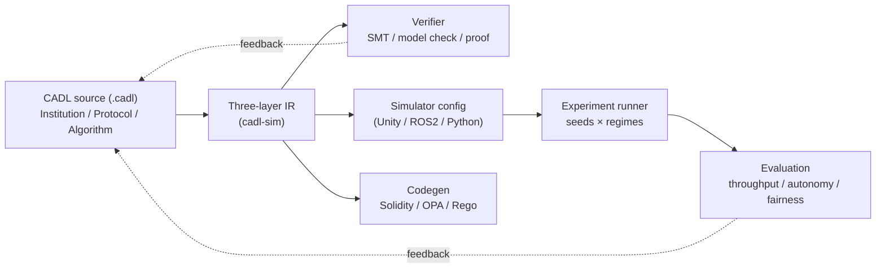

# CADL: Contract Architecture Description Language

**Language Specification — Version 0.1 (Draft)**

Graduate School of Informatics, Nagoya University — ERTL

March 17, 2026

---

## Overview

CADL (Contract Architecture Description Language) is a domain-specific language (DSL)
for formally specifying, verifying, and deploying **institutional designs** in
multi-agent **System of Systems (SoS)**.

CADL adopts a **three-layer architecture** — Institution, Protocol, and Algorithm —
enabling precise description of governance rules, coordination mechanisms, and
computational behavior within a single unified language. From a CADL specification,
the toolchain automatically generates simulator configurations and verifies
design consistency.

## Architecture at a Glance

The same IR drives three outputs in parallel: formal verification,
runtime simulator configs, and institutional-constraint code
(smart contracts / policy). Experiment results feed back into the
CADL source so governance parameters (α, β, λ, ρ) can be tuned.

## How to Read This Specification

This document is organized into three parts. Readers are encouraged to follow
the order below, but each chapter is also self-contained.

### Part I — Background and Requirements

- **[1. Introduction](./01-introduction.md)** — Motivation, problem setting, and
  the role of CADL within the SoS research agenda.
- **[2. Objectives](./02-objectives.md)** — What CADL aims to solve, and the
  scope of this first draft.
- **[3. Comparison](./03-comparison.md)** — Relationship to existing ADLs,
  contract languages, and multi-agent DSLs.
- **[4. Requirements](./04-requirements.md)** — Functional and non-functional
  requirements that drive the language design.

### Part II — Language and Design

- **[5. Language Specification](./05-language-spec.md)** — Core syntax and
  semantics of the three layers (Institution / Protocol / Algorithm).
- **[6. Design](./06-design.md)** — Design rationale, toolchain architecture,
  and intermediate representation (IR).
- **[7. Examples](./07-examples.md)** — Worked examples illustrating typical
  CADL usage.

### Part III — Applications and Outlook

- **[8. Use Cases](./08-use-cases.md)** — Application domains and case studies.
- **[9. Research](./09-research.md)** — Open research questions and theoretical
  foundations.
- **[10. Roadmap](./10-roadmap.md)** — Planned extensions and the path toward v1.0.

### Appendices

- **[Appendix A — Syntax](./appendix-a-syntax)** — EBNF grammar reference.
- **[Appendix B — References](./appendix-b-references)** — Cited literature.

## Suggested Reading Paths

- **First-time readers** — Read Chapters 1–2, skim Chapter 5, then look at
  Chapter 7 for concrete examples.
- **Implementers / tool builders** — Focus on Chapters 5, 6, and Appendix A.
- **Researchers** — Chapters 3, 9, and 10 give the broader context and
  open problems.

## Related Tools

- **[CADL Explorer](https://cadl-explorer.streamlit.app/)** — An interactive
  web application that demonstrates the CADL governance pipeline end-to-end,
  from specification through simulation to governance evaluation.

## Status

This is **Version 0.1 (Draft)**. The language and toolchain are under active
development; syntax and semantics may change in future revisions. Feedback
and discussion are welcome through the project channels.
