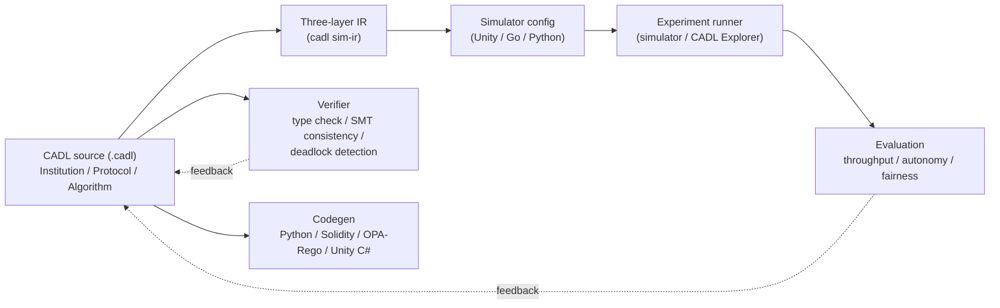

# CADL: Contract Architecture Description Language

**Language Specification — Version 0.2 (Draft)**

Graduate School of Informatics, Nagoya University — ERTL

October 10, 2026

---

## Overview

CADL (Contract Architecture Description Language) is a domain-specific language (DSL)
for formally specifying, verifying, and deploying **institutional designs** in
multi-agent **System of Systems (SoS)**.

CADL adopts a **three-layer architecture** — Institution, Protocol, and Algorithm —
so that governance rules and coordination mechanisms are described precisely
within a single unified language. The Algorithm layer names the central and
local algorithms each side runs; it does not describe their internals. From a CADL specification,
the toolchain automatically generates simulator configurations and verifies
design consistency.

## Architecture at a Glance



One source drives three outputs: formal verification and
institutional-constraint code (smart contracts / policy / runtime
classes) are produced from the parsed definition, and runtime simulator
configs from the three-layer IR. Experiment results feed back into the
CADL source so governance parameters ([α, β, λ, ρ](./glossary.md)) can be
tuned; α, β, and λ are the per-contract parameters, and ρ belongs to the
motivation extension ([Appendix C](./appendix-c-motivation.md)). The `cadl`
tool covers the source, verifier, codegen, IR, and simulator-config steps;
running experiments and evaluating them is done with a simulator or with
CADL Explorer.

## How to Read This Specification

This document is organized into three parts. Readers are encouraged to follow
the order below, but each chapter is also self-contained.

### Part I — Background and Requirements

- **[1. Introduction](./01-introduction.md)** — Motivation, problem setting, and
  the role of CADL within the SoS research agenda.
- **[2. Objectives](./02-objectives.md)** — What CADL aims to solve, and the
  scope of this draft.
- **[3. Comparison](./03-comparison.md)** — Relationship to existing ADLs,
  contract languages, and multi-agent DSLs.
- **[4. Requirements](./04-requirements.md)** — Functional and non-functional
  requirements that drive the language design.

### Part II — Language and Design

- **[5. Language Specification](./05-language-spec.md)** — Core syntax and
  semantics of the three layers (Institution / Protocol / Algorithm).
- **[6. Design](./06-design.md)** — Design rationale, toolchain architecture,
  verification engine, and runtime system. The intermediate
  representation (IR) is described in
  [Appendix E, §E.7](./appendix-e-sos-dsl.md#e7-intermediate-representation-ir-addition)
  and the [Glossary](./glossary.md).
- **[7. Examples](./07-examples.md)** — Worked examples illustrating typical
  CADL usage.

### Part III — Applications and Outlook

- **[8. Use Cases](./08-use-cases.md)** — Application domains and case studies.
- **[9. Research](./09-research.md)** — Open research questions and theoretical
  foundations.
- **[10. Roadmap](./10-roadmap.md)** — Implementation phases and the current
  status of the reference implementation.

### Appendices

- **[Appendix A — Syntax](./appendix-a-syntax.md)** — EBNF grammar reference.
- **[Appendix B — References](./appendix-b-references.md)** — Cited literature.
- **[Appendix C — Motivation Extension](./appendix-c-motivation.md)** — Agent motivation models and profiles.
- **[Appendix D — Code Generation Targets](./appendix-d-codegen.md)** — Catalogue of codegen targets.
- **[Appendix E — SoS-DSL Extension](./appendix-e-sos-dsl.md)** — Contract lifecycles and runtime monitors.
- **[Glossary](./glossary.md)** — Terms used throughout the specification.

## Suggested Reading Paths

- **First-time readers** — Read Chapters 1–2, skim Chapter 5, then look at
  Chapter 7 for concrete examples. The Chapter 7 listings are conceptual;
  runnable examples are in the
  [`examples/` directory](https://github.com/ertlnagoya/cadl/tree/master/examples)
  of the cadl repository and in the [hands-on course](../handson/index.md).
- **Implementers / tool builders** — Focus on Chapters 5, 6, and Appendix A.
- **Researchers** — Chapters 3, 9, and 10 give the broader context and
  open problems.

## Getting the tool

The reference implementation is [`cadl`](https://github.com/ertlnagoya/cadl).
It is installed with `pip install cadl-lang` (Python 3.9+); the command is
`cadl`. A first check is:

```bash
pip install cadl-lang
cadl --version
```

Then, with a `.cadl` file such as those in the repository's
[`examples/` directory](https://github.com/ertlnagoya/cadl/tree/master/examples),
run `cadl check <file>.cadl` and `cadl verify <file>.cadl`. See the
[repository README](https://github.com/ertlnagoya/cadl#readme) for all
commands and the [hands-on course](../handson/index.md) for a guided
walkthrough.

## Related Tools

- **[cadl](https://github.com/ertlnagoya/cadl)** — The CADL compiler and
  command-line tool (reference implementation), published on PyPI as
  [cadl-lang](https://pypi.org/project/cadl-lang/).
- **[CADL Explorer](https://cadl-explorer.streamlit.app/)** — An interactive
  web application that demonstrates the CADL governance pipeline end-to-end,
  from specification through simulation to governance evaluation.
- **[cadl-raspimouse-simulator](https://github.com/ertlnagoya/cadl-raspimouse-simulator)** —
  The simulator used by the hands-on course.

## Learning by doing

To write and run the language rather than only read about it, see the [hands-on materials](../handson/index.md): starting from robot delivery, they walk through authoring a spec, generating code, and running the simulation.

## Status

This is **Version 0.2 (Draft)**. The language and toolchain are under active
development; syntax and semantics may change in future revisions.

Version 0.2 reconciles the text of Version 0.1 with the reference
implementation. The changes that affect how an existing file is read are:

- **β is the degree of centralisation of decision-making**: 0 is fully
  decentralised and 1 is fully centralised
  ([Section 5.4.2](./05-language-spec.md)). Parts of Version 0.1 described
  it in the opposite direction.
- **SoS-DSL extension ([Appendix E](./appendix-e-sos-dsl.md))**: `on_violation.transition` and
  `on_match.transition` name a target *state* (rules L-5 and M-3), and
  `on_match.violation` is a label that needs no declaration (rule M-2). The
  extension itself is still `sos-dsl: 0.1`.
- **A `sharing:` entry MUST be a quoted string**
  (`- "TAXI[*] -> CENTRAL : position"`); unquoted, YAML reads it as a
  mapping and not as a string
  ([Appendix A, §A.4](./appendix-a-syntax.md#a4-contracts-institution-layer)).
- **The bound of a symbolic range is a symbolic size**: in `[1..N]`, `N`
  stands for any number of actors, and the language has no construct that
  gives it a value ([Section 5.2.2](./05-language-spec.md),
  [Appendix A, §A.3](./appendix-a-syntax.md#a3-context-actors-metrics)).
- **Identifiers are ASCII**; strings and comments may contain any Unicode
  character (requirement NFR-7 in [Chapter 4](./04-requirements.md),
  [Appendix A, §A.1](./appendix-a-syntax.md#a1-lexical-rules)).

The [motivation extension](./appendix-c-motivation.md) keeps its own label,
v0.1-ext.

The specification and the reference implementation are numbered
independently: this specification is Version 0.2, and the reference
implementation it was checked against is `cadl` 0.3.8.

Feedback and discussion are welcome via [GitHub Issues](https://github.com/ertlnagoya/cadl/issues).
Problems with the specification or this site can be reported at
[cadl-spec Issues](https://github.com/ertlnagoya/cadl-spec/issues).
