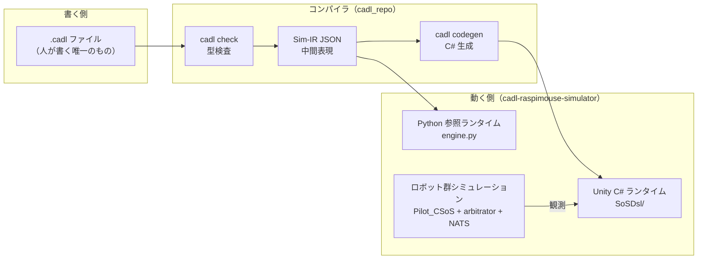

# 全体構造とコード解説 — 初めて触る人のために

コース A（メイン教材）に入る前に、このシステムが**全体としてどう動いているか**と、**どのファイルが何をしているか**を 30〜60 分で把握するためのページです。手を動かす前にここを一度読んでおくと、教材の各 Step で「いま自分はどの部品を触っているのか」が見えるようになります。

## 1. 全体アーキテクチャ — 1 枚の絵

登場するのは「仕様を書く側」と「仕様が動く側」の 2 つの世界と、その間をつなぐコンパイラです。



覚えることは 3 つだけです。

1. **契約のロジックとして人間が書くのは `.cadl` ファイルだけ**です。IR、C# の契約クラス、図は、ツールチェインのコマンドがそこから生成します。
2. **同じ IR を 2 つのランタイムが同じ意味論で実行**します。C# の契約コードは IR から*生成*されるのに対し、Python 参照ランタイムは IR を直接読み込む手書きの*インタプリタ*です（答え合わせ用）。
3. ロボットの制御コードと契約のコードは**分離**されています。契約はロボットを「観測」するだけです。ロボットの制御コード `Pilot_CSoS.cs` に契約のロジックは入っておらず、手書きの橋渡しは、ロボットの状態変化を契約イベントに変換する薄いブリッジ（`PilotContractBridge.cs`）だけです。

## 2. リポジトリと役割

| リポジトリ | 役割 | 公開 | コースで触るか |
| --- | --- | --- | --- |
| `cadl-spec` | 言語仕様書とこの教材サイト | 公開 | 読むだけ |
| `cadl`（`cadl_repo` としてクローン） | コンパイラ（パーサ・型検査・IR・コード生成） | 公開 | コマンドとして使う |
| `cadl-explorer` | Streamlit アプリ：ガバナンス設計の比較、CADL の編集と検査、状態機械図の描画 | 公開 | Web アプリとして使う（`streamlit run app.py`） |
| `cadl-raspimouse-simulator` | Unity プロジェクト・Go アービトレータ・Python ランタイム | 公開 | **Step 5〜6 で主に触る場所** |

リポジトリはこの 4 つです。シミュレータは、Unity プロジェクト（`unity/`）、Go アービトレータ（`arbitrator/`）、Python ランタイム（`cadl/runtime/`）を 1 つのリポジトリにまとめています。下の第 4 節で説明するファイルは、すべてこのリポジトリにあります。

名前についての補足です。Unity シーン（`C-SoS.unity`）、ロボットの制御コード（`Pilot_CSoS`）、アービトレータのディレクトリ（`C-SoS/`）に付いている「C-SoS」は、シミュレータ側では Collaborative SoS の略で（設定ファイルは `sosType: collaborative`）、このコースで使うモードの名前です。このモードでは、ロボットが配送を申し出て（claim）、`arbitrator/C-SoS` のアービトレータが落札を決めます。リポジトリには参考用に `D-SoS.unity` シーンも入っていますが、そのアービトレータは含まれていません。このラベルはシミュレータ側で決まるもので、CADL ファイルの `type:` とは独立です。このコースの CADL ファイルは `type: Acknowledged` と宣言しており、教材がロボット配送 SoS の類型を述べるときは、この宣言を指しています。

## 3. 1 つの契約が通る道 — ファイル単位で追う

教材の例題 `sos_dsl_robot_delivery.cadl`（153 行）を例に、自分の書いた 1 行がどこへ流れていくかを追います。

**(1) 仕様 → IR**。`.cadl` の `deadline: 5s` は、`cadl_repo/src/cadl/parser.py` が構文解析し、`sim/lower.py` が IR に落とすと `"deadline_ms": 5000` という JSON になります（IR 全体で 245 行）。IR は「人間向けの書き方」を捨てて「機械が実行しやすい形」だけを残した中間表現です。

**(2) IR → C#**。`codegen/unity_csharp/contract_emitter.py` が IR を読んで、契約 1 つにつき 3 ファイルを生成します：状態の列挙（`DeliverySlaState.cs`）、状態機械本体（`DeliverySlaContract.cs`）、監視ルール（`DeliverySlaMonitors.cs`）。これに共有ランタイム 5 ファイル（後述）を足した計 770 行が `unity/Assets/Scripts/SoSDsl/` に配置されます。

**(3) C# が Unity で動く**。シーン上の `ContractRuntimeHost` が毎フレーム `Runtime.Tick(now)` を呼び、期限切れと監視ルールを評価します。各ロボットに付けた `PilotContractBridge` が、ロボットの状態変化（配送を落札した・配達を終えた）を**契約イベント**（`route_assignment` や `Delivered`）に翻訳して流し込みます。違反や状態遷移は Console に 1 行ずつ出ます：

```
[lifecycle DELIVERY_SLA/robot-2-1 Proposed -> Assigned (assign, event) @ 2050ms]
[violation DELIVERY_SLA/robot-2-1 battery_guard Major monitor:battery_guard @ 2150ms]
```

## 4. 主要ファイル解説

### 契約ランタイム（生成される側・C#）— `unity/Assets/Scripts/SoSDsl/`

| ファイル | 中身 | 行数の目安 |
| --- | --- | --- |
| `Runtime/ContractRuntime.cs` | インスタンス登録・イベント配送・`Tick` ループ。心臓部 | 約 90 |
| `Runtime/PredicateEvaluator.cs` | `"battery < 20 AND state == Assigned"` のような述語文字列の評価器 | 約 250 |
| `Runtime/ContractEvent.cs` | lifecycle / violation イベントの共通構造体。Console の行はここの `ToString()` | 約 40 |
| `Runtime/EventBus.cs` / `Severity.cs` | 軽量 pub-sub と深刻度 enum | 小 |
| `Generated/DeliverySlaContract.cs` | 遷移表そのもの。「このイベントが来て、この状態なら、この状態へ」の if 文が並ぶ | 約 220 |
| `Generated/DeliverySlaMonitors.cs` | 監視ルール。周期（500ms 等）ごとに述語を評価し、真なら違反を発行 | 約 100 |

### 手書きの橋渡し — `SoSDsl/Demo/`

| ファイル | 中身 |
| --- | --- |
| `ContractRuntimeHost.cs` | シーンに 1 つ。ランタイムを保持し、毎フレーム Tick し、イベントを Console に印字 |
| `PilotContractBridge.cs` | ロボットごとに 1 つ。`Pilot_CSoS` を**観測**して契約イベントに翻訳。`Assigned Dwell Ms`（700ms）は周期監視が Assigned 状態を見逃さないための待ち時間 |

### シミュレータ本体（契約とは独立に動く）

| ファイル | 中身 |
| --- | --- |
| `LineTrace/Pilot_CSoS.cs` | ロボットの頭脳。経路追従・配送の入札（claim）・落札・完了。**契約のことは何も知らない** |
| `arbitrator/C-SoS/main/main.go` | Go 製のアービトレータ（配送の割当係）。NATS で配送を配り、早い者勝ち（FCFS）で落札を決める |
| `Assets/streamingAssets/cadl_config.json` | グラフ（11 ノード・17 エッジ）・ロボット台数・NATS 設定。両側が読み込む：アービトレータ起動時の `[Config]` 行（Terminal 2）と、Unity の Console に出る `[GraphDefinition] Loaded from CADL config` の行は、このファイルに由来する |

### Python 参照ランタイム — `cadl/runtime/`（答え合わせ用）

| ファイル | 中身 |
| --- | --- |
| `engine.py` | C# ランタイムと同じ意味論の Python 実装（約 720 行）。IR を読み、状態機械・期限・監視を動かす |
| `multi_robot_demo.py` | 5 台のロボットが 5 通りの結末（完了・応答期限切れ・バッテリ違反・配送遅延・未割当）になる台本つき実行 |

## 5. どこを触ると何が変わるか

改造したくなったとき、目的ごとに触るべき場所は 1 か所です（他は生成物か、手で編集しない場所です）。

| やりたいこと | 触る場所 |
| --- | --- |
| 期限を変える・監視を増やす・状態を足す | **`.cadl` ファイル**（→ e2e スクリプトで再生成） |
| ロボットの動き方を変える | `Pilot_CSoS.cs`（ブリッジが観測するイベントが変わらない限り、契約側の変更は不要） |
| 契約イベントへの翻訳を変える | `PilotContractBridge.cs` |
| 生成される C# の形を変える | `contract_emitter.py`（上級者向け） |
| ロボット台数・地図を変える | `cadl_config.json` |

**触ってはいけない場所**：`Generated/` と `Runtime/` の中身の手編集。次に e2e スクリプトを実行すると上書きされます（直したいなら生成器を直す）。

## 6. おすすめの読む順番（30〜60 分）

1. このページの図と第 3 節（10 分）
2. `examples/sos_dsl_robot_delivery.cadl` を上から読む（10 分）— コメントが多く、教材 Step 2〜3 の答えでもある
3. `Generated/DeliverySlaContract.cs` の `HandleEvent` を読む（10 分）— `.cadl` の遷移がそのまま if 文になっているのを確認
4. `PilotContractBridge.cs` を読む（10 分）— 「観測→イベント」の翻訳がどれだけ薄いかを確認
5. 余裕があれば `engine.py` の `ContractRuntime.tick`（10 分）

ここまで読めたら、[コース A（メイン教材）](main-textbook.md) の Step 0 へ進んでください。
