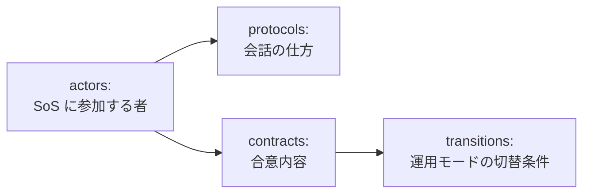
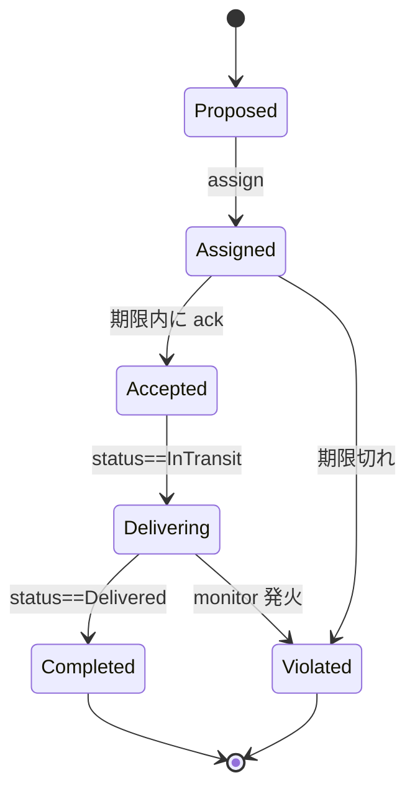

# コース A — 演習問題集

> ⬅ メイン教材に戻る → [コース A — ロボット配送](main-textbook.md)
>
> 📚 学術背景・参考文献 → [`academic-background.md`](academic-background.md)

このブックレットは、SoS-DSL ハンズオンに付属する練習課題をまとめたものです。2 つのパートに分かれています。

- **Part 1 — ロボット配送コース（5 回シリーズ）**。同じロボット配送ドメインを CADL モデリング → DSL 設計 → 可視化 → シミュレーション → 改善の順にたどる、構造化された授業課題。1 セッション 90 分、3〜5 週の授業を想定。**このブックレットの中心。**
- **Part 2 — 新しい SoS の end-to-end モデリング（コース C）**。Part 1 を終えたあと、*別の*ドメイン（フードデリバリー、緊急対応など）を選んで同じ流れを自走します。意図的に自由度を高くしてあり、概要だけを示しています。毎週の宿題というより、自走型のミニプロジェクトに近い位置付けです。

---

## Part 1 — ロボット配送コース（5 回）

## コース全体図

| 回 | タイトル | テーマ | 提出物 |
| --- | --- | --- | --- |
| 1 | **CADL モデリング** | SoS の構造 | `my_delivery_v1.cadl`（構造のみ） |
| 2 | **DSL 設計** | 規範：ライフサイクルとモニター | `my_delivery_v2.cadl`（lifecycle + monitors 付き） |
| 3 | **可視化** | 仕様を視覚的に読み・比較する | スクリーンショット付き A/B 比較レポート |
| 4 | **シミュレーション** | 仕様の実行とトレース解読 | ベースライントレース + パラメータスイープ |
| 5 | **改善** | 観察結果を仕様の磨き込みに活かす | `my_delivery_v3.cadl` + Before/After レポート |

各回 **授業 90 分** + **宿題 3 時間程度**。5 回を通した最終提出物は **3 ページのレポート**（初期モデル / シミュレーション比較 / 振り返り）。

:::info[リポジトリの公開状況]
第 1〜3 回は `cadl` と `cadl-explorer` だけで進められます。第 4〜5 回は `cadl-raspimouse-simulator` にある Python 参照ランタイムを使います（入手方法は [メイン教材](main-textbook.md) の Step 0 を参照してください）。
:::

### 縮小 3 回バージョン

3 回しか時間が取れない場合（短期モジュール、集中講義など）の対応表：

| 縮小版 | 統合する内容 |
| --- | --- |
| 第 A 回 | 第 1 回 + 第 2 回（モデリング + DSL 設計） |
| 第 B 回 | 第 3 回 + 第 4 回（可視化 + シミュレーション） |
| 第 C 回 | 第 5 回（改善） |

課題自体は同じです。発展的な (★★★) 課題を宿題に回すだけです。

### 各回の構成

すべての回は同じフォーマットです：

1. **学習目標** — 終わったときに何ができるようになるか
2. **前提** — 前回までの提出物 + 事前読書
3. **概念導入**（約 30 分）— 必要最小限の理論
4. **演習**（約 50 分）— ★（基本）→ ★★（中級）→ ★★★（発展）
5. **まとめ + 宿題**（約 10 分）— 次回に持参するもの

### 評価ルーブリック（参考）

教員はこれを採点に、学生は自己点検に使えます。

| 項目 | 配点 |
| --- | --- |
| 各回の ★ と ★★ 課題をすべて完了 | 40% |
| 提出した CADL ファイルがすべて `cadl check` を通る | 20% |
| 最終 3 ページレポートが理解を示している（手順をなぞるだけでない） | 30% |
| ★★★ 発展課題に最低 1 つは挑戦している | 10% |

---

## 第 1 回 — CADL モデリング

### 学習目標

- SoS のアクターを同定し、CADL の `id`, `role`, `autonomy`, `interface` で宣言できる。
- 構造的な契約を `parties`, `assume`, `guarantee`, `incentives` で書ける。
- `cadl check` を実行し、その診断メッセージを説明できる。

### 前提

- メイン教材の Step 0 と Step 1 を完了（リポジトリのクローンと、Step 1 に挙げた章 — Introduction、Language Specification、Appendix E、Examples — の通読）。
- 事前読書 30 分：cadl-spec 第 5 章 *Language Specification*。

### 概念導入（約 30 分）

CADL ファイルは「**誰が**参加し、**お互いに何を期待しているか**」を、「いつ」「どれくらいの頻度で」よりも先に述べます。構造を組み立てる部品は次のとおりです。



第 1 回では **actors** と **contracts** だけを扱います。`protocols` と `transitions` は発展課題に回します。

### 演習（授業 50 分 + 宿題）

#### 演習 1.1 (★) — 構造モデルのベースラインを作る

**目的**: メイン教材のアクター / 契約例を、ゼロから書き起こした新ファイル `my_delivery_v1.cadl` に再現する。

**手順**:

1. `cadl_repo` の直下に `my_delivery_v1.cadl` を作成し（見比べる同梱の例は `examples/sos_dsl_robot_delivery.cadl`）、以下のコマンドはそのディレクトリで実行する。
2. 3 つのアクターを宣言：`DISPATCHER`、`ROBOT[1..N]`、`CUSTOMER[1..M]`。それぞれに妥当な `autonomy` レベルを選ぶ。
3. 1 つの契約 `DELIVERY_SLA` を宣言：`parties: [DISPATCHER, "ROBOT[*]", "CUSTOMER[*]"]`、`assume: ["ROBOT[i].battery > 20"]`、`guarantee: ["delivery_time <= 300s"]`。
4. `cadl check my_delivery_v1.cadl` を実行し、`Type check passed: my_delivery_v1.cadl` と表示されることを確認。

**確認**: ファイルが型検査を通り、IR JSON にアクター 3 つ、契約 1 つが見える。

#### 演習 1.2 (★★) — 4 番目のアクターを追加する

**目的**: 定期的にロボットを点検する `MAINTENANCE` アクターを追加し、`MAINTENANCE` と `ROBOT[*]` の間に別の契約 `MAINTENANCE_SLA` を宣言する。

**手順**:

1. `MAINTENANCE` を追加（単一、低自律度、capabilities `[inspect, repair]`）。
2. 契約 `MAINTENANCE_SLA` を宣言：`parties: [MAINTENANCE, "ROBOT[*]"]`。
3. `assume` に `ROBOT[i].battery > 0` を含めるか、もっと強い条件にするか判断する。
4. `cadl check` を再実行。

**振り返り**: 同じアクターに *2 つの* 契約があるとき、`assume` 節はどう作用しますか？（ヒント：両方が同時に成り立つ必要がある — これがまさに Dahmann (2014) が SoS pain point #5 として挙げた *相互依存* の問題です。）

#### 演習 1.3 (★★) — プロトコルを追加する

**目的**: 構造の骨格を超えて、配送フローを `protocols:` セクションでメッセージ交換のシーケンスとして書く。

**手順**:

1. `sos:` の下（`contracts:` と同じインデント）に `protocols:` セクションを追加し、プロトコル `DeliveryProposal` を 1 つ書く。`trigger` を付ける。プロトコルに参加者の一覧を書くキーはない。誰が参加するかは `steps` に書いた送信者と受信者で決まる。
2. `steps:` に 3 ステップを、それぞれクオートした文字列で列挙：`"DISPATCHER -> ROBOT[i] : route_assignment"`、`"ROBOT[i] -> DISPATCHER : ack"`、`"ROBOT[i] -> DISPATCHER : completion"`。
3. 思いつくなら `precondition` / `postcondition` を追加（ほかに任意のキーとして `safety_invariant` と `timing` がある）。
4. `cadl check my_delivery_v1.cadl` を実行し、続けてプロトコルが IR に入ったことを確認：`cadl sim-ir my_delivery_v1.cadl --format json | grep -n -A6 '"protocols"'` に `"id": "DeliveryProposal"` が出る。ここでは `cadl check` だけに頼らないこと。`cadl check` は知らないキーを黙って無視するので、キー名を間違えても（`pre:`、`participants:` など）検査は通ってしまう。

```yaml
  protocols:
    - id: DeliveryProposal
      trigger: "new_delivery_request(CUSTOMER[i])"
      precondition: "ROBOT[i].battery > 20"
      steps:
        - "DISPATCHER -> ROBOT[i] : route_assignment"
        - "ROBOT[i] -> DISPATCHER : ack"
        - "ROBOT[i] -> DISPATCHER : completion"
      postcondition: "ROBOT[i].status == Delivered"
```

**振り返り**: なぜプロトコルは *メッセージ* の列として書かれ、コードとして書かれないのでしょうか？ Python 関数では得られないどんな利点があるでしょうか？（ヒント：各ステップを *誰が実装するか* を考える。）

#### 演習 1.4 (★★★) — 知らないドメインを書いてみる

**目的**: 既存ファイルを一切コピーせず、**配送ドローンの群**（地上ロボットではなく）の CADL 骨格をゼロから書く。ドメインの形は同じだが、アクターと capabilities は異なる。

**手順**:

1. `my_drone_delivery.cadl` を白紙から作成。
2. アクターを決める。ヒント：*DRONE* は *ROBOT* と違う `capabilities` を必要とする（高度、飛行禁止区域、天候を考慮）。
3. `cadl check` を実行。

**振り返り**: 自分のファイルのうち、ロボット配送と *同じ* 部分はどれくらいで、本当に違う部分はどれくらいですか？ 同じライフサイクルが小修正で再利用できる — これがまさに SoS-DSL の設計意図です。

### まとめ + 宿題

**第 2 回に持参**:

- `my_delivery_v1.cadl`（クリーンにコンパイルされる）
- v1 で表現できないものを 3〜5 行のメモで列挙（ヒント：タイミング、何を違反とみなすか、その帰結）。

---

## 第 2 回 — DSL 設計

### 学習目標

- 構造的な契約に、インスタンスごとの `lifecycle:` を追加できる。
- 述語とサンプリング指定を持つ宣言的 `monitors:` を追加できる。
- `cadl sim-ir` の JSON 出力を読み、自分が追加した部分を特定できる。

### 前提

- 第 1 回の `my_delivery_v1.cadl`
- 事前読書 30 分：cadl-spec [Appendix E](../spec/appendix-e-sos-dsl.md)。

### 概念導入（約 30 分）

クラスレベルの契約仕様は「私たちが結ぶ合意の*種類*」を語ります。しかし、各具体的な配送はその合意の **インスタンス** であり、次のように進行します：



これを明示的に書けるようにするキーが 2 つあります。

- `lifecycle:` — 状態、初期 / 終端マーカー、`deadline` + `on_violation` 付き遷移
- `monitors:` — 周期的またはイベント駆動で評価される宣言的な観測者。`rule` が成立すると、違反を記録する（`on_match.violation`）、契約インスタンスを指定した状態（`on_match.transition`、例：`Violated`）へ移す、またはその両方を行う

### 演習（授業 50 分 + 宿題）

#### 演習 2.1 (★) — 基本的なライフサイクルを追加

**目的**: `my_delivery_v1.cadl` を `my_delivery_v2.cadl` として保存し、`DELIVERY_SLA` にメイン教材の 7 状態を持つ `lifecycle:` ブロックを追加。

**手順**:

1. `v1` → `v2` をコピー。
2. `lifecycle.states`、`lifecycle.initial`、`lifecycle.terminal` と 4 つの遷移（`assign`、`accept`、`start_delivery`、`complete`）を追加。
3. `accept` に `deadline: 5s` と `on_violation.transition: Violated` を設定（値は移動先の状態名）。あわせて、メイン教材の Step 3 と同じく `sos:` の下に `extensions: [sos-dsl: 0.1]` を宣言する。
4. `cadl check my_delivery_v2.cadl` を実行し、続けて `cadl sim-ir my_delivery_v2.cadl --format json | grep -n -A3 '"lifecycle"'` を実行（`"lifecycle"` キーは IR の 86 行目あたりにあるので、`head` では途中で切れて見えない）。
5. 出力で `"lifecycle"` が `null` でなくなったことを確認：行が `"lifecycle": {` になり、続いて `"states": [` と最初の状態名が並ぶ。

#### 演習 2.2 (★★) — 過速度モニターを追加

**目的**: 配送中に 1.5 m/s を超えて走るロボットを検出し、severity `Critical` で `Violated` へ強制遷移させる。

**手順**: `monitors:` の下に追加：

```yaml
- id: over_speed
  observe: "ROBOT[i].speed"
  sampling: periodic(200ms)
  rule: "ROBOT[i].speed > 1.5 AND state == Delivering"
  on_match:
    transition: Violated
    severity: Critical
```

**振り返り**: ロボットの制御コード（Unity 側の `Pilot_CSoS.cs`）を 1 行も変えずに *新しい規範ルール* を追加しました。これは構造コードと規範仕様の分離について何を語っていますか？（[Maier 1998] の条件 (4)「創発的振る舞い」と比べてみてください。ここでは規範が、構成要素を再設計することなく創発的振る舞いを *制約* しています）

#### 演習 2.3 (★★) — Cancelled 状態を追加

**目的**: ロボットがまだ `Assigned` の段階で顧客が配送をキャンセルできるようにし、新しい `Cancelled` 終端状態にルーティングする。

**手順**:

1. `lifecycle.states` と `lifecycle.terminal` に `Cancelled` を追加。
2. `Assigned` から `Cancelled` への遷移 `customer_cancel` を `"CUSTOMER[i] -> DISPATCHER : cancel_order"` で発火。
3. 判断：`Cancelled` は違反扱いにすべきか？ CADL では終端状態は暗黙に違反ではなく、単に *閉じた* 状態。

**振り返り**: `Cancelled` を追加したとき、既存のシミュレーションは壊れましたか？ なぜですか？ （状態追加は後方互換だが、deadline 追加は違う。）

#### 演習 2.4 (★★★) — 2 つの契約を共存させる

**目的**: `DELIVERY_SLA` とは別に `FLEET_SAFETY` 契約を新設する。そのライフサイクルは個別の配送とは独立していて、ロボットが稼働している間はずっと有効な契約。

**手順**:

1. 3 状態のライフサイクルを定義：`Operational → Degraded → OutOfService`。
2. battery < 10% で `Degraded` を発火するモニターを追加（配送状態に関係なく）。
3. `cadl check` を実行。`DELIVERY_SLA` のルールと衝突しますか？

**振り返り**: 同じロボットが *両方の* 契約の当事者になり得ます。一方が「進めてよい」と言い、もう一方が「停止せよ」と言うとき、どんな意味論を望みますか？

### まとめ + 宿題

**第 3 回に持参**:

- `my_delivery_v2.cadl`（最低限 2.1〜2.3 を完了）
- IR JSON スナップショット `my_delivery_v2.ir.json`（`cadl sim-ir … --format json > my_delivery_v2.ir.json`）
- （任意）2.4 に取り組んだなら `my_delivery_v2_with_safety.cadl`

---

## 第 3 回 — 可視化

### 学習目標

- cadl-explorer の Lifecycle View を使って、契約仕様を一目で読み取れる。
- 視覚的な慣習を同定し、CADL を知らない聴衆に説明できる。
- 2 つの仕様（v1 と v2）を図で比較できる。

### 前提

- 第 2 回の `my_delivery_v2.cadl`
- `my_delivery_v2.ir.json`
- （任意）まだ cadl-explorer を開いていなければメイン教材 Step 4

### 概念導入（約 30 分）

ソフトウェアエンジニアはコードをデバッグします。SoS エンジニアは **図** をデバッグします — システムが分散していてデバッガでステップ実行できないからです。Lifecycle View がそのデバッガに当たります。

| 視覚要素 | 意味 |
| --- | --- |
| 二重円 | `lifecycle.initial` |
| 破線枠 + 緑塗り | terminal state `Completed` |
| 破線枠 + 赤塗り | terminal state `Violated` |
| 破線枠 + 灰塗り | その他の terminal state（`Terminated`, `Cancelled`） |
| 実線エッジ + `Δ 5s` | `deadline` を持つ遷移 |
| 赤い破線エッジ | `on_violation` による強制遷移 |

### 演習（授業 50 分 + 宿題）

#### 演習 3.1 (★) — v1 と v2 の両方を可視化

**目的**: cadl-explorer を起動し、v1 と v2 の IR ファイルを両方ロードする。Lifecycle View で v1 と v2 が *厳密に* どう違うかを同定。

**手順**:

1. `cadl-explorer` を起動（`streamlit run app.py`）。
2. v1 用にも IR を生成：`cadl sim-ir my_delivery_v1.cadl --format json > my_delivery_v1.ir.json`。
3. **Contract Lifecycle** ページを開く（サイドバー上部のページ一覧にある）。v1 を先にアップロード、次に v2。
4. スクリーンショットを取る。

**確認**: v1 では「契約にライフサイクルが無い」旨の警告が表示される。v2 では 8 状態の状態機械が描画される（`Cancelled` を追加する演習 2.3 を飛ばした場合は 7 状態）。

#### 演習 3.2 (★★) — A/B 比較レポート

**目的**: 1 ページの A/B 比較レポートを書く：*同じ契約、第 2 回の規範追加の前と後*。

**手順**: 1 ページの Markdown ドキュメント。以下を含める：

- v1 の可視化のスクリーンショット（おそらく「ライフサイクル無し」メッセージ）
- v2 のライフサイクルのスクリーンショット
- 状態数、deadline 付き遷移数、monitor 数、terminal state 数を列挙する表
- v1 が黙って許してしまうが v2 が捕まえる **失敗の種類** を 3 文で

**提出**: `session3_comparison.md` + 2 枚のスクリーンショット。

#### 演習 3.3 (★★★) — Violation Trace View を作る

**目的**: cadl-explorer に新しい Streamlit ページを追加。`multi_robot_demo --log <path>` の NDJSON ログ（第 4 回で生成）を取り込み、Gantt 風のタイムラインで表示する。

**手順**:

1. 開発用のログを作る（シミュレータのリポジトリで実行）：

   ```bash
   cd ~/program/cadl-raspimouse-simulator
   python3 -m cadl.runtime.multi_robot_demo --log session4_baseline.ndjson
   ```

   1 行が 1 つの JSON レコードです。使うフィールドは `instance_id`、`kind`（`lifecycle` または `violation`）、`to_state`、`t_ms`、違反レコードの `detected_by` です。
2. `cadl-explorer/cadl_sim/sos_dsl/violation_trace_view.py` を作成。NDJSON 各行をパースし `instance_id` でグループ化する。状態区間は、ある `lifecycle` レコードの `t_ms` から、同じインスタンスの次の `lifecycle` レコードの `t_ms` まで。ログには実行終了のレコードがないので、各インスタンスの最後の状態はログ中の最大の `t_ms` で閉じる（そうしないと、`Proposed` から動かないインスタンスにバーが出ない）。
3. Plotly で描く — 新規依存不要。状態区間は `go.Bar(orientation="h", base=start, x=duration)`、違反は `go.Scatter(mode="markers", marker=dict(symbol="x", color="red"))` を使う（`Bar` だけではマーカーを描けない）。
4. ページとして配線する。cadl-explorer に `pages/` ディレクトリはない。ページは `views/` に置き、`app.py` で明示的に登録する。`cadl-explorer/views/violation_trace.py` を作成し（`views/lifecycle.py` を手本にする）、ログは `st.file_uploader(..., type=["ndjson"])` で読み込む（リポジトリにサンプルのログは同梱されていない）。そのうえで `app.py` の `st.navigation([...])` のリストに 1 行追加：

   ```python
   st.Page("views/violation_trace.py", title="Violation Trace", url_path="violation-trace"),
   ```

ベースラインのログでは、`robot-0-1`〜`robot-4-1` の 5 行と、赤いマーカー 3 個が表示されます。

これは *先回り* で作るものです — 第 4 回でシミュレーションが走るとき、ビューワが既に準備できている状態にしておきます。

### まとめ + 宿題

**第 4 回に持参**:

- `session3_comparison.md` + 2 枚のスクリーンショット
- （任意）3.3 で書いた `violation_trace_view.py`

**事前ディスカッション**: 1 文で — シミュレーション結果で *何があれば驚くか*？

---

## 第 4 回 — シミュレーション

### 学習目標

- 自分の仕様に対して Python 参照ランタイムをマルチロボットで実行できる。
- NDJSON トレースを読み、ロボットごとのサマリに集約できる。
- 1 つずつパラメータを変え、観測前に予測を立てる。

### 前提

- `my_delivery_v2.cadl` とその IR
- （任意）第 3 回の `violation_trace_view.py`

### 概念導入（約 30 分）

`cadl-raspimouse-simulator/cadl/runtime/` の Python ランタイムは IR を読み込み、*決定論的で再実行可能な* 離散時間シミュレーションを実行します。5 ロボットの `multi_robot_demo.py` が固定のテストベンチです：

| ロボット | 期待する終端 | なぜ大事か |
| --- | --- | --- |
| robot-0-1 | `Completed` | 正常系が通ることの確認 |
| robot-1-1 | `Violated` via `deadline:accept` | 期限切れの検出のデモ |
| robot-2-1 | `Violated` via `monitor:battery_guard` | 周期的 monitor のデモ |
| robot-3-1 | `Violated` via `monitor:deadline_watch` | 宣言的 monitor のデモ |
| robot-4-1 | `Proposed` のまま | 「インスタンスが進まない」ことも有効なトレース |

これがあらゆる仕様変更を検証する **ground truth（正解）** です。

この表は *同梱の* fixture についてのものです。同梱の fixture は `battery_guard` と `deadline_watch` の両方の monitor を宣言しています。自分の IR でデモを動かすとき（`--ir`、演習 4.2 以降）、自分のファイルで宣言していない monitor は発火しません。メイン教材の v2 は `battery_guard` を持ちますが `deadline_watch` を持たないので、`robot-3-1` は `Violated` にならず、違反なしの `Delivering` で終わります。自分の v2 に `battery_guard` もない場合、`robot-2-1` は `Violated` のままですが、原因は `deadline:accept` になります。

### 演習（授業 50 分 + 宿題）

#### 演習 4.1 (★) — ベースラインを取得

**目的**: まずは *同梱の* fixture に対して `multi_robot_demo --summary` を実行し（自分の `my_delivery_v2.cadl` はまだ使いません）、出力をそのまま記録して各行を説明する。

**手順**:

```bash
cd ~/program/cadl-raspimouse-simulator
python3 -m cadl.runtime.multi_robot_demo --summary > session4_baseline.txt
python3 -m cadl.runtime.multi_robot_demo --log session4_baseline.ndjson
```

**確認**: 5 体すべての最終状態が上の表と一致する。

#### 演習 4.2 (★★) — 期限を縮める

**目的**: `my_delivery_v2.cadl` の `accept` 期限を `5s` → `1s` → `100ms` → `50ms` と段階的に縮め、結果が変わる境目を見つける。それでも完了するロボットはいるか？

**手順**:

1. `my_delivery_v2.cadl` を編集、`accept` 遷移の `deadline: 5s` を `deadline: 1s` に変更（このシナリオの時間スケールはミリ秒で、ロボットは割当ての約 100 ms 後に応答します）。
2. IR を再生成し、`--ir` オプションを付けてデモを実行（`--ir` を付けないと同梱の fixture が読み込まれる）：

   ```bash
   cd ~/program/cadl_repo
   cadl sim-ir my_delivery_v2.cadl --format json > my_delivery_v2.ir.json
   cd ~/program/cadl-raspimouse-simulator
   python3 -m cadl.runtime.multi_robot_demo --ir ~/program/cadl_repo/my_delivery_v2.ir.json --summary
   ```

3. 同じファイルを `deadline: 5s` のまま実行したときの summary と比べ、続けて `100ms` と `50ms` で手順 1〜2 を繰り返す。本編テキストの v2 では次のようになります。

   | `deadline` | 変化 |
   |---|---|
   | `5s`、`1s` | 変化なし。summary は同一で、この実行では期限は制約になっていない。 |
   | `100ms` | `robot-2-1` は `Violated` のままだが、原因が `monitor:battery_guard` から `deadline:accept` に変わる（モニタより先に期限が発火する）。 |
   | `50ms` | 完了するロボットがなくなる。`robot-0-1`〜`robot-3-1` がすべて `deadline:accept` で `Violated` になる。 |

   `my_delivery_v2.cadl` には `deadline_watch` モニターと `late_failure` 遷移が無いので、`5s`・`1s`・`100ms` の実行では `robot-3-1` は `Violated` ではなく `Delivering` で終わります。自分の v2 で再現できるのは、同梱例の 5 通りの結末のうち 4 通りです。

**振り返り**: 厳しすぎる期限（ここでは `50ms`）は努力に関係なく *すべての* 契約を違反にします。緩すぎる期限（`5s` と `1s` は同じ結果）は不正動作を見逃します。**実 SoS の期限値を決めるプロセスは？**（ヒント：ベースラインデータ + 許容偽陽性率）

#### 演習 4.3 (★★) — World パラメータを変える

**目的**: 同じシナリオを per-instance battery / speed / deadline 値を変えて実行。違反パターンがどう変わるかを観察。

**手順**: `multi_robot_demo.py` のコピーを作り、`_seed_battery(...)` と `update_instance_world(...)` の呼び出しを修正、`--summary` で実行。最低 3 構成を試す。

**提出**: 構成名 → ロボットごとの終端状態の小さな表。

#### 演習 4.4 (★★★) — Unity シーンを動かす

**目的**: C# ランタイムが Python と同じトレース形を出すことを検証する。

**手順**: メイン教材の Step 6 に従う。Console 出力を Python の `session4_baseline.ndjson` と比較し、イベントの形式が同じであることを確認する（終端状態の内訳まで Python 側のシナリオと一致するわけではありません）。

### まとめ + 宿題

**第 5 回に持参**:

- `session4_baseline.txt` + `session4_baseline.ndjson`
- パラメータスイープ表（最低 3 構成）
- 1 文：もっとも驚いた違反パターンとその理由

---

## 第 5 回 — 改善

### 学習目標

- シミュレーション観察を使って *どのつまみを回すか* を同定する。
- 適切な層（deadline / monitor / lifecycle / actor / runtime）で仕様を調整する。
- 再実行で変更を検証する。

### 前提

- 第 1〜4 回のすべての提出物。

### 概念導入（約 30 分）

設計の各層に固有の修正方法があります：

| トレースで観察される症状 | 修正する層 | 例 |
| --- | --- | --- |
| すべてのロボットで期限切れ | 仕様 — `deadline` を緩める | 5s → 7s |
| 1 体のロボットで monitor が頻発（偽陽性） | 仕様 — `rule` を厳しく | `< 20` → `< 15` |
| World モデルが間違っていてロボットが Violated になる | ランタイム — world snapshot のキーを修正 | `update_instance_world` 呼び出しを確認 |
| 報酬が支払われない | ランタイム — 報酬実行を実装 | `engine.py` を拡張 |
| すべて成功するが *集約* がおかしい（例：遅延） | 新 monitor または新契約 | `FLEET_THROUGHPUT_SLA` を追加 |

これは規範的 SoS 仕様における *不具合の小さな分類* です。

### 演習（授業 50 分 + 宿題）

#### 演習 5.1 (★) — 1 つの失敗を診断する

**目的**: 第 4 回のトレースから *1 つ* の違反を選ぶ。1 段落で説明：どの層を、どう変えるか。

**提出**: `session5_diagnosis.md`（1 ページ）。

#### 演習 5.2 (★★) — 修正を適用する

**目的**: 5.1 の診断を実装する。修正後の仕様を `my_delivery_v3.cadl` として保存。

**手順**:

1. 5.1 で診断した変更を実施。
2. 演習 4.2 と同じ手順で、新しいファイルの IR を生成し、その IR に対してデモを再実行：

   ```bash
   cd ~/program/cadl_repo
   cadl sim-ir my_delivery_v3.cadl --format json > my_delivery_v3.ir.json
   cd ~/program/cadl-raspimouse-simulator
   python3 -m cadl.runtime.multi_robot_demo --ir ~/program/cadl_repo/my_delivery_v3.ir.json --summary
   ```

3. 修正したい違反が消え、*かつ* 他を壊していないことを確認。

**提出**: `my_delivery_v3.cadl` + v2 との diff。

#### 演習 5.3 (★★★) — 報酬実行を実装

**目的**: 現在、報酬は仕様（`incentives.rules`）に *書かれている* だけで *実行* されない。しかも、ルールの文字列はランタイムまで届いていない。仕様を IR に変換するとき（`cadl_repo/src/cadl/sim/lower.py`）、契約の `governance` に残るのは `lambda` と `incentive_type` だけで、`rules` のリストは落とされる。Python ランタイムにアクターごとの残高を持たせ、契約が `Completed` に到達したら報酬を加算する。

**手順**:

1. `ContractRuntime` に `balances: dict[str, float]` とアクセサ `runtime.balance(actor_id)` を追加し、ルールを受け取る口を用意する（例：`ContractRuntime(ir, log_path=None, reward_rules=[...])`）。
2. ルールを取得する。IR には入っていないので、cadl のパーサで `.cadl` ソースから読み、**別のスクリプトで JSON に書き出す**（自分のファイルに `incentives:` ブロックがなければ、メイン教材 Step 2 のものを追加する）：

   ```python
   # dump_rules.py — cadl-lang をインストールした Python 環境で実行
   import json, sys
   from cadl.parser import parse_file

   sos = parse_file(sys.argv[1])
   rules = [{"contract": c.id, "rule": r.description}
            for c in sos.contracts if c.incentives
            for r in c.incentives.rules]
   json.dump(rules, open(sys.argv[2], "w"), indent=2)
   # python dump_rules.py my_delivery_v2.cadl rules.json
   # -> [{"contract": "DELIVERY_SLA", "rule": "reward(ROBOT[i], 10) when on_time_delivery"}]
   ```

   別スクリプトにするのは、シミュレータのリポジトリに独自のトップレベルパッケージ `cadl/` があり、`cadl-lang` を隠してしまうためです。ランタイムの中、そのテスト、あるいはシミュレータのルートから `python -m` で実行するコードでは、`from cadl.parser import parse_file` が `No module named 'cadl.parser'` で失敗します。スクリプトは別のディレクトリで実行し、`rules.json` をデモに渡します（`multi_robot_demo` に `--rewards rules.json` オプションを追加する）。

   各ルールは元の文字列のままです。`reward(<actor_ref>, <amount>) when on_time_delivery` の形式を自分でパースし（正規表現で足りる）、それ以外は読み飛ばします（同梱の例には `penalty(...)` のルールもある）。

   *発展版*: ソースを読む代わりに、`lower.py`（と `sim/ir.py` の `GovernanceParams`）を拡張して IR にルールを載せる（例：`governance.incentive_rules`）。編集したチェックアウトの `cadl` を使い（`pip install -e .`。PyPI 版にはこのキーがない）、`cadl sim-ir --format json` の出力に現れることを確認したうえで、ランタイムが IR から読むようにする。
3. 誰に支払うかを決める。ランタイムが知っているのはインスタンス ID（`robot-0-1`）だけで、契約インスタンスにアクターのフィールドはない。インスタンスを開くときにアクターを渡し（例：`open_instance(..., actors={"ROBOT": "robot-0"})`）、ルールの `ROBOT[i]` をそれに対応付ける。
4. 終端状態に入ったときに加算する。インスタンスが閉じる箇所は 2 つある — `StateMachineEngine.fire_transition`（`complete` を含む通常の遷移）と `ContractRuntime._fire_state_jump`（期限とモニタによるジャンプ）— ので、両方にフックする。`on_time_delivery` は「インスタンスが `Completed` に入り、`violation` レコードがない」と自分で定義する。ランタイムの述語評価器は単独の識別子を真として扱うため、これを判定できない。
5. `cadl/runtime/tests/test_rewards.py` を追加：
   - 配送 `Completed` で 10 ポイント獲得するテスト
   - `Violated` 配送では報酬が払われないテスト
6. `multi_robot_demo --summary` の出力に最終残高を追加。同梱のシナリオでは `robot-0` が 10、他の 4 台は 0 になる。

**振り返り**: CADL 仕様には既に `reward(ROBOT[i], 10) when on_time_delivery` と書かれていましたが、ここまでランタイムは無視してきました。IR にすら載っていませんでした。**「仕様にそう書いてある」と「ランタイムが実際にそう動く」の境界線はどこですか？**

#### 演習 5.4 (★★★) — 最終レポート

**目的**: コース全体をカバーする 3 ページのレポート。

| ページ | 内容 |
| --- | --- |
| 1 | 初期 CADL モデル（v1）、モデルが問うている質問、v1 で欠けていたもの |
| 2 | シミュレーション結果 — ベースラインと修正後の比較。表と最低 1 枚の cadl-explorer スクリーンショット |
| 3 | 振り返り：*規範を追加すること* で何が得られたか？ *シミュレーションを動かすこと* で仕様だけでは分からなかった何を学んだか？ SoS-DSL の次の一手は？ |

### まとめ

**第 5 回終了時に提出**:

- `my_delivery_v1.cadl` / `v2.cadl` / `v3.cadl`
- `session5_diagnosis.md` + 最終レポート（3 ページ）
- （任意）`test_rewards.py` と修正版 `engine.py`

---

## 最終提出物の総まとめ

第 5 回終了時、すべての学生は以下を持っているはずです：

| 成果物 | 出る回 |
| --- | --- |
| `my_delivery_v1.cadl`（構造のみ） | 1 |
| `my_delivery_v2.cadl`（lifecycle + monitors 付き） | 2 |
| `session3_comparison.md` + 2 枚のスクリーンショット | 3 |
| `session4_baseline.ndjson` + パラメータスイープ表 | 4 |
| `my_delivery_v3.cadl`（改善版） + 3 ページ最終レポート | 5 |
| （任意）`test_rewards.py` + 報酬実行コード | 5 |
| （任意）`violation_trace_view.py` Streamlit ページ | 3 |

5 個（任意込みで 7 個）すべてを 1 つのコース提出物リポジトリに置きます。

---

## 発展課題（任意・★★★）— LLM による契約生成：生成と検査のループ

**概要**。Part 1 では契約を自分の手で書きました。この発展課題では、「応答は 5 秒以内」「低バッテリ機には割り当てない」といった**自然言語の運行要件から LLM に CADL 契約を生成させ、`cadl check` を通るまで診断メッセージを返して自動修正させるループ**を構築し、評価します。LLM が提案し、型検査が門番をする——LLM の出力は検査を通るまで有効化しない、という構成が本質です。ただし、`cadl check` の合格は構文と型のレベルの検査であり、安全性の保証ではありません。合格が示すのはドラフトが CADL として整っていることだけで、期限や規則の内容が正しいことまでは示しません。

**ポイント**。

- 検査を通った契約が**意図どおりとは限りません**。合格したドラフトの `deadline` の値や監視ルールを、自分が Step 3 で手書きした契約と突き合わせてください（「合格 ≠ 意図一致」に気づくことがこの課題の最大の学びです）。
- 失敗時の診断メッセージは**加工せずそのまま** LLM に返すのが基本です。何を直せたか・直せなかったかを記録しましょう。
- 評価は回数の統計で行います：初回通過率（first_pass_rate）、K 回以内の通過率（pass@K）、通過までの平均ラウンド数。

**ヒント**。

- system prompt に CADL の文法制約（SoS type は 4 種のみ、識別子は ASCII、`deadline: 5s` の形式など）を明示すると、初回通過率の向上が期待できます。制約の有無で実際に測って比較するのも良い実験です。
- `cadl check` はサブプロセスとして呼び出せます（終了コードと出力を見る）。
- 現時点で公開されている参考実装はありません（著者らの実装である `cadl-ai-governance` リポジトリの `step_a_design.py` と `measure_step_a.py` は非公開です）。ループ本体と小さな計測スクリプトを書くことも、この課題の一部です。まず LLM の代わりに決定的なモック（決まった順にドラフトを返す関数）でループの動きを観察し、それから実 LLM に切り替えるのが安全です。

---

## Part 2 — 新しい SoS の end-to-end モデリング（コース C） {/* #course-c */}

Part 2 は、意図的に自由度を高くしてあります。手順を細かく示した課題ではなく概要として示しており、ドメインを選ぶのも、白紙から仕様を書くのも、仕様をどう動かすかを決めるのも受講者自身です。小さな自走型プロジェクトとして取り組んでください。

ロボット配送以外のドメインを選び、Part 1 と同じ 5 段階をたどります。推奨は **フードデリバリー（Collaborative SoS としてモデル化）**、さらに挑戦するなら **大規模災害の発生直後、指揮系統がまだ成立していない段階の災害対応（Virtual SoS）** です。Part 1 との大きな違いは、出発点となる `.cadl` ファイルが提供されないことです。

1. アクターと契約を同定する（テンプレートはありません）。
2. SoS の類型（Maier / ISO/IEC/IEEE 21841）のどれに当たるかを判定し、宣言する `type:` の理由を説明する。
3. `lifecycle:` と `monitors:` をゼロから書き、`cadl check` を通し、cadl-explorer で確認する。
4. 自分で選んだランタイムで仕様を動かす。標準の選択肢は、IR JSON からライフサイクルを再生する軽量な Python の離散事象ハーネス（例：SimPy）で、Unity は不要です。ハーネスは提供されません。これを書くことも課題の一部です。
5. パラメータスイープを行い、比較レポートを書く（演習 5.4 の 3 ページ形式がそのまま使えます）。

Part 2 に必要なのは公開リポジトリ（`cadl`、`cadl-explorer`）だけです。

この Part 2 課題の学術的位置付け（Maier 条件、ISO 規格、分類体系）は [`academic-background.md`](academic-background.md) を参照。
