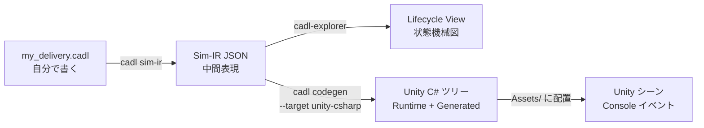
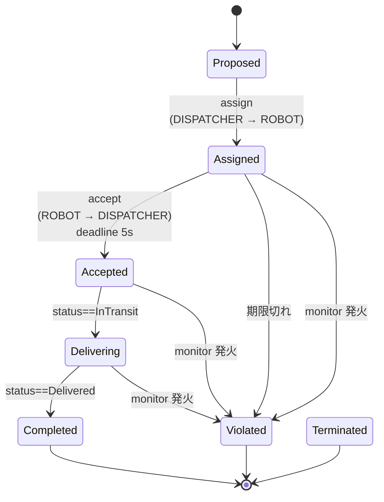

# コース A — ロボット配送：CADL と SoS-DSL で SoS を設計する

> **対象**: SoS の概念を学び始めたばかりの学部生・大学院初年度。CADL の経験は不要です。
>
> **所要時間**: 90 分（5 分のセットアップ + 15 分 × 6 ステップ）。
>
> **持ち帰るもの**: 自分で書いた CADL 仕様、その仕様から生成された Unity C# 実装、5 台のロボットが期限切れやバッテリ違反を実際に検出する動くシミュレーション。

---

## なぜこのハンズオンをやるのか

**System of Systems (SoS)** とは、それぞれが独立して運用される複数のシステムを統合した「システムのシステム」のことです。例えば、配送ロボットの群、中央管制（dispatcher）、注文を出す顧客 — それぞれが独自の目的と独自のソフトウェアを持ちます。SoS 設計者の仕事は、彼ら全員のコードを書くことではなく、彼らが従う「ゲームのルール」を書くことです。誰が誰に何を頼めるか、何が違反となるか、結果はどうなるか。

今日学ぶことは 3 つです。

1. **構造を記述する** — CADL で SoS の構造を書く。誰がいて、誰が誰と話すか。
2. **規範を記述する** — SoS-DSL 拡張（Appendix E）で SoS の規範を書く。各契約インスタンスがいつまでに何をすべきか、違反したらどうなるか。
3. **実行可能コードを生成する** — 単一の仕様から実行可能コードを生成し、Unity プロジェクトに配置して、シミュレーション上で規範が自動的に守られるのを観察する。

## ある対象が SoS かどうかを見分ける

「これは SoS だ」と言う前にかける試金石が **Maier の 5 条件** です（[Maier, 1998]、**ISO/IEC/IEEE 21841:2019** に標準化）。

| # | 条件 | 平易な確認 |
| --- | --- | --- |
| 1 | 運用上の独立性 | SoS が "止まって" いても各構成要素は独立に動くか？ |
| 2 | 管理上の独立性 | 各構成要素は別のオーナー・意思決定者を持つか？ |
| 3 | 地理的分散 | 各部分は離れた場所に存在し、エネルギーや物質ではなく情報を交換しているか？ |
| 4 | 創発的振る舞い | 全体は、どの個別構成要素にもできないことをするか？ |
| 5 | 進化的発展 | 構成要素は SoS のライフタイム中に加除・改変されるか？ |

(1) と (2) は基本的に必須。(3)〜(5) は通常それに伴います。

**当てはめ** — このハンズオンのロボット配送の場合：

- ✓ (1) 各ロボットは独立に wandering 動作ができる。
- ~ (2) 全ロボットが架空の同じディスパッチャを共有（境界的）。
- ✓ (3) ロボットは 30×30 のグリッドに分散。
- ✓ (4) 集合的なスループットはどの単一ロボットも設計していない。
- ~ (5) このシナリオでは個体数は固定だが、シミュレータは変更に対応している。

(2) が境界的なため、このハンズオンは教科書的 SoS よりも *並行制御問題* に近い位置にあります。**演習問題集の Part 2** では (2) が明確に成立するドメイン（フードデリバリー）を採用します。

> 📚 ISO/IEC/IEEE 21839 / 21840 / 21841 / 15288 / 42010 の標準ランドスケープ、SoS の 4 類型、関連研究領域（ADL、規範的 MAS、実行時検証）、推薦文献リストの詳細は → [`academic-background.md`](academic-background.md) を参照してください。

---

## 全体像

書くのは一番左のボックス（CADL ファイル）だけです。右側はすべて自動生成されます。

```
   ┌────────────────────────┐
   │  CADL 仕様              │   ← Step 2 と 3 で書く
   │  my_delivery.cadl      │
   └──────────┬─────────────┘
              │
              │  cadl check    →  タイポ / 型エラー検出
              │  cadl sim-ir   →  JSON 中間表現 (IR) を出力
              │
              ▼
   ┌────────────────────────┐
   │  Sim-IR JSON           │
   │  (cadl-spec App. E.7)  │
   └─────┬──────────────┬───┘
         │              │
         │              └──────────────┐
         │  cadl-explorer              │  cadl codegen --target unity-csharp
         │  Lifecycle View             │
         ▼                             ▼
   ┌─────────────────┐       ┌─────────────────────────┐
   │  状態機械の図    │       │  Unity C# ツリー         │
   │                  │       │  Runtime/    Generated/ │
   └─────────────────┘       └────────────┬────────────┘
                                          │  Assets/ にコピー
                                          ▼
                             ┌──────────────────────────┐
                             │  Unity シーン + arbitrator │
                             │  → Console にライブで        │
                             │     contract イベント       │
                             └──────────────────────────┘
```



---

## 準備するもの

| ツール | バージョン | 用途 |
| --- | --- | --- |
| Python | 3.10 以上 | `cadl` CLI を実行 |
| Unity | 2022.3.27f1 (LTS) | シミュレーションを実行 |
| Go | 1.21 以上 | arbitrator をビルド |
| NATS Server | 最新版 | ロボットと arbitrator のメッセージバス |
| Node.js | 18 以上 | 仕様サイトを表示（任意） |

```bash
# macOS / Homebrew
brew install python@3.11 go nats-server node
# Unity は Unity Hub からインストール
```

---

## Step 0 — セットアップ (5 分)

### 学ぶこと
- ツールチェインを構成する 4 つのリポジトリ。

### 背景

CADL ツールチェインは、各部分が独立して進化できるよう 4 つのリポジトリに分かれています。

| リポジトリ | 役割 |
| --- | --- |
| `cadl-spec`            | 言語仕様書（Docusaurus サイト） |
| `cadl`                 | コンパイラ本体（パーサ・IR・コード生成器） |
| `cadl-explorer`        | Streamlit ベースの可視化 |
| `raspimouse-swarm-simulator` | Unity シーン + Go arbitrator + Python 参照ランタイム |

### 手順

```bash
mkdir -p ~/program && cd ~/program

# 1) 4つすべてをクローン。最後の --recursive を忘れずに
#    （unity submodule を引き込みます）。
git clone https://github.com/ertlnagoya/cadl-spec
git clone https://github.com/ertlnagoya/cadl                         cadl_repo
git clone https://github.com/ertlnagoya/cadl-explorer
git clone --recursive https://github.com/ertlnagoya/raspimouse-swarm-simulator

# 2) 全リポジトリで SoS-DSL feature ブランチに切り替え。
for r in cadl-spec cadl_repo cadl-explorer raspimouse-swarm-simulator; do
  (cd $r && git checkout feature/sos-dsl)
done
(cd raspimouse-swarm-simulator/unity && git checkout feature/sos-dsl)

# 3) 編集モードで cadl CLI を install。変更が即反映されます。
cd cadl_repo
python3 -m venv .venv && source .venv/bin/activate
pip install -e .
```

### 期待される出力

```
$ cadl --help
usage: cadl [-h] [--version]
            {parse,check,verify,codegen,regime-map,iec62853,sim-validate,sim-ir,sim-gen,ai}
            ...

CADL: Contract Architecture Description Language toolchain

positional arguments:
  {parse,check,verify,codegen,regime-map,iec62853,sim-validate,sim-ir,sim-gen,ai}
                        Available commands
    parse               Parse a CADL file and report errors
    check               Parse and type-check a CADL file
    verify              Parse, type-check, and verify a CADL file
    codegen             Generate runtime code from a CADL file
    ...
```

### チェック 0

`cadl codegen --help` の `--target` の選択肢に `unity-csharp` が含まれていれば（`{python,solidity,opa,unity-csharp}`）、ブランチと install は正しく完了しています。

### 🛠 セットアップのトラブルシューティング

**ブランチを確認する（最頻のつまずき）。** SoS-DSL のコード（Step 5 の `multi_robot_demo` など）は **`feature/sos-dsl` ブランチにだけ**あります。手順 2 のブランチ切替を飛ばすと `main` のままになり、`git pull` しても「Already up to date」と出るのに中身が無い、という状態になります。全リポジトリで確認してください。

```bash
for r in cadl-spec cadl_repo cadl-explorer raspimouse-swarm-simulator; do
  echo "$r: $(git -C ~/program/$r branch --show-current)"   # すべて feature/sos-dsl か
done
```

`feature/sos-dsl` 以外のものがあれば `git -C ~/program/<repo> checkout feature/sos-dsl` で切り替えます。

**arbitrator submodule が 404 になる場合。** `git clone --recursive` で `raspimouse-swarm-arbitrator` の指定コミットが取得できない（GitHub で 404）ことがあります。これは多くの場合**アクセス権の問題ではなく、submodule が指す固定コミットがリモートから参照できない**状態が原因です。arbitrator が必要なのは **Step 6（Unity のライブ実行）だけ**なので、Step 1〜5 はそのまま進められます。親リポジトリは取得できているので、他の submodule だけ初期化するには次を実行し、Step 6 を行うときに担当（インストラクタ）へ連絡してください。

```bash
cd ~/program/raspimouse-swarm-simulator
git submodule update --init unity     # arbitrator はスキップして Step 1〜5 へ
```

---

## Step 1 — CADL 仕様書を読む (15 分)

### 学ぶこと
- 仕様書のどこに **構造の層**（actors / contracts / protocols）が書かれているか。
- 仕様書のどこに **規範の層**（Appendix E の lifecycle / monitors）があるか。

### 背景

SoS の文脈では、仕様言語が果たすべき仕事は 2 つあります。

1. **記述的（descriptive）** — *何が存在するか*。アクター、接続、交換するメッセージ。
2. **規範的（normative）** — *何が起こるべきか*。義務、期限、違反。

CADL は (1) を本体文法（Appendix A）でカバーします。SoS-DSL 拡張（Appendix E）は (1) の上に (2) を加えます — 同じ構文ファミリーで、新しい body キーは `lifecycle:` と `monitors:` の 2 つだけです。

### 手順

```bash
cd ~/program/cadl-spec
npm install
npm run start
# ブラウザで http://localhost:3000 が開く
```

15 分以内に収まるよう、以下の章を表のおすすめ時間で順に読みます。

| 章 | 答えてくれる問い | 時間 |
| --- | --- | --- |
| 1. Introduction | CADL は何のため？ | 2 分 |
| 5. Language Specification | actors / contracts / protocols はどう書く？ | 5 分 |
| **Appendix E（今日のメイン）** | **契約のライフサイクルと監視はどう書く？** | **6 分** |
| 7. Examples | 完全なファイルはどう見える？ | 2 分 |

### 期待される出力

Docusaurus サイトには Appendix E.6 が以下のようなコードブロックで表示されます。よく読んでください。Step 3 で同じようなものを書いてもらいます。

```yaml
contracts:
  - id: DELIVERY_SLA
    parties: [DISPATCHER, "ROBOT[*]", "CUSTOMER[*]"]
    assume:
      - "ROBOT[i].battery > 20"
    guarantee:
      - "delivery_time <= 300s"

    lifecycle:
      states: [Proposed, Assigned, Accepted, Delivering, Completed, Violated, Terminated]
      initial: Proposed
      terminal: [Completed, Violated, Terminated]
      transitions:
        - id: accept
          from: Assigned
          to:   Accepted
          on:   "ROBOT[i] -> DISPATCHER : ack(accepted)"
          deadline: 5s
          on_violation:
            transition: Violated
            severity:   Major

    monitors:
      - id: battery_guard
        observe: "ROBOT[i].battery"
        sampling: periodic(500ms)
        rule: "ROBOT[i].battery < 20 AND state == Assigned"
        on_match:
          transition: Violated
          severity:   Major
```

### チェック 1

スクロールせずに、次の 3 問に口頭で答えられますか？

1. 配送契約の **初期状態** は何？ → *Proposed*
2. ロボットが **5 秒** 以内に ack を返さなかったら何が起こる？ → *severity `Major` で `Violated` へ強制遷移（lift）される*
3. バッテリ 20% 以下で **まだ Assigned のとき** どの監視が発火する？ → *`battery_guard`*

全部答えられたら、書き始めるのに十分な理解ができています。

---

## Step 2 — ロボット配送を CADL で書く (15 分)

### 学ぶこと
- アクターを `id`, `role`, `autonomy`, `interface` で宣言する方法。
- 契約の parties, A/G clauses (`assume` / `guarantee`), incentives の宣言方法。

### 背景

CADL の `actors:` ブロックは SoS の UML クラス図のようなものです。各アクター型はポート（`interface.input` / `interface.output`）と自律度（`autonomy: low | medium | high`）を持ちます。`contracts:` ブロックは、指定したアクターサブセットの間の *合意* です。

```mermaid
flowchart LR
  D[DISPATCHER<br/>autonomy: low<br/>タスクを割り当てる]
  R1["ROBOT[1..N]<br/>autonomy: high<br/>追従 / 集荷 / 配送"]
  C1["CUSTOMER[1..M]<br/>autonomy: medium<br/>注文する"]
  C1 -- delivery_request --> D
  D  -- route_assignment  --> R1
  R1 -- position_report   --> D
  D  -- delivery_notif    --> C1
  R1 -. governed by ........ DELIVERY_SLA[(DELIVERY_SLA<br/>契約)] .-.- D
```

### 手順

example の横に新ファイル `my_delivery.cadl` を作って下の骨組みを貼り付けます。コメントを読んで、各ブロックが何をしているか理解しましょう。

```yaml
# my_delivery.cadl ─── 私の最初の SoS 仕様
# (このファイルは構造のみを記述します。規範は Step 3 で追加します)

sos:
  name: "MyDelivery"
  type: Acknowledged           # 中央権威 + 自律エージェント
  version: "0.1.0"

  context:
    environment:
      grid_size:    30
      num_robots:    3
      time_step_ms: 100

  # ── SoS に存在する者たち ──────────────────────────────────────
  actors:
    - id: DISPATCHER
      role: "central_coordinator"
      autonomy: low                            # 方針に従う、自由行動なし
      capabilities: [assign_tasks]
      interface:
        input:  [position_report, task_completion]
        output: [route_assignment]

    - id: "ROBOT[1..N]"                        # パラメトリック: N コピー
      role: "delivery_agent"
      autonomy: high
      capabilities: [follow_path, pick_up, deliver]
      interface:
        input:  [route_assignment]
        output: [position_report, task_completion]

    - id: "CUSTOMER[1..M]"
      role: "service_requester"
      autonomy: medium
      capabilities: [submit_order]
      interface:
        input:  [delivery_notification]
        output: [delivery_request]

  # ── 当事者間の合意 ───────────────────────────────────────────
  contracts:
    - id: DELIVERY_SLA
      parties: [DISPATCHER, "ROBOT[*]", "CUSTOMER[*]"]
      assume:
        - "ROBOT[i].battery > 20"              # 入力前提条件
      guarantee:
        - "delivery_time <= 300s"              # 出力事後条件
      incentives:
        type: task_completion
        lambda: 0.5
        rules:
          - "reward(ROBOT[i], 10) when on_time_delivery"
```

型チェッカを実行：

```bash
cd ~/program/cadl_repo
cadl check my_delivery.cadl
```

### 期待される出力

```
$ cadl check my_delivery.cadl
Type check passed: my_delivery.cadl
```

IR JSON に変換して最初の 30 行を確認：

```bash
cadl sim-ir my_delivery.cadl --format json | head -30
```

```jsonc
{
  "name": "MyDelivery",
  "sos_type": "Acknowledged",
  "description": "",
  "environment": {
    "grid_size":    30,
    "num_robots":    3,
    "time_step_ms": 100
  },
  "institution": {
    "actors": [ ... ],
    "contracts": [
      {
        "id": "DELIVERY_SLA",
        "parties": ["DISPATCHER", "ROBOT[*]", "CUSTOMER[*]"],
        "assume":   ["ROBOT[i].battery > 20"],
        "guarantee":["delivery_time <= 300s"],
        ...
        "lifecycle": null,           ← まだ書いていない
        "monitors":  []
      }
    ]
  },
```

### チェック 2

両方とも確認：

1. `cadl check my_delivery.cadl` が `Type check passed: my_delivery.cadl` と表示され、`[ERROR]` の行がない。
2. IR JSON で `"lifecycle": null` と `"monitors": []` になっている。

この `null` と `[]` こそが **Step 3 で埋めるギャップ** です。構造だけの仕様では「ロボットは 5 秒以内に ack せよ」と言えない理由がこれです。

### よくある間違い

| 症状 | 原因 |
| --- | --- |
| `YAML parse error: while parsing a flow sequence` | `[ROBOT[i].battery, ...]` のように subscript 付きをクオートなしで書いた。`["ROBOT[i].battery", ...]` のように quote する。 |
| `Unknown SoS type: 'Centralized'` | CADL は `Directed | Acknowledged | Collaborative | Virtual` のみ受け付ける。 |
| `Type check failed: actor 'CUSTOMER' not declared` | `CUSTOMER[1..M]` だけ宣言して `CUSTOMER` を使った。`"CUSTOMER[*]"` で全顧客を参照する。 |

### おさらい

SoS の **構造** を記述する CADL ファイルが完成しました。コンパイルでき、IR に変換でき、IR の中に契約 `DELIVERY_SLA` が 1 つあることも確認できました。次はこの契約を強制可能にします。

---

## Step 3 — SoS-DSL の契約 (lifecycle + monitors) を追加する (15 分)

### 学ぶこと
- 契約インスタンスが取りうる **7 つのライフサイクル状態**。
- 期限を強制する `deadline` + `on_violation` の書き方。
- ワールドスナップショットの述語で動く周期的 `monitor` の書き方。

### 背景

クラスレベルの契約仕様（Step 2）は **合意** を記述しますが、実際の SoS では同じ合意の **複数の同時インスタンス** が存在します — 配送要求 1 件につき 1 インスタンス。各インスタンスは独自の状態を持ち、時間とともに進行します。



**同じライフサイクル** が全配送要求に再利用され、データ（どのロボット、どの顧客）だけが異なります。

### 手順

`my_delivery.cadl` の `DELIVERY_SLA` 契約に、以下のハイライトされた 2 ブロックを追加します。インデントが重要です（YAML）。

```yaml
  contracts:
    - id: DELIVERY_SLA
      parties: [DISPATCHER, "ROBOT[*]", "CUSTOMER[*]"]
      assume:
        - "ROBOT[i].battery > 20"
      guarantee:
        - "delivery_time <= 300s"
      incentives:
        type: task_completion
        lambda: 0.5
        rules:
          - "reward(ROBOT[i], 10) when on_time_delivery"

      # ╔═══════════════════════════════════════════════════════════════╗
      # ║  新ブロック 1: インスタンスごとのライフサイクル                  ║
      # ╚═══════════════════════════════════════════════════════════════╝
      lifecycle:
        states:
          - Proposed
          - Assigned
          - Accepted
          - Delivering
          - Completed
          - Violated
          - Terminated
        initial: Proposed
        terminal: [Completed, Violated, Terminated]
        transitions:
          - id: assign
            from: Proposed
            to:   Assigned
            on:   "DISPATCHER -> ROBOT[i] : route_assignment"

          - id: accept
            from: Assigned
            to:   Accepted
            on:   "ROBOT[i] -> DISPATCHER : ack(accepted)"
            deadline: 5s                           # ⏱ 5 秒以内に来なければ
            on_violation:                          # → Violated に飛ばす
              transition: Violated
              severity:   Major

          - id: start_delivery
            from: Accepted
            to:   Delivering
            on:   "ROBOT[i].status == InTransit"

          - id: complete
            from: Delivering
            to:   Completed
            on:   "ROBOT[i].status == Delivered"

      # ╔═══════════════════════════════════════════════════════════════╗
      # ║  新ブロック 2: 宣言的モニター                                  ║
      # ╚═══════════════════════════════════════════════════════════════╝
      monitors:
        - id: battery_guard
          observe: "ROBOT[i].battery"
          sampling: periodic(500ms)                # 評価周期
          rule: "ROBOT[i].battery < 20 AND state == Assigned"
          on_match:
            transition: Violated
            severity:   Major
```

型チェッカを再実行：

```bash
cadl check my_delivery.cadl
```

### 期待される出力

```
$ cadl check my_delivery.cadl
Type check passed: my_delivery.cadl
```

IR に変換して新フィールドが入ったか確認：

```bash
cadl sim-ir my_delivery.cadl --format json \
  | python3 -c "
import json, sys
d = json.load(sys.stdin)
c = d['institution']['contracts'][0]
print(f'lifecycle.initial : {c[\"lifecycle\"][\"initial\"]}')
print(f'lifecycle.states  : {c[\"lifecycle\"][\"states\"]}')
print(f'monitors[0].id    : {c[\"monitors\"][0][\"id\"]}')
print(f'  rule            : {c[\"monitors\"][0][\"rule\"]}')
"
```

```
lifecycle.initial : Proposed
lifecycle.states  : ['Proposed', 'Assigned', 'Accepted', 'Delivering', 'Completed', 'Violated', 'Terminated']
monitors[0].id    : battery_guard
  rule            : ROBOT[i].battery < 20 AND state == Assigned
```

### チェック 3

1. Step 2 と Step 3 の差分は **新ブロック 2 つだけ**。アクターは変更なし。
2. IR の `"lifecycle": null` がオブジェクトになり、`"monitors": []` が要素 1 のリストになった。

### よくある間違い

| 症状 | 原因 |
| --- | --- |
| コピペ後に `KeyError: 'states'` | `lifecycle:` ブロックのインデントが違う。`assume:` / `guarantee:` と同じレベルに置く。 |
| パーサが `on:` をブール値として黙って扱う | YAML 1.1 の癖。CADL のパーサは内部で `_yaml_on_key` 回避策を持っているので example は正しく動く。自分でパーサを書くなら注意。 |
| `monitor.rule` が常に false | `state == Assigned` の右辺は **裸の識別子** で OK（CADL の慣習）。`"Assigned"` のように quote すると意味が変わる。 |

### おさらい

同じファイルで構造（Step 2）と規範（Step 3）の両方を記述しました。IR はもう「構造のみ」ではなく、ランタイムを構築できる情報を持っています。

---

## Step 4 — ライフサイクルを可視化する (15 分)

### 学ぶこと
- cadl-explorer の Lifecycle View ページの読み方。
- 視覚的な慣習（二重円、破線枠、赤エッジ）が仕様のどこに対応するか。

### 手順

```bash
cd ~/program/cadl-explorer
pip install -r requirements.txt
streamlit run app.py
# ブラウザで http://localhost:8501 が開く
```

サイドバーから **SoS_DSL_Lifecycle** ページを選択します。

IR JSON のロード方法は 2 通り：

- **(a) アップロード** — `my_delivery.cadl` から生成した IR を File uploader にドラッグ & ドロップ。
- **(b) 同梱例** — ドロップダウンから `sos_dsl_robot_delivery.ir.json` を選択。

### 表示されるもの

以下の図は **(a) の `my_delivery.cadl`**（4 遷移・モニター 1 個）を読み込んだ場合です。**(b) の同梱例 `sos_dsl_robot_delivery.cadl`** を読み込むと遷移は 5（`late_failure` を追加）、モニターは 3 個（`battery_guard` / `collision_watch` / `deadline_watch`）になります。

ページは 2 列に分かれます：

```
┌──────────────────────────────────┬──────────────────────────────┐
│ Lifecycle — DELIVERY_SLA          │  Lifecycle metadata          │
│                                   │                               │
│   ┏━━━━━━━━━━┓                    │  states          : 7         │
│   ┃ Proposed ┃ ←initial (二重円)  │  initial         : Proposed  │
│   ┗━━━━┳━━━━━┛                    │  terminal        : 3         │
│        │ assign                   │  transition_count: 4         │
│        ▼                          │                               │
│   ┌──Assigned──┐                  │                               │
│   │            │ accept Δ 5s      │                               │
│   │            ▼                  │                               │
│   │       ┌Accepted┐              │                               │
│   │       └────┬───┘              │                               │
│   │ violation  │                  │                               │
│   │ (赤・破線)  │ start_delivery   │                               │
│   ▼            ▼                  │                               │
│ ╔Violated╗ ┌Delivering┐           │                               │
│ ╚════════╝ └────┬─────┘           │                               │
│ (赤・破線)       │ complete         │                               │
│                 ▼                  │                               │
│             ╔Completed╗            │                               │
│             ╚═════════╝            │                               │
│             (緑・破線)              │                               │
└──────────────────────────────────┴──────────────────────────────┘

┌─────────────────────────────────────────────────────────────────┐
│ Monitors                                                          │
├──────────────┬──────────────────────┬─────────────┬──────────────┤
│ id           │ sampling             │ on_match    │ severity     │
├──────────────┼──────────────────────┼─────────────┼──────────────┤
│ battery_guard│ periodic(500ms)      │ Violated    │ Major        │
└──────────────┴──────────────────────┴─────────────┴──────────────┘
```

視覚的慣習：

| 要素 | 意味 |
| --- | --- |
| 二重円 | `lifecycle.initial` |
| 破線枠 + 緑塗り | terminal state `Completed` |
| 破線枠 + 赤塗り | terminal state `Violated` |
| 破線枠 + 灰塗り | terminal state `Terminated` |
| 実線エッジ + ラベル `Δ 5s` | `deadline_ms = 5000` を持つ遷移 |
| **赤い破線エッジ** + `violation Major` | `on_violation` による強制遷移 |

### チェック 4

ライフサイクルのスクリーンショットを撮るか、よく見て確認：

- 二重円のノードは `Proposed` だけ。
- `Assigned` から `Violated` への **赤い破線エッジ** が 1 本ある（これが期限切れによる強制遷移）。
- Monitors テーブルに `battery_guard` が `periodic(500ms)` / `Major` で表示されている。

### おさらい

この図は **IR JSON から直接** 生成されており、手描きはゼロです。CADL の `deadline: 5s` を `10s` に変えて IR を再生成し、画面をリロードすれば、エッジのラベルが `Δ 10s` に変わります。

---

## Step 5 — Unity C# を生成する (15 分)

### 学ぶこと
- 1 つの CLI コマンドで CADL が Unity に貼れる C# ツリーに変わる仕組み。
- なぜ **2 つの**ランタイム（Python + C#）が **同じ意味論**で動くのか。

### 手順

リポジトリにエンドツーエンドのスクリプトが入っています。実行：

```bash
cd ~/program/cadl_repo
./scripts/sos_dsl_handson_e2e.sh \
    examples/sos_dsl_robot_delivery.cadl \
    --unity ../raspimouse-swarm-simulator/unity
```

> 自分の仕様を使いたいなら入力を `my_delivery.cadl` に変えてください。ただし bridge が発火するイベント名と `lifecycle.transitions[*].on:` がマッチする必要があるので、最初は同梱の example を推奨します。

### 期待される出力

```
$ ./scripts/sos_dsl_handson_e2e.sh examples/sos_dsl_robot_delivery.cadl \
      --unity ../raspimouse-swarm-simulator/unity

== INPUT ==
  source : .../examples/sos_dsl_robot_delivery.cadl
  size   : 153 lines

== Step 1/4 — parse + type-check (cadl check) ==
  OK

== Step 2/4 — emit Sim-IR JSON (cadl sim-ir) ==
  output/sos_dsl_handson/sos_dsl_robot_delivery.ir.json
  contracts : 1
  states    : 7
  monitors  : 3

== Step 3/4 — codegen Unity C# (cadl codegen --target unity-csharp) ==
  output    : output/sos_dsl_handson/unity-csharp
  runtime   : 5 files
  generated : 3 files
  total lines : 770

== Step 4/4 — drop into ../raspimouse-swarm-simulator/unity/Assets/Scripts/SoSDsl/ ==
  installed : .../Runtime, .../Generated
  preserved : .../Demo (if it existed)

== DONE ==
Next steps for the student:
  1. Open the Unity project at .../unity in Unity 2022.3.x
  2. Open Assets/Scenes/C-SoS.unity
  3. Add a ContractRuntimeHost GameObject
  4. Attach PilotContractBridge to each robot that has Pilot_CSoS
  5. Press Play and watch the Console
```

生成されたツリーを確認：

```
output/sos_dsl_handson/unity-csharp/
├── Runtime/                          # 生成のたび同一、契約間で共有
│   ├── Severity.cs                   # enum Minor / Major / Critical
│   ├── ContractEvent.cs              # lifecycle/violation 共通の struct
│   ├── EventBus.cs                   # 軽量 FIFO publish-subscribe
│   ├── PredicateEvaluator.cs         # CADL 述語評価器（Python 版と同等）
│   └── ContractRuntime.cs            # 登録 + tick ループ
└── Generated/                        # CADL の契約ごとに 1 セット
    ├── DeliverySlaState.cs           # public enum DeliverySlaState { Proposed, Assigned, ... }
    ├── DeliverySlaContract.cs        # DELIVERY_SLA 用 IContractInstance 実装
    └── DeliverySlaMonitors.cs        # monitor 1 個に対し Eval_xxx メソッド
```

### なぜ 2 つのランタイム？

同じ IR が両方を駆動します：

```
                             ┌──────────────────────┐
                             │ multi_robot_demo.py  │ ← 今日 Python で実行
                             │ (Python ランタイム)    │
                             │                      │
                  ┌──────────┘                      │
   IR JSON ──────►│                                 │
                  └──────────┐                      │
                             │ DeliverySlaContract  │ ← 後で Unity で実行
                             │ (Unity / C#)          │
                             └──────────────────────┘
```

両方のランタイムが正しいなら、同じ入力に対して **同じトレース** を生成するはずです。Unity 無しでも検証できます：

```bash
cd ~/program/raspimouse-swarm-simulator
python3 -m cadl.runtime.multi_robot_demo --summary
```

```
$ python3 -m cadl.runtime.multi_robot_demo --summary
# multi_robot_demo summary (20 events)
  robot-0-1     state=Completed     violations=[(none)]
  robot-1-1     state=Violated      violations=[deadline:accept]
  robot-2-1     state=Violated      violations=[monitor:battery_guard]
  robot-3-1     state=Violated      violations=[monitor:deadline_watch]
  robot-4-1     state=Proposed      violations=[(none)]
```

5 ロボット、5 種類の異なる結末。**これが Step 6 の Unity 実行で再現すべき正解です。**

> #### 🛠 うまくいかないとき：`multi_robot_demo` が見つからない
>
> まず **ブランチを確認**してください。`multi_robot_demo` は **`feature/sos-dsl` ブランチにだけ**あります（`main` には**ありません**）。`main` のままだと `git pull` しても「Already up to date」と出るのに見つからない、という症状になります。
>
> ```bash
> git -C ~/program/raspimouse-swarm-simulator branch --show-current   # → feature/sos-dsl になっているか
> ```
>
> ブランチが正しいのに見つからない場合は、チェックアウトが**古い**可能性です（`multi_robot_demo` は途中のコミットで追加されたため、古い版には**1 契約のスモークテスト `demo_delivery` だけ**が入っています）。`feature/sos-dsl` に切替＆更新してください。
>
> ```bash
> cd ~/program/raspimouse-swarm-simulator
> git checkout feature/sos-dsl
> git pull                      # 最新に更新（multi_robot_demo を取得）
> python3 -m cadl.runtime.multi_robot_demo --summary
> ```
>
> 更新できない／旧版のままで確認したいときは、`demo_delivery` で 3 つの仕組み（正常系・期限違反・モニタ違反）を1契約ずつ確認できます（出力は 1 契約ぶんなので上の 5 ロボット表とは形が異なります）。
>
> ```bash
> PYTHONPATH=. python3 -m cadl.runtime.demo_delivery --scenario happy     # 受理されて Accepted で止まる
> PYTHONPATH=. python3 -m cadl.runtime.demo_delivery --scenario late      # 5 秒の期限切れ → deadline:accept で Violated
> PYTHONPATH=. python3 -m cadl.runtime.demo_delivery --scenario battery   # バッテリ低下 → monitor:battery_guard で Violated
> ```

### チェック 5

```bash
cd ~/program/cadl_repo
PYTHONPATH=src python3 -m pytest tests/test_unity_csharp_structural.py -q
# 9 passed
```

これら 9 個のテストは、Unity が生成 C# をコンパイルできなくなる構造的バグ（括弧不一致、namespace 欠落、名前衝突等）を検出します。失敗すれば生成器の回帰です。

### おさらい

今あるもの：

- 245 行の Sim-IR JSON。
- 770 行の Unity に貼れる C# ツリー（Unity プロジェクトに配置済み）。
- C# トレースが **どうなるべきか** を示す Python のリファレンス実装。

----

## Step 6 — Unity でシミュレーションを動かす (15 分)

### 学ぶこと
- 既存シーンに `ContractRuntimeHost` と `PilotContractBridge` を組み込む方法。
- Unity Console でリアルタイムの contract イベントを読む方法。

### 6.1 NATS と arbitrator を起動

**2 つ**の別 Terminal で：

```bash
# Terminal 1 — NATS メッセージブローカ
nats-server -p 4222
```

```
[INFO] Starting nats-server
[INFO] Server is ready
[INFO] Listening for client connections on 0.0.0.0:4222
```

```bash
# Terminal 2 — C-SoS arbitrator (Go)
cd ~/program/raspimouse-swarm-simulator/arbitrator/C-SoS/main
go run main.go
```

```
[arbitrator] connected to NATS at nats://localhost:4222
[arbitrator] subscribing to demand.next, demand.init, ...
[arbitrator] ready (ExpectedRobots = 5)
```

### 6.2 C-SoS シーンを開く

1. Unity Hub を起動。`~/program/raspimouse-swarm-simulator/unity` を Unity 2022.3.27f1 (LTS) で開く。
2. 初回オープンは Library 再構築で 1〜5 分かかる。
3. Project ペインで `Assets/Scenes/C-SoS.unity` をダブルクリック。

30×30 のグリッドシーンと、赤/緑/青/黄/紫のラベルがついた 5 体のロボットプレハブが見えるはずです。

### 6.3 ContractRuntimeHost を追加（シーンに 1 つだけ）

```
Hierarchy ▸ 右クリック ▸ Create Empty
名前を ContractRuntimeHost に変更
Inspector ▸ Add Component ▸ "ContractRuntimeHost" を検索 ▸ CADL.SosDsl.Demo.ContractRuntimeHost を選択
```

Inspector：

```
ContractRuntimeHost (Script)
├── Log To Console      ☑  （チェックを入れたまま）
└── Runtime              <Play 時にランタイムが現れる>
```

### 6.4 各ロボットに PilotContractBridge を追加

Hierarchy 上部の検索欄に `Pilot_CSoS` と入れると、5 体のロボットだけに絞り込めます。

それぞれに対して：

```
Inspector ▸ Add Component ▸ "PilotContractBridge"   (CADL.SosDsl.Demo.PilotContractBridge)
```

Inspector に：

```
PilotContractBridge (Script)
├── Robot Battery       [───────●───] 90.0
└── Request Deadline Ms              300000
```

5 体のうち 1 体の Battery スライダーを **15** まで下げ、`battery_guard` モニターを発火させます。

シーンを保存（`Cmd+S` / `Ctrl+S`）。

### 6.5 Play を押す

Editor 上部の ▶ をクリック。

### 表示されるもの

Console に以下のような行が連続的に出ます。Console の検索欄に `lifecycle DELIVERY_SLA` または `violation` と入れて絞り込めます。

```
[lifecycle DELIVERY_SLA/robot-0-1 Proposed -> Assigned     (assign,        event)   @ 1234ms]
[lifecycle DELIVERY_SLA/robot-0-1 Assigned -> Accepted     (accept,        event)   @ 1234ms]
[lifecycle DELIVERY_SLA/robot-0-1 Accepted -> Delivering   (start_delivery,event)   @ 1280ms]
[lifecycle DELIVERY_SLA/robot-0-1 Delivering-> Completed   (complete,      event)   @ 8341ms]

[lifecycle DELIVERY_SLA/robot-2-1 Proposed -> Assigned     (assign,        event)   @ 2050ms]
[violation DELIVERY_SLA/robot-2-1 battery_guard Major monitor:battery_guard         @ 2150ms]
[lifecycle DELIVERY_SLA/robot-2-1 Assigned -> Violated     (<jump>,        monitor) @ 2150ms]
```

### チェック 6

すべて確認：

| 項目 | 期待 |
| --- | --- |
| `[lifecycle ... robot-{id}-1 ...]` イベントが **5 体すべて** に出る | はい |
| Battery 15 のロボットには `monitor:battery_guard` の violation が出る | はい |
| 各ロボットの最初の遷移は `Proposed -> Assigned` | はい |
| `Proposed` のまま数秒以上留まるロボットはない（FCFS arbitrator がすぐ broadcast する） | はい |
| トレースの形が Step 5 の Python `multi_robot_demo --summary` の出力と一致する | はい |

### よくある間違い

| 症状 | 対処 |
| --- | --- |
| Console: `[PilotContractBridge X] ContractRuntimeHost.Instance is null` | host を置き忘れ。Step 6.3 をやり直す。 |
| Console に何も出ない | NATS / arbitrator が起動していない。Terminal 1 と 2 が "ready" のままか確認。 |
| Battery を下げたロボットだけ違反、他は `Proposed` のまま | arbitrator が delivery を offer していない — 通常はシーンの CADL config で `taskArbitration.enabled` が `false` のため。`true` に設定して再生。 |
| Play 後 Console に `The name 'CADL.SosDsl.Demo.ContractRuntimeHost' could not be found` | Generated/Runtime ファイルが認識されていない。e2e スクリプトを再実行、または Unity で `Assets ▸ Reimport All`。 |

### おさらい

CADL で仕様を書き、IR に変換し、C# を生成し、リアルタイムシミュレーションとして実行するところまでを通しで体験し、期限やバッテリの規則が実際に強制される様子を確認しました。

---

## まとめ — 何を学んだか

| 層 | 書いたもの | 書かずに済んだもの |
| --- | --- | --- |
| 仕様 | 70 行の CADL ファイル（Step 2 と 3） | なし — 仕様こそが唯一の source of truth |
| IR | なし | 245 行の JSON が自動生成 |
| 可視化 | なし | Lifecycle View ページ |
| 実装 | なし | 770 行の Unity C# |
| ランタイム意味論 | なし | 動く状態機械 + monitors + deadline timers |

これは SoS にとってなぜ重要なのか？ **同じ仕様がすべての成果物を駆動する** — ドキュメント、図、シミュレーション、コード。仕様を変える（例えば期限を 5s から 3s にする）と、下流の成果物が自動的に更新されます。この性質こそが大規模 SoS 設計を保守可能にします。

---

## 次にやること

ハンズオンはここまでで終わりですが、演習問題集が別ブックレットとして用意されています：

→ **[`exercises.md`](exercises.md)**

2 つのパートに分かれています：

- **Part 1 — ロボット配送サービスの拡張演習**: 今ビルドしたシステムを 1 軸ずつ改造する 5 課題（★ 〜 ★★★）。期限を縮める、モニターを増やす、ライフサイクル状態を追加する、報酬実行を実装する、Violation Trace View を作る。
- **Part 2 — 新しい SoS のモデリングを一通り体験する演習**: *別のドメイン*（コーヒーショップ、複数エレベータ、フードデリバリー…）を選び、CADL を書き、SimPy でシミュレートし、パラメータスイープで結果を比較する。

ゴールに合わせて選んでください — 学んだことを定着させたいなら Part 1、新しい問題でワークフローを試したいなら Part 2。

---

## リファレンス

| トピック | ファイル |
| --- | --- |
| 言語仕様 | `cadl-spec/docs/spec/`（今日のメインは Appendix E） |
| パーサ実装 | `cadl_repo/src/cadl/parser.py` |
| IR | `cadl_repo/src/cadl/sim/ir.py`, `cadl_repo/src/cadl/sim/lower.py` |
| Unity C# 生成器 | `cadl_repo/src/cadl/codegen/unity_csharp/` |
| Python 参照ランタイム | `raspimouse-swarm-simulator/cadl/runtime/` |
| Lifecycle 可視化 | `cadl-explorer/cadl_sim/sos_dsl/` |
| End-to-end スクリプト | `cadl_repo/scripts/sos_dsl_handson_e2e.sh` |

### 用語集

| 用語 | 意味 |
| --- | --- |
| **SoS** | System of Systems — 構成要素自体が独立に運用されるシステム |
| **Actor** | SoS の自律参加者（ロボット、dispatcher、顧客） |
| **Contract（契約）** | 当事者間の規範的合意のクラス |
| **Contract instance（契約インスタンス）** | 1 件の配送要求に対応する具体的な契約実行 |
| **Lifecycle（ライフサイクル）** | 契約インスタンスが辿る状態機械 |
| **Monitor（モニター）** | 契約に紐づく宣言的な観測ルール |
| **Deadline（期限）** | 遷移に対する `deadline: <時間>` 形式のタイミング制約 |
| **`on_violation`** | 期限切れ時にランタイムが行う状態遷移 |
| **Severity（深刻度）** | 違反の分類：Minor / Major / Critical |
| **IR** | 中間表現（Intermediate Representation）— パーサと生成器の間の JSON |
| **Codegen target** | コード生成のバックエンド。例：`python`, `solidity`, `unity-csharp` |
| **Bridge（橋渡し）** | Pilot 状態変化を contract イベントに翻訳する `MonoBehaviour` |
