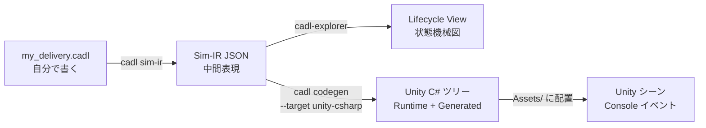
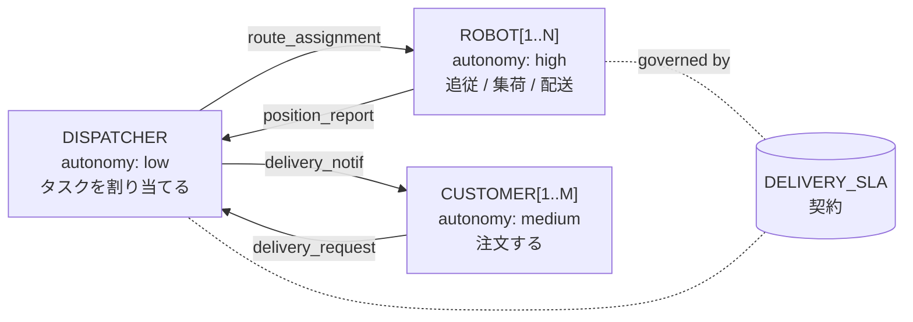
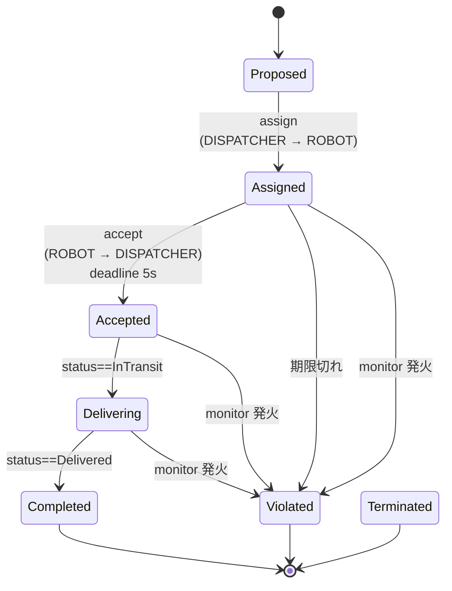

# コース A — ロボット配送：CADL と SoS-DSL で SoS を設計する

> **対象**: SoS の概念を学び始めたばかりの学部生・大学院初年度。CADL の経験は不要です。
>
> **所要時間**: 約 95 分（5 分のセットアップ + 15 分 × 6 ステップ）。
>
> **持ち帰るもの**: 自分で書いた CADL 仕様、その仕様から生成された Unity C# 実装、期限切れやバッテリ規則への違反が検出され、該当する契約インスタンスが `Violated` に移る、5 台構成の動くシミュレーション。
>
> **初めての人へ**: 先に [全体構造とコード解説](code-walkthrough.md) を読んでおくと、各 Step で自分がどの部品を触っているのかが見えます。

---

## なぜこのハンズオンをやるのか

**System of Systems (SoS)** とは、それぞれが独立して運用される複数のシステムを統合した「システムのシステム」のことです。例えば、配送ロボットの群、中央管制（dispatcher）、注文を出す顧客 — どれも独自の目的と独自のソフトウェアを持っています。本ハンズオンでシミュレーションするロボットは、小型自律走行ロボット **Raspberry Pi Mouse（ラズパイマウス）** です（シミュレータ名 `cadl-raspimouse-simulator` の由来。実機は ROS 上で動作しますが、本ハンズオンはシミュレータのみで完結します）。SoS 設計者の仕事は、それら全部のコードを書くことではなく、全員が従う「ゲームのルール」を決めることです。誰が誰に何を頼めるのか、何をしたら違反なのか、違反したらどうなるのか。

今日学ぶことは 3 つです。

1. **構造を記述する** — CADL で SoS の構造を書く。誰がいて、誰が誰と話すか。
2. **規範を記述する** — SoS-DSL 拡張（[Appendix E](../spec/appendix-e-sos-dsl.md)）で SoS の規範を書く。各契約インスタンスがいつまでに何をすべきか、違反したらどうなるか。
3. **実行可能コードを生成する** — 単一の仕様から実行可能コードを生成し、Unity プロジェクトに配置して、シミュレーション上で規範への違反がランタイムによって検出されるのを観察する。

## ある対象が SoS かどうかを見分ける

「これは SoS だ」と言う前にかける試金石が **Maier の 5 条件** です（[Maier, 1998]。SoS の分類自体は **ISO/IEC/IEEE 21841:2019** で標準化）。

| # | 条件 | 平易な確認 |
| --- | --- | --- |
| 1 | 運用上の独立性 | SoS が "止まって" いても各構成要素は独立に動くか？ |
| 2 | 管理上の独立性 | 各構成要素は別のオーナー・意思決定者を持つか？ |
| 3 | 地理的分散 | 各部分は離れた場所に存在し、エネルギーや物質ではなく情報を交換しているか？ |
| 4 | 創発的振る舞い | 全体は、どの個別構成要素にもできないことをするか？ |
| 5 | 進化的発展 | 構成要素は SoS のライフタイム中に加除・改変されるか？ |

(1) と (2) は必須と考えてよく、(3)〜(5) はたいていそれに付いてきます。

**当てはめ** — このハンズオンのロボット配送の場合：

- ✓ (1) 各ロボットは割り当てが無くても自律的に動き回れる。
- △ (2) 全ロボットが同じディスパッチャを共有しているため、管理上の独立性は弱い。
- ✓ (3) ロボットはグラフ状の経路網に分散して配置される。
- ✓ (4) 全体としての配送スループットは、どの 1 台にも単独では生み出せない。
- △ (5) このシナリオでは台数は固定だが、シミュレータ自体は増減に対応している。

(2) が弱いぶん、このハンズオンは教科書的な SoS というより *並行制御の問題* に近い位置にあります。それでも CADL ファイルでは `type: Acknowledged` と宣言しています。各ロボットを、自前の制御ソフトウェアと自律性（`autonomy: high`）を保ちつつ、タスク割当についてはディスパッチャを SoS レベルの権威として認める構成システムとしてモデル化しているためです。管理上の独立性がはっきり成立するドメイン（フードデリバリー）は、**演習問題集の Part 2** の推奨題材です。

> 📚 ISO/IEC/IEEE 21839 / 21840 / 21841 / 15288 / 42010 の標準ランドスケープ、SoS の 4 類型、関連研究領域（ADL、規範的 MAS、実行時検証）、推薦文献リストの詳細は → [`academic-background.md`](academic-background.md) を参照してください。

---

## 全体像

書くのは一番左のボックス（CADL ファイル）だけです。右側はすべて、ツールチェインのコマンドがこのファイルから生成します。

```
   ┌────────────────────────┐
   │  CADL 仕様              │   ← Step 2 と 3 で書く
   │  my_delivery.cadl      │
   └──────────┬─────────────┘
              │
              │  cadl check    →  タイポ / 型エラー検出
              │  cadl sim-ir   →  JSON 中間表現 (IR) を出力
              │
              ▼
   ┌────────────────────────┐
   │  Sim-IR JSON           │
   │  (cadl-spec App. E.7)  │
   └─────┬──────────────┬───┘
         │              │
         │              └──────────────┐
         │  cadl-explorer              │  cadl codegen --target unity-csharp
         │  Lifecycle View             │
         ▼                             ▼
   ┌─────────────────┐       ┌─────────────────────────┐
   │  状態機械の図    │       │  Unity C# ツリー         │
   │                  │       │  Runtime/    Generated/ │
   └─────────────────┘       └────────────┬────────────┘
                                          │  Assets/ にコピー
                                          ▼
                             ┌──────────────────────────┐
                             │  Unity シーン + arbitrator │
                             │  → Console にライブで        │
                             │     contract イベント       │
                             └──────────────────────────┘
```



---

## 準備するもの

| ツール | バージョン | 用途 |
| --- | --- | --- |
| Python | 3.10 以上 | `cadl` CLI を実行 |
| Unity | 6000.2.9f1 (Unity 6.2) | シミュレーションを実行 |
| Go | 1.21 以上 | arbitrator をビルド |
| NATS Server | 最新版 | ロボットと arbitrator のメッセージバス |
| Node.js | 18 以上 | 仕様サイトを表示（任意） |

```bash
# macOS / Homebrew
brew install python@3.11 go nats-server node
# Unity は Unity Hub からインストール
```

---

## Step 0 — セットアップ (5 分)

### 学ぶこと
- ツールチェインを構成するリポジトリと、それぞれで使うブランチ。

### 背景

CADL ツールチェインは、各部分が独立して進化できるよう 4 つのリポジトリに分かれています。

| リポジトリ | 役割 | 使うブランチ |
| --- | --- | --- |
| `cadl-spec`            | 言語仕様書とこのハンズオンサイト（Docusaurus） | `main`（既定） |
| `cadl`（`cadl_repo` としてクローン） | コンパイラ本体（パーサ・IR・コード生成器） | `master`（既定） |
| `cadl-explorer`        | Streamlit ベースの可視化 | `main`（既定） |
| `cadl-raspimouse-simulator` | Step 5〜6 で使うシミュレータ。Unity プロジェクト・Go arbitrator・Python 参照ランタイムを 1 つのリポジトリにまとめたもの | `main`（既定） |

:::info[リポジトリの公開状況]
`cadl-spec`（本仕様・ハンズオンサイト）、`cadl`（コンパイラ / CLI）、`cadl-explorer`（可視化）、`cadl-raspimouse-simulator`（シミュレータ）は公開しています。コース A はすべての Step を公開リポジトリだけで進められます。コース B で使う `mobility-sos-exercise` は**現時点では非公開**です。
:::

### 手順

```bash
mkdir -p ~/program && cd ~/program

# 1) リポジトリをクローンします。
#    cadl-spec・cadl・cadl-raspimouse-simulator は既定ブランチ
#    （main / master / main）のまま使います。
git clone https://github.com/ertlnagoya/cadl-spec
git clone https://github.com/ertlnagoya/cadl                         cadl_repo
git clone https://github.com/ertlnagoya/cadl-explorer
git clone https://github.com/ertlnagoya/cadl-raspimouse-simulator

# 2) 編集モードで cadl CLI を install。変更が即反映されます。
cd ~/program/cadl_repo
python3 -m venv .venv && source .venv/bin/activate
pip install -e .
cd ~/program
```

### 期待される出力

```
$ cadl --help
usage: cadl [-h] [--version]
            {parse,check,verify,codegen,regime-map,iec62853,sim-validate,sim-ir,sim-gen,ai}
            ...

CADL: Contract Architecture Description Language toolchain

positional arguments:
  {parse,check,verify,codegen,regime-map,iec62853,sim-validate,sim-ir,sim-gen,ai}
                        Available commands
    parse               Parse a CADL file and report errors
    check               Parse and type-check a CADL file
    verify              Parse, type-check, and verify a CADL file
    codegen             Generate runtime code from a CADL file
    ...
```

### チェック 0

`cadl codegen --help` の `--target` の選択肢に `unity-csharp` が含まれていれば（`{python,solidity,opa,unity-csharp}`）、install は正しく完了しています。

### おさらい

セットアップを終えて分かるのは、CADL が「仕様サイト・コンパイラ・可視化・シミュレータ」という 4 つのリポジトリが噛み合って動く仕組みだ、ということです。そして以降のすべては、**各リポジトリが上の表のブランチになっている**（すべて `main`。`cadl_repo` だけは `master`）、という前提の上に成り立ちます。この段階でのつまずきの大半は、ブランチ違いです。

### 🛠 セットアップのトラブルシューティング

**ブランチを確認する（最頻のつまずき）。** 4 つのリポジトリは、すべて既定ブランチ（`main`。`cadl_repo` だけは `master`）のまま使います。ここで説明しているページやコマンドが見つからない場合は、まず古いブランチに切り替えていないかを確認してください。次のコマンドで確認できます。

```bash
cd ~/program
echo "cadl-spec:     $(git -C cadl-spec branch --show-current)"       # main
echo "cadl_repo:     $(git -C cadl_repo branch --show-current)"       # master
echo "cadl-explorer: $(git -C cadl-explorer branch --show-current)"   # main
echo "simulator:     $(git -C cadl-raspimouse-simulator branch --show-current)"   # main
```

ブランチが違うリポジトリがあれば、`git -C ~/program/<repo> checkout <branch>` で切り替えます。

---

## Step 1 — CADL 仕様書を読む (15 分)

### 学ぶこと
- 仕様書のどこに **構造の層**（actors / contracts / protocols）が書かれているか。
- 仕様書のどこに **規範の層**（Appendix E の lifecycle / monitors）があるか。

### 背景

SoS の文脈では、仕様言語が果たすべき仕事は 2 つあります。

1. **記述的（descriptive）** — *何が存在するか*。アクター、接続、交換するメッセージ。
2. **規範的（normative）** — *何が起こるべきか*。義務、期限、違反。

CADL は (1) を本体文法（Appendix A）でカバーします。SoS-DSL 拡張（[Appendix E](../spec/appendix-e-sos-dsl.md)）は (1) の上に (2) を加えます — 同じ構文ファミリーで、新しい body キーは `lifecycle:` と `monitors:` の 2 つだけです。

### 手順

```bash
cd ~/program/cadl-spec
npm install
npm run start
# ブラウザで http://localhost:3000 が開く
```

15 分に収まるよう、下表の目安時間に沿って順に読んでいきます。

| 章 | 答えてくれる問い | 時間 |
| --- | --- | --- |
| 1. Introduction | CADL は何のため？ | 2 分 |
| 5. Language Specification | actors / contracts / protocols はどう書く？ | 5 分 |
| **[Appendix E](../spec/appendix-e-sos-dsl.md)（今日のメイン）** | **契約のライフサイクルと監視はどう書く？** | **6 分** |
| 7. Examples | 完全なファイルはどう見える？ | 2 分 |

### 期待される出力

[Appendix E](../spec/appendix-e-sos-dsl.md) の E.6 節に、ロボット配送の例が載っています。以下はその抜粋（遷移 1 つとモニター 1 つに絞った短縮版）です。よく読んでください。Step 3 で同じようなものを書いてもらいます。

```yaml
contracts:
  - id: DELIVERY_SLA
    parties: [DISPATCHER, "ROBOT[*]", "CUSTOMER[*]"]
    assume:
      - "ROBOT[i].battery > 20"
    guarantee:
      - "delivery_time <= 300s"

    lifecycle:
      states: [Proposed, Assigned, Accepted, Delivering, Completed, Violated, Terminated]
      initial: Proposed
      terminal: [Completed, Violated, Terminated]
      transitions:
        - id: accept
          from: Assigned
          to:   Accepted
          on:   "ROBOT[i] -> DISPATCHER : ack(accepted)"
          deadline: 5s
          on_violation:
            transition: Violated
            severity:   Major

    monitors:
      - id: battery_guard
        observe: "ROBOT[i].battery"
        sampling: periodic(500ms)
        rule: "ROBOT[i].battery < 20 AND state == Assigned"
        on_match:
          transition: Violated
          severity:   Major
```

### チェック 1

スクロールせずに、次の 3 問に口頭で答えられますか？

1. 配送契約の **初期状態** は何？ → *Proposed*
2. ロボットが **5 秒** 以内に ack を返さなかったら何が起こる？ → *severity `Major` の違反として `Violated` へ強制的に遷移する*
3. バッテリ 20% 未満で **まだ Assigned のとき** どの監視が発火する？ → *`battery_guard`*

全部答えられたら、書き始めるのに十分な理解ができています。

### おさらい

仕様書を読み終えると、SoS の仕様が「**構造の層**（何が存在するか）」と「**規範の層**（何を守るべきか）」の二階建てで、それぞれどこに書かれているかが分かります。配送契約なら、初期状態は `Proposed`、ack が 5 秒で返らなければ `Major` で `Violated` に飛び、Assigned 中にバッテリが下がれば `battery_guard` が見張る——この“地図”を持って Step 2 の執筆に入れます。

---

## Step 2 — ロボット配送を CADL で書く (15 分)

### 学ぶこと
- アクターを `id`, `role`, `autonomy`, `interface` で宣言する方法。
- 契約の parties, A/G clauses (`assume` / `guarantee`), incentives の宣言方法。

### 背景

CADL の `actors:` ブロックは SoS の UML クラス図のようなものです。各アクター型はポート（`interface.input` / `interface.output`）と自律度（`autonomy: low | medium | high`）を持ちます。`contracts:` ブロックは、指定したアクターサブセットの間の *合意* です。



### 手順

`cadl_repo` の直下に `my_delivery.cadl` を新規作成し（`~/program/cadl_repo/my_delivery.cadl`。手本になる同梱の例は `examples/sos_dsl_robot_delivery.cadl` です）、下の骨組みを貼り付けます。Step 2〜4 のコマンドは `~/program/cadl_repo` で実行します。コメントを読みながら、各ブロックが何をしているかを確かめてください。

```yaml
# my_delivery.cadl ─── 私の最初の SoS 仕様
# (このファイルは構造のみを記述します。規範は Step 3 で追加します)

sos:
  name: "MyDelivery"
  type: Acknowledged           # 中央権威 + 自律エージェント
  version: "0.1.0"

  context:
    environment:
      grid_size:    30                         # 抽象的な環境パラメータ（Unity の経路グラフとは別）
      num_robots:    3
      time_step_ms: 100

  # ── SoS に存在する者たち ──────────────────────────────────────
  actors:
    - id: DISPATCHER
      role: "central_coordinator"
      autonomy: low                            # 方針に従う、自由行動なし
      capabilities: [assign_tasks]
      interface:
        input:  [position_report, task_completion]
        output: [route_assignment]

    - id: "ROBOT[1..N]"                        # パラメトリック: N コピー
      role: "delivery_agent"
      autonomy: high
      capabilities: [follow_path, pick_up, deliver]
      interface:
        input:  [route_assignment]
        output: [position_report, task_completion]

    - id: "CUSTOMER[1..M]"
      role: "service_requester"
      autonomy: medium
      capabilities: [submit_order]
      interface:
        input:  [delivery_notification]
        output: [delivery_request]

  # ── 当事者間の合意 ───────────────────────────────────────────
  contracts:
    - id: DELIVERY_SLA
      parties: [DISPATCHER, "ROBOT[*]", "CUSTOMER[*]"]
      assume:
        - "ROBOT[i].battery > 20"              # 入力前提条件
      guarantee:
        - "delivery_time <= 300s"              # 出力事後条件
      incentives:
        type: task_completion
        lambda: 0.5
        rules:
          - "reward(ROBOT[i], 10) when on_time_delivery"
```

型チェッカを実行：

```bash
cd ~/program/cadl_repo
cadl check my_delivery.cadl
```

### 期待される出力

```
$ cadl check my_delivery.cadl
Type check passed: my_delivery.cadl
```

IR JSON に変換して最初の 30 行を確認：

```bash
cadl sim-ir my_delivery.cadl --format json | head -30
```

```jsonc
{
  "name": "MyDelivery",
  "sos_type": "Acknowledged",
  "description": "",
  "environment": {
    "grid_size":    30,
    "num_robots":    3,
    "time_step_ms": 100
  },
  "institution": {
    "actors": [ ... ],
    "contracts": [
      {
        "id": "DELIVERY_SLA",
        "parties": ["DISPATCHER", "ROBOT[*]", "CUSTOMER[*]"],
        "assume":   ["ROBOT[i].battery > 20"],
        "guarantee":["delivery_time <= 300s"],
        ...
        "lifecycle": null,           ← まだ書いていない
        "monitors":  []
      }
    ]
  },
```

### チェック 2

両方とも確認：

1. `cadl check my_delivery.cadl` が `Type check passed: my_delivery.cadl` と表示され、`[ERROR]` の行がない。
2. IR JSON で `"lifecycle": null` と `"monitors": []` になっている。

この `null` と `[]` こそが **Step 3 で埋めるギャップ** です。構造だけの仕様では「ロボットは 5 秒以内に ack せよ」と言えない理由がこれです。

### よくある間違い

| 症状 | 原因 |
| --- | --- |
| `YAML parse error: while parsing a flow sequence` | `[ROBOT[i].battery, ...]` のように subscript 付きをクオートなしで書いた。`["ROBOT[i].battery", ...]` のように quote する。 |
| `Unknown SoS type: 'Centralized'` | CADL が受け付けるのは `Directed` / `Acknowledged` / `Collaborative` / `Virtual` の 4 つだけ。 |
| `Type check failed: actor 'CUSTOMER' not declared` | `CUSTOMER[1..M]` だけ宣言して `CUSTOMER` を使った。`"CUSTOMER[*]"` で全顧客を参照する。 |

### おさらい

SoS の **構造** を記述する CADL ファイルが完成しました。コンパイルでき、IR に変換でき、IR の中に契約 `DELIVERY_SLA` が 1 つあることも確認できました。次は、ランタイムがこの契約への違反を検出できるように、規範を書き加えます。

---

## Step 3 — SoS-DSL の契約 (lifecycle + monitors) を追加する (15 分)

### 学ぶこと
- 契約インスタンスが取りうる **7 つのライフサイクル状態**。
- 遷移に期限を付け、期限切れのときにインスタンスをどの状態へ移すかを指定する `deadline` + `on_violation` の書き方。
- ワールドスナップショットの述語で動く周期的 `monitor` の書き方。

### 背景

クラスレベルの契約仕様（Step 2）は **合意** を記述しますが、実際の SoS では同じ合意の **複数の同時インスタンス** が存在します — 配送要求 1 件につき 1 インスタンス。各インスタンスは独自の状態を持ち、時間とともに進行します。



**同じライフサイクル** が全配送要求に再利用され、データ（どのロボット、どの顧客）だけが異なります。

### 手順

まず `my_delivery.cadl` の先頭付近で、このファイルが SoS-DSL 拡張を使うことを宣言します。[Appendix E](../spec/appendix-e-sos-dsl.md) はこの宣言を求めており（SHOULD）、同梱の例にも入っています。

```yaml
sos:
  name: "MyDelivery"
  type: Acknowledged           # 中央権威 + 自律エージェント
  version: "0.1.0"
  extensions:                  # ← 追加: SoS-DSL 拡張を使うことの宣言
    - sos-dsl: 0.1
```

続いて、`DELIVERY_SLA` 契約に、以下のハイライトされた 2 ブロックを追加します。インデントが重要です（YAML）。

```yaml
  contracts:
    - id: DELIVERY_SLA
      parties: [DISPATCHER, "ROBOT[*]", "CUSTOMER[*]"]
      assume:
        - "ROBOT[i].battery > 20"
      guarantee:
        - "delivery_time <= 300s"
      incentives:
        type: task_completion
        lambda: 0.5
        rules:
          - "reward(ROBOT[i], 10) when on_time_delivery"

      # ╔═══════════════════════════════════════════════════════════════╗
      # ║  新ブロック 1: インスタンスごとのライフサイクル                  ║
      # ╚═══════════════════════════════════════════════════════════════╝
      lifecycle:
        states:
          - Proposed
          - Assigned
          - Accepted
          - Delivering
          - Completed
          - Violated
          - Terminated
        initial: Proposed
        terminal: [Completed, Violated, Terminated]
        transitions:
          - id: assign
            from: Proposed
            to:   Assigned
            on:   "DISPATCHER -> ROBOT[i] : route_assignment"

          - id: accept
            from: Assigned
            to:   Accepted
            on:   "ROBOT[i] -> DISPATCHER : ack(accepted)"
            deadline: 5s                           # ⏱ 5 秒以内に来なければ
            on_violation:                          # → Violated に飛ばす
              transition: Violated
              severity:   Major

          - id: start_delivery
            from: Accepted
            to:   Delivering
            on:   "ROBOT[i].status == InTransit"

          - id: complete
            from: Delivering
            to:   Completed
            on:   "ROBOT[i].status == Delivered"

      # ╔═══════════════════════════════════════════════════════════════╗
      # ║  新ブロック 2: 宣言的モニター                                  ║
      # ╚═══════════════════════════════════════════════════════════════╝
      monitors:
        - id: battery_guard
          observe: "ROBOT[i].battery"
          sampling: periodic(500ms)                # 評価周期
          rule: "ROBOT[i].battery < 20 AND state == Assigned"
          on_match:
            transition: Violated
            severity:   Major
```

型チェッカを再実行：

```bash
cadl check my_delivery.cadl
```

### 期待される出力

```
$ cadl check my_delivery.cadl
Type check passed: my_delivery.cadl
```

IR に変換して新フィールドが入ったか確認：

```bash
cadl sim-ir my_delivery.cadl --format json \
  | python3 -c "
import json, sys
d = json.load(sys.stdin)
c = d['institution']['contracts'][0]
print(f'lifecycle.initial : {c[\"lifecycle\"][\"initial\"]}')
print(f'lifecycle.states  : {c[\"lifecycle\"][\"states\"]}')
print(f'monitors[0].id    : {c[\"monitors\"][0][\"id\"]}')
print(f'  rule            : {c[\"monitors\"][0][\"rule\"]}')
"
```

```
lifecycle.initial : Proposed
lifecycle.states  : ['Proposed', 'Assigned', 'Accepted', 'Delivering', 'Completed', 'Violated', 'Terminated']
monitors[0].id    : battery_guard
  rule            : ROBOT[i].battery < 20 AND state == Assigned
```

### チェック 3

1. Step 2 と Step 3 の差分は **`extensions:` の宣言と新ブロック 2 つだけ**。アクターは変更なし。
2. IR の `"lifecycle": null` がオブジェクトになり、`"monitors": []` が要素 1 のリストになった。

### よくある間違い

| 症状 | 原因 |
| --- | --- |
| コピペ後に `KeyError: 'states'` | `lifecycle:` ブロックのインデントが違う。`assume:` / `guarantee:` と同じレベルに置く。 |
| `on:` がブール値として解釈されてしまう | YAML 1.1 の癖。CADL のパーサは内部に `_yaml_on_key` の回避策を持っているので同梱の例は正しく動く。自分でパーサを書くときは注意。 |
| `monitor.rule` が常に false | `state == Assigned` の右辺は **裸の識別子** で OK（CADL の慣習）。`"Assigned"` のように quote すると意味が変わる。 |

### おさらい

同じファイルで構造（Step 2）と規範（Step 3）の両方を記述しました。IR はもう「構造のみ」ではなく、ランタイムを構築できる情報を持っています。

---

## Step 4 — ライフサイクルを可視化する (15 分)

### 学ぶこと
- cadl-explorer の Lifecycle View ページの読み方。
- 視覚的な慣習（二重円、破線枠、赤エッジ）が仕様のどこに対応するか。

### 手順

```bash
cd ~/program/cadl-explorer
pip install -r requirements.txt
streamlit run app.py
# ブラウザで http://localhost:8501 が開く
```

サイドバーで、既定のページ（**app**）から **SoS DSL Lifecycle** に切り替えます（サイドバーにこのページが無い場合は、`cadl-explorer` のチェックアウトが古くなっています。`main` で `git pull` してください）。

IR JSON のロード方法は 2 通り：

- **(a) アップロード** — 自分のファイルの IR を読み込みます。先に `~/program/cadl_repo` で `cadl sim-ir my_delivery.cadl --format json > my_delivery.ir.json` を実行して保存し、その `my_delivery.ir.json` を File uploader にドラッグ & ドロップします。
- **(b) 同梱例** — ドロップダウンから `sos_dsl_robot_delivery.ir.json` を選択。

### 表示されるもの

次のスクリーンショットは、**(b) の同梱例**を読み込んだ画面です。左のサイドバーにアップローダと同梱例の選択欄、中央にライフサイクル図、右にライフサイクルのメタデータが表示されます。


図の部分を拡大したものです（同梱例なので遷移は 5 本。赤い破線は、`accept` の期限切れで `Violated` へ強制的に移る辺です）。


図の下には、契約のモニター一覧が表示されます。


以下の模式図は **(a) の `my_delivery.cadl`**（4 遷移・モニター 1 個）を読み込んだ場合です。**(b) の同梱例 `sos_dsl_robot_delivery.cadl`** を読み込むと遷移は 5（`late_failure` を追加）、モニターは 3 個（`battery_guard` / `collision_watch` / `deadline_watch`）になります。

ページは 2 列に分かれます：

```
┌──────────────────────────────────┬──────────────────────────────┐
│ Lifecycle — DELIVERY_SLA          │  Lifecycle metadata          │
│                                   │                               │
│   ┏━━━━━━━━━━┓                    │  states          : 7         │
│   ┃ Proposed ┃ ←initial (二重円)  │  initial         : Proposed  │
│   ┗━━━━┳━━━━━┛                    │  terminal        : 3         │
│        │ assign                   │  transition_count: 4         │
│        ▼                          │                               │
│   ┌──Assigned──┐                  │                               │
│   │            │ accept Δ 5s      │                               │
│   │            ▼                  │                               │
│   │       ┌Accepted┐              │                               │
│   │       └────┬───┘              │                               │
│   │ violation  │                  │                               │
│   │ (赤・破線)  │ start_delivery   │                               │
│   ▼            ▼                  │                               │
│ ╔Violated╗ ┌Delivering┐           │                               │
│ ╚════════╝ └────┬─────┘           │                               │
│ (赤・破線)       │ complete         │                               │
│                 ▼                  │                               │
│             ╔Completed╗            │                               │
│             ╚═════════╝            │                               │
│             (緑・破線)              │                               │
└──────────────────────────────────┴──────────────────────────────┘

┌─────────────────────────────────────────────────────────────────┐
│ Monitors                                                          │
├──────────────┬──────────────────────┬─────────────┬──────────────┤
│ id           │ sampling             │ on_match    │ severity     │
├──────────────┼──────────────────────┼─────────────┼──────────────┤
│ battery_guard│ periodic(500ms)      │ Violated    │ Major        │
└──────────────┴──────────────────────┴─────────────┴──────────────┘
```

視覚的慣習：

| 要素 | 意味 |
| --- | --- |
| 二重円 | `lifecycle.initial` |
| 破線枠 + 緑塗り | terminal state `Completed` |
| 破線枠 + 赤塗り | terminal state `Violated` |
| 破線枠 + 灰塗り | terminal state `Terminated` |
| 実線エッジ + ラベル `Δ 5s` | `deadline_ms = 5000` を持つ遷移 |
| **赤い破線エッジ** + `violation Major` | `on_violation` による強制遷移 |

### チェック 4

ライフサイクルのスクリーンショットを撮るか、よく見て確認：

- 二重円のノードは `Proposed` だけ。
- `Assigned` から `Violated` への **赤い破線エッジ** が 1 本ある（これが期限切れによる強制遷移）。
- Monitors テーブルに `battery_guard` が `periodic(500ms)` / `Major` で表示されている。

### おさらい

この図は **IR JSON から直接** 生成されており、手描きはゼロです。CADL の `deadline: 5s` を `10s` に変えて IR を再生成し、画面をリロードすれば、エッジのラベルが `Δ 10s` に変わります。

---

## Step 5 — Unity C# を生成する (15 分)

### 学ぶこと
- 1 つの CLI コマンドで CADL が Unity に貼れる C# ツリーに変わる仕組み。
- なぜ **同じ意味論**のランタイムが **2 つ**あるのか（IR を解釈実行する Python 参照ランタイムと、生成される C#）。

### 手順

リポジトリにエンドツーエンドのスクリプトが入っています。実行：

```bash
cd ~/program/cadl_repo
./scripts/sos_dsl_handson_e2e.sh \
    examples/sos_dsl_robot_delivery.cadl \
    --unity ../cadl-raspimouse-simulator/unity
```

> シミュレータのリポジトリが無くても、コード生成までは実行できます。`--unity ""` を渡すと、`output/sos_dsl_handson/` に C# ツリーを生成したところでスクリプトが終了します。
>
> 自分の仕様を使いたいなら入力を `my_delivery.cadl` に変えてください。ただし bridge が発火するイベント名と `lifecycle.transitions[*].on:` がマッチする必要があるので、最初は同梱の example を推奨します。

### 期待される出力

```
$ ./scripts/sos_dsl_handson_e2e.sh examples/sos_dsl_robot_delivery.cadl \
      --unity ../cadl-raspimouse-simulator/unity

== INPUT ==
  source : .../examples/sos_dsl_robot_delivery.cadl
  size   : 153 lines

== Step 1/4 — parse + type-check (cadl check) ==
  OK

== Step 2/4 — emit Sim-IR JSON (cadl sim-ir) ==
  output/sos_dsl_handson/sos_dsl_robot_delivery.ir.json
  contracts : 1
  states    : 7
  monitors  : 3

== Step 3/4 — codegen Unity C# (cadl codegen --target unity-csharp) ==
  output    : output/sos_dsl_handson/unity-csharp
  runtime   : 5 files
  generated : 3 files
  total lines : 770

== Step 4/4 — drop into ../cadl-raspimouse-simulator/unity/Assets/Scripts/SoSDsl/ ==
  installed : .../Runtime, .../Generated
  preserved : .../Demo (if it existed)

== DONE ==
Next steps for the student:
  1. Open the Unity project at .../unity in Unity 6 (6000.2)
  2. Open Assets/Scenes/C-SoS.unity
  3. Add a ContractRuntimeHost GameObject
  4. Attach PilotContractBridge to each robot that has Pilot_CSoS
  5. Press Play and watch the Console
```

生成されたツリーを確認：

```
output/sos_dsl_handson/unity-csharp/
├── Runtime/                          # 生成のたび同一、契約間で共有
│   ├── Severity.cs                   # enum Minor / Major / Critical
│   ├── ContractEvent.cs              # lifecycle/violation 共通の struct
│   ├── EventBus.cs                   # 軽量 FIFO publish-subscribe
│   ├── PredicateEvaluator.cs         # CADL 述語評価器（Python 版と同等）
│   └── ContractRuntime.cs            # 登録 + tick ループ
└── Generated/                        # CADL の契約ごとに 1 セット
    ├── DeliverySlaState.cs           # public enum DeliverySlaState { Proposed, Assigned, ... }
    ├── DeliverySlaContract.cs        # DELIVERY_SLA 用 IContractInstance 実装
    └── DeliverySlaMonitors.cs        # monitor 1 個に対し Eval_xxx メソッド
```

スクリプトを実行すると、生成されたファイルが Unity プロジェクトに入ります。Unity でプロジェクトを開き（開き方は Step 6.2）、Project ウィンドウを見ると、`Assets/Scripts/SoSDsl/Generated` の下に表示されます。`DeliverySlaContract` を選ぶと、生成された C# が Inspector に表示されます（このファイルは編集しません。再生成のたびに上書きされます）。


### なぜ 2 つのランタイム？

同じ IR が両方を駆動しますが、駆動の仕方は異なります。Python 参照ランタイム（シミュレータリポジトリの `cadl/runtime/engine.py`）は、起動時に IR JSON を読み込む手書きの**インタプリタ**です。一方、C# の契約クラスは `cadl codegen` が IR から**生成**します。

```
                             ┌──────────────────────┐
                             │ multi_robot_demo.py  │ ← 今日 Python で実行
                             │ (Python ランタイム)    │
                             │                      │
                  ┌──────────┘                      │
   IR JSON ──────►│                                 │
                  └──────────┐                      │
                             │ DeliverySlaContract  │ ← 後で Unity で実行
                             │ (Unity / C#)          │
                             └──────────────────────┘
```

両方のランタイムが正しいなら、同じ入力に対して **同じトレース** を生成するはずです。Unity 無しでも検証できます：

```bash
cd ~/program/cadl-raspimouse-simulator
python3 -m cadl.runtime.multi_robot_demo --summary
```

```
$ python3 -m cadl.runtime.multi_robot_demo --summary
# multi_robot_demo summary (20 events)
  robot-0-1     state=Completed     violations=[(none)]
  robot-1-1     state=Violated      violations=[deadline:accept]
  robot-2-1     state=Violated      violations=[monitor:battery_guard]
  robot-3-1     state=Violated      violations=[monitor:deadline_watch]
  robot-4-1     state=Proposed      violations=[(none)]
```

5 ロボット、5 種類の異なる結末です。これは、契約が取りうる結末（正常完了・期限違反・モニター違反・未割当のまま）を 1 回の実行で一望できるように組んだ **Python 側のシナリオ** です。

Step 6 の Unity 実行では、割当のタイミングも各ロボットのバッテリ設定も違うので、**この 5 行がそのまま再現されるわけではありません**（Unity では通常、バッテリを下げた 1 台が `battery_guard` で違反し、残りは `Completed` まで進みます）。突き合わせるのは個々の結末の並びではなく、**同じ仕組み — lifecycle の遷移・`deadline`・`monitor` — が同じ意味で働くこと** です。

> #### 🛠 うまくいかないとき：`multi_robot_demo` が見つからない
>
> コマンドは **`cadl-raspimouse-simulator` のルートで**実行してください。Python は `cadl.runtime` をカレントディレクトリから探します。別の場所で実行すると、`runtime` モジュールを持たないコンパイラ側の `cadl` パッケージだけが見つかり、`No module named cadl.runtime` というエラーになります。
>
> ```bash
> cd ~/program/cadl-raspimouse-simulator
> git pull                      # チェックアウトを最新にする
> python3 -m cadl.runtime.multi_robot_demo --summary
> ```
>
> 契約インスタンスを 1 つずつ確認したいときは、`demo_delivery` で 3 つの仕組み（正常系・期限違反・モニタ違反）を1契約ずつ確認できます（出力は 1 契約ぶんなので上の 5 ロボット表とは形が異なります）。
>
> ```bash
> PYTHONPATH=. python3 -m cadl.runtime.demo_delivery --scenario happy     # 受理されて Accepted で止まる
> PYTHONPATH=. python3 -m cadl.runtime.demo_delivery --scenario late      # 5 秒の期限切れ → deadline:accept で Violated
> PYTHONPATH=. python3 -m cadl.runtime.demo_delivery --scenario battery   # バッテリ低下 → monitor:battery_guard で Violated
> ```

### チェック 5

```bash
cd ~/program/cadl_repo
PYTHONPATH=src python3 -m pytest tests/test_unity_csharp_structural.py -q
# 9 passed
```

これら 9 個のテストは、Unity が生成 C# をコンパイルできなくなる構造的バグ（括弧不一致、namespace 欠落、名前衝突等）を検出します。失敗すれば生成器の回帰です。

### おさらい

今あるもの：

- 245 行の Sim-IR JSON（同梱の例の場合）。
- 770 行の Unity に貼れる C# ツリー（Unity プロジェクトに配置済み）。
- C# トレースが **どうなるべきか** を示す Python のリファレンス実装。

---

## Step 6 — Unity でシミュレーションを動かす (15 分)

### 学ぶこと
- 既存シーンに `ContractRuntimeHost` と `PilotContractBridge` を組み込む方法。
- Unity Console でリアルタイムの contract イベントを読む方法。

### 6.1 NATS と arbitrator を起動

**2 つ**の別 Terminal で：

```bash
# Terminal 1 — NATS メッセージブローカ
nats-server -p 4222
```

```
[INFO] Starting nats-server
[INFO] Server is ready
[INFO] Listening for client connections on 0.0.0.0:4222
```

```bash
# Terminal 2 — C-SoS arbitrator (Go)
cd ~/program/cadl-raspimouse-simulator/arbitrator/C-SoS/main
go run main.go
```

```
[Config] Loaded from ../../../unity/Assets/streamingAssets/cadl_config.json: nats_url=nats://localhost:4222 numAgents=5
[Config]   init=init next=next ret=ret fin=fin disp=disp resource=resource
[Config]   taskArbitration.enabled=true protocol=fcfs intervalSec=1.0
```

この 3 行目 `taskArbitration.enabled=true` が出ていれば、arbitrator が設定を読めていて配送を配り始められる状態です。ここが `false` だったり `[Config]` 行自体が出ない場合は、設定ファイルを読めていません（下の注記の `-config` で絶対パスを渡してください）。

> #### 🛠 Play のたびに arbitrator を再起動する（重要）
>
> Go の arbitrator はロボット台数や配送状態を**起動時に一度だけ**初期化し、Unity を停止→再生しても**状態をリセットしません**。前回セッションの「busy／割当中」を抱えたまま新しい配送を出さなくなり、**全車が `Proposed` のまま約 5 分後に `deadline_watch` で `Violated`**、という症状になります。**Play のたびに Terminal 2 の arbitrator を `Ctrl+C` で止めて再起動**してください（不安なら NATS も）。起動順は必ず **NATS → arbitrator → Unity の Play**。
>
> 設定ファイルは**絶対パスで明示**すると確実です（既定は相対パスで、起動ディレクトリに依存します）。
>
> ```bash
> cd ~/program/cadl-raspimouse-simulator/arbitrator/C-SoS/main
> go run main.go -config ~/program/cadl-raspimouse-simulator/unity/Assets/streamingAssets/cadl_config.json
> ```
>
> 起動直後に `[Config] … taskArbitration.enabled=true …` が表示されれば config を読めています。

### 6.2 C-SoS シーンを開く

1. Unity Hub を起動。`~/program/cadl-raspimouse-simulator/unity` を **Unity 6000.2.9f1 (Unity 6.2)** で開く。
2. 初回オープンはパッケージの取得と Library の構築で数分かかる。
3. Project ペインで `Assets/Scenes/C-SoS.unity` をダブルクリック。

**11 個のノードと 17 本のエッジ**からなる経路網（グラフ）と、その上を走る **5 体**のロボット（Red / Blue / Green / Yellow / Purple）が見えるはずです。ノード数・エッジ数・台数はいずれも `Assets/streamingAssets/cadl_config.json` から読み込まれるので、Console にも `[GraphDefinition] Loaded from CADL config: 11 nodes, 17 edges` と出ます（CADL ファイルの `context.environment` にある `grid_size: 30` は IR に引き継がれる抽象的な環境パラメータで、Unity シーンは参照しません。シーンの経路グラフは `cadl_config.json` で定義されたものです）。


Scene ビューで経路網が小さく見える場合は、Hierarchy で `road` を選び、マウスを Scene ビューの上に置いて `F` キーを押すと、経路網が画面いっぱいに表示されます。ロボットの動きは **Scene** ビューで見てください。このプロジェクトでは、**Game** ビューのカメラは経路網のほうを向いていません。

> #### 🛠 Unity のバージョンに注意
>
> このプロジェクトは **Unity 6000.2.9f1** で保存されており（`ProjectSettings/ProjectVersion.txt` に記録）、本コースの動作確認もこのバージョンで行っています。Unity Hub からインストールしてください。プロジェクトを追加したときに対応する Editor が無ければ、Unity Hub がインストールを案内します。
>
> Unity 2022.3 以前では開かないでください。`Packages/manifest.json` には Unity 6 にしか無いパッケージが含まれています。より新しい Unity 6 で開くと初回にプロジェクトのアップグレードを求められますが、本コースでは未確認です。

### 6.3 ContractRuntimeHost を追加（シーンに 1 つだけ）

```
Hierarchy ▸ 右クリック ▸ Create Empty
名前を ContractRuntimeHost に変更
Inspector ▸ Add Component ▸ "ContractRuntimeHost" を検索 ▸ CADL.SosDsl.Demo.ContractRuntimeHost を選択
```

Inspector：

```
ContractRuntimeHost (Script)
├── Log To Console      ☑  （チェックを入れたまま）
└── Runtime              <Play 時にランタイムが現れる>
```


### 6.4 各ロボットに PilotContractBridge を追加

Hierarchy 上部の検索欄に `Pilot_CSoS` と入れると、5 体のロボットだけに絞り込めます。

それぞれに対して：

```
Inspector ▸ Add Component ▸ "PilotContractBridge"   (CADL.SosDsl.Demo.PilotContractBridge)
```

Inspector に：

```
PilotContractBridge (Script)
├── Robot Battery       [───────●───] 90.0
├── Request Deadline Ms              300000
└── Assigned Dwell Ms                700
```

> `Assigned Dwell Ms` は「`Assigned` 状態に最低どれだけ留まってから accept するか」です。`battery_guard` のような周期モニター（500ms 間隔）が `Assigned` 中に最低 1 回評価される猶予を作るためのもので、既定の 700ms のまま触らないでください（モニター周期より短くすると違反が検出されなくなります）。

5 体のうち 1 体の Battery スライダーを **15** まで下げ、`battery_guard` モニターを発火させます。

このときのエディタは次のようになります。ロボット `m2` を選択した状態で、Inspector の一番下に `Pilot Contract Bridge` コンポーネントが表示されています（Robot Battery は 15）。


シーンを保存（`Cmd+S` / `Ctrl+S`）。

### 6.5 Play を押す

Editor 上部の ▶ をクリック。

### 表示されるもの

Console に以下のような行が連続的に出ます。Console の検索欄に `lifecycle DELIVERY_SLA` または `violation` と入れて絞り込めます。


このスクリーンショットは Play 開始から数秒後のもので、Console の検索欄に `DELIVERY_SLA` と入力し、Scene タブを選んだ状態です。

同じ実行中の経路網を拡大したものです。5 台のロボットが走行しています。


```
[lifecycle DELIVERY_SLA/robot-0-1 Proposed -> Assigned     (assign,        event)   @ 1234ms]
[lifecycle DELIVERY_SLA/robot-0-1 Assigned -> Accepted     (accept,        event)   @ 1934ms]
[lifecycle DELIVERY_SLA/robot-0-1 Accepted -> Delivering   (start_delivery,event)   @ 1980ms]
[lifecycle DELIVERY_SLA/robot-0-1 Delivering-> Completed   (complete,      event)   @ 8341ms]

[lifecycle DELIVERY_SLA/robot-2-1 Proposed -> Assigned     (assign,        event)   @ 2050ms]
[violation DELIVERY_SLA/robot-2-1 battery_guard Major monitor:battery_guard         @ 2150ms]
[lifecycle DELIVERY_SLA/robot-2-1 Assigned -> Violated     (<jump>,        monitor) @ 2150ms]
```

`robot-0-1` の `assign` と `accept` の間が 700 ms 空いているのは、6.4 で設定した `Assigned Dwell Ms` によるものです。

### チェック 6

すべて確認：

| 項目 | 期待 |
| --- | --- |
| `[lifecycle ... robot-{id}-1 ...]` イベントが **5 体すべて** に出る | はい |
| Battery 15 のロボットには `monitor:battery_guard` の violation が出る | はい |
| 各ロボットの最初の遷移は `Proposed -> Assigned` | はい |
| 各ロボットが 10 秒程度までに `Proposed -> Assigned` に進む（claim 待ちがあるので即時ではない） | はい |
| Step 5 の Python と **同じ種類のイベント**（lifecycle 遷移・violation）が同じ意味で出ている | はい |

### よくある間違い

| 症状 | 対処 |
| --- | --- |
| Console: `[PilotContractBridge X] ContractRuntimeHost.Instance is null` | host を置き忘れ。Step 6.3 をやり直す。 |
| Console に contract イベントが何も出ない | NATS / arbitrator が起動していない。Terminal 1 に `Server is ready`、Terminal 2 に `[Config] … taskArbitration.enabled=true …` が出ているか確認。 |
| 配送が一切割り当てられない（`WON delivery` が出ない） | arbitrator が設定を読めていない可能性。`-config` に `cadl_config.json` の**絶対パス**を渡して起動し直し、`taskArbitration.enabled=true` の表示を確認する（同梱の config は既定で `true`）。 |
| Play 後 Console に `The name 'CADL.SosDsl.Demo.ContractRuntimeHost' could not be found` | Generated/Runtime ファイルが認識されていない。e2e スクリプトを再実行、または Unity で `Assets ▸ Reimport All`。 |
| **全車が `Proposed` のまま、約 5 分後に `deadline_watch` で `Violated`** | arbitrator が前回 Play の状態を持ち越している（落札が来ない）。Play を止め、**arbitrator を再起動**（必要なら NATS も）してから再生。**Play のたびに再起動が必要**（6.1 の注記参照）。 |
| **コンパイルエラー `... already contains a definition for ...`（パスが `Generated/Generated/…` や `Runtime/Runtime/…`）** | 生成ツリーが入れ子に二重コピーされている。`Assets/Scripts/SoSDsl/Generated/Generated` と `Runtime/Runtime` を削除（最新の e2e スクリプトは自動で掃除する）。 |
| **Battery 15 の車も違反せず `Completed` まで進む** | bridge が `assign` と `accept` を同一フレームで撃ち、`Assigned` に留まらないため periodic な `battery_guard` がサンプリングできない。同梱の `PilotContractBridge` は `assignedDwellMs`（既定 700ms）で対策済み。bridge を差し替えた場合はこの値を monitor 周期より大きく保つ。 |

### おさらい

CADL で仕様を書き、IR に変換し、C# を生成し、リアルタイムシミュレーションとして実行するところまでを通しで体験し、期限切れやバッテリ規則への違反が検出され、該当する契約インスタンスが `Violated` に移る様子を確認しました（ランタイムが行うのは違反の検出と記録であり、ロボットの逸脱そのものを防ぐわけではありません）。

---

## まとめ — 何を学んだか

| 層 | 書いたもの | 書かずに済んだもの |
| --- | --- | --- |
| 仕様 | 約 100 行の CADL ファイル（Step 2 と 3） | なし — 仕様こそが唯一の source of truth |
| IR | なし | 生成された JSON（同梱の例で 245 行） |
| 可視化 | なし | Lifecycle View ページ |
| 実装 | なし | 生成された Unity C#（同梱の例で 770 行） |
| ランタイム意味論 | なし | 動く状態機械 + monitors + deadline timers |

これは SoS にとってなぜ重要なのか？ **同じ仕様がすべての成果物を駆動する** — ドキュメント、図、シミュレーション、コード。仕様を変える（例えば期限を 5s から 3s にする）ときは、1 つのファイルを編集して生成コマンド（`cadl sim-ir`、`cadl codegen`、または e2e スクリプト）を再実行します。すると IR も図も生成 C# も同じ出典から作り直され、同じ規則を別の場所で手作業で書き直す必要がありません。出典を 1 つに保てることが、大規模な SoS 設計の保守を助けます。

---

## 次にやること

ハンズオンはここまでで終わりですが、演習問題集が別ブックレットとして用意されています：

→ **[`exercises.md`](exercises.md)**

2 つのパートに分かれています：

- **Part 1 — ロボット配送コース**: 全 5 回・計 19 課題（★ 〜 ★★★）と、任意の発展課題 1 つ。今ビルドしたシステムを作り直したうえで、1 軸ずつ改造します。期限を縮める、モニターを増やす、ライフサイクル状態を追加する、報酬実行を実装する、Violation Trace View を作る、などです。
- **Part 2 — 新しい SoS のモデリングを一通り体験する演習（コース C）**: 概要だけを示した、自由度の高い自走型の課題です。*別のドメイン*（フードデリバリー、スマート交通、組織間のデータ共有など）を選び、白紙から CADL を書き、自分で選んだ小さなシミュレーションハーネス（SimPy のような Python の離散事象ハーネスが標準の選択肢です）で動かし、パラメータスイープで結果を比較します。

ゴールに合わせて選んでください — 学んだことを定着させたいなら Part 1、新しい問題でワークフローを試したいなら Part 2。

---

## リファレンス

| トピック | ファイル |
| --- | --- |
| 言語仕様 | `cadl-spec/docs/spec/`（今日のメインは [Appendix E](../spec/appendix-e-sos-dsl.md)） |
| パーサ実装 | `cadl_repo/src/cadl/parser.py` |
| IR | `cadl_repo/src/cadl/sim/ir.py`, `cadl_repo/src/cadl/sim/lower.py` |
| Unity C# 生成器 | `cadl_repo/src/cadl/codegen/unity_csharp/` |
| Python 参照ランタイム | `cadl-raspimouse-simulator/cadl/runtime/` |
| Lifecycle 可視化 | `cadl-explorer/cadl_sim/sos_dsl/` |
| End-to-end スクリプト | `cadl_repo/scripts/sos_dsl_handson_e2e.sh` |

### 用語集

| 用語 | 意味 |
| --- | --- |
| **SoS** | System of Systems — 構成要素自体が独立に運用されるシステム |
| **Actor** | SoS の自律参加者（ロボット、dispatcher、顧客） |
| **Contract（契約）** | 当事者間の規範的合意のクラス |
| **Contract instance（契約インスタンス）** | 1 件の配送要求に対応する具体的な契約実行 |
| **Lifecycle（ライフサイクル）** | 契約インスタンスが辿る状態機械 |
| **Monitor（モニター）** | 契約に紐づく宣言的な観測ルール |
| **Deadline（期限）** | 遷移に対する `deadline: <時間>` 形式のタイミング制約 |
| **`on_violation`** | 遷移の期限が切れたときのランタイムの動作。`transition:` には、インスタンスの移動先となる**状態名**（例：`Violated`）を書く（遷移の `id` ではない） |
| **`on_match`** | モニターの `rule` が成立したときのランタイムの動作。`transition:` には同じく移動先の状態名（例：`Violated`）を、`violation:` には記録する違反名を書く |
| **Severity（深刻度）** | 違反の分類：Minor / Major / Critical |
| **IR** | 中間表現（Intermediate Representation）— パーサと生成器の間の JSON |
| **Codegen target** | コード生成のバックエンド。例：`python`, `solidity`, `unity-csharp` |
| **Bridge（橋渡し）** | Pilot 状態変化を contract イベントに翻訳する `MonoBehaviour` |
