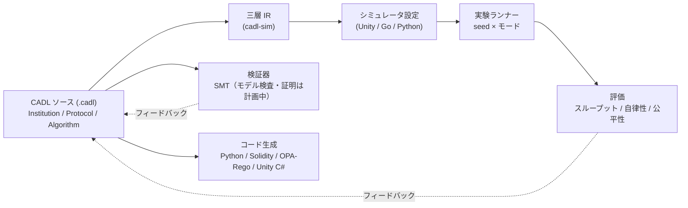

# CADL: Contract Architecture Description Language

**言語仕様書 — Version 0.1 (ドラフト)**

名古屋大学大学院情報学研究科 ERTL

2026年10月9日

---

## 概要

CADL（Contract Architecture Description Language）は，マルチエージェント
**System of Systems（SoS）** における**制度設計**を形式的に記述・検証・展開
するためのドメイン特化言語（DSL）です。

CADLは**三層アーキテクチャ**——制度層（Institution）・プロトコル層（Protocol）・
アルゴリズム層（Algorithm）——を採用し，ガバナンスルール，エージェント間の
調整メカニズム，計算的な振る舞いを単一の統合言語で精密に記述できます。
CADL仕様からシミュレータ設定の自動生成や設計整合性の検証を行うツールチェーンも
提供します。

## アーキテクチャ全体像

1つのソースから3種類の出力が生成されます。形式検証と制度制約コード
（スマートコントラクト／ポリシー／ランタイムクラス）は構文解析された定義から，
ランタイムシミュレータ設定は三層 IR から生成されます。
実験結果は CADL ソースへフィードバックされ，ガバナンスパラメータ
（α, β, λ, ρ）の調整に利用されます。

## 本仕様書の読み方

本書は3部構成になっています。以下の順序で読むことを推奨しますが，各章は
単独でも読めるように構成されています。

### 第I部 — 背景と要件

- **[1. はじめに](./01-introduction.md)** — 動機，問題設定，SoS研究における
  CADLの位置づけ。
- **[2. 目的](./02-objectives.md)** — CADLが解決する課題と，本ドラフトのスコープ。
- **[3. 比較](./03-comparison.md)** — 既存ADL・契約言語・マルチエージェントDSLとの関係。
- **[4. 要件](./04-requirements.md)** — 言語設計を駆動する機能的・非機能的要件。

### 第II部 — 言語と設計

- **[5. 言語仕様](./05-language-spec.md)** — 三層（制度・プロトコル・アルゴリズム）
  のコア構文と意味論。
- **[6. 設計](./06-design.md)** — 設計の根拠，ツールチェーン構成，中間表現（IR）。
- **[7. 例](./07-examples.md)** — CADLの典型的な利用例。

### 第III部 — 応用と展望

- **[8. ユースケース](./08-use-cases.md)** — 応用領域とケーススタディ。
- **[9. 研究](./09-research.md)** — 未解決の研究課題と理論的基盤。
- **[10. ロードマップ](./10-roadmap.md)** — 拡張計画とv1.0に向けた道筋。

### 付録

- **[付録A — 構文](./appendix-a-syntax)** — EBNF文法リファレンス。
- **[付録B — 参考文献](./appendix-b-references)** — 参照文献。
- **[付録C — 動機拡張](./appendix-c-motivation)** — エージェントの動機モデルとプロファイル。
- **[付録D — コード生成ターゲット](./appendix-d-codegen)** — コード生成ターゲットの一覧。
- **[付録E — SoS-DSL拡張](./appendix-e-sos-dsl)** — 契約のライフサイクルとランタイムモニター。
- **[用語集](./glossary)** — 仕様全体で用いる用語。

## 推奨される読み順

- **はじめて読む方** — 1〜2章を読み，5章をざっと眺めてから7章で具体例を確認。
- **実装者・ツール開発者** — 5章，6章，付録Aを中心に。
- **研究者** — 3章，9章，10章で全体的な文脈と未解決問題を把握。

## 関連ツール

- **[CADL Explorer](https://cadl-explorer.streamlit.app/)** — CADLの
  ガバナンスパイプラインをエンドツーエンドで体験できるインタラクティブな
  Webアプリケーション。仕様からシミュレーション，ガバナンス評価までを
  一貫して可視化します。

## 手を動かして学ぶ

仕様を読むだけでなく実際に書いて動かしたい場合は，[ハンズオン教材](../handson/index.md)を参照されたい。ロボット配送を題材に，仕様の記述からコード生成・シミュレーション実行までを一通り体験できる。

## ステータス

本書は**Version 0.1（ドラフト）** です。言語およびツールチェーンは開発中であり，
構文・意味論は今後のリビジョンで変更される可能性があります。
フィードバックや議論は[GitHub Issues](https://github.com/ertlnagoya/cadl/issues)で歓迎します。
